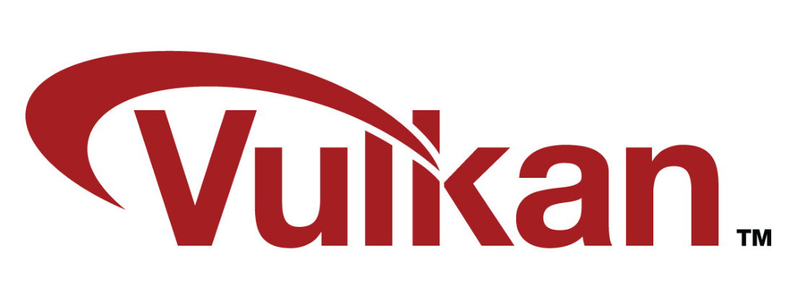
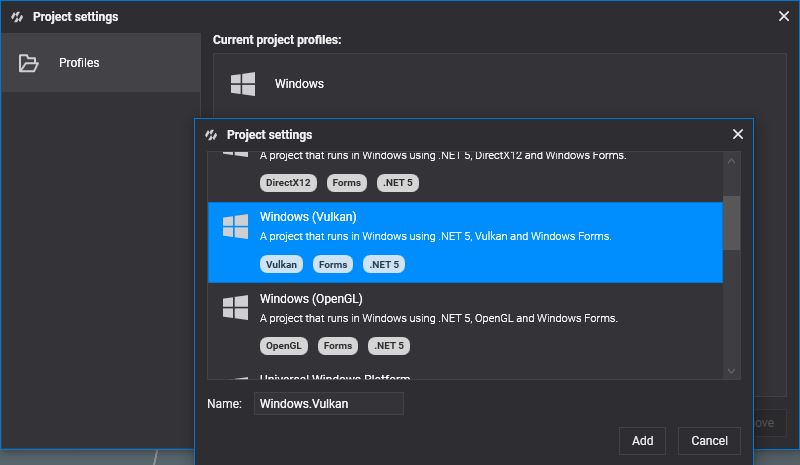
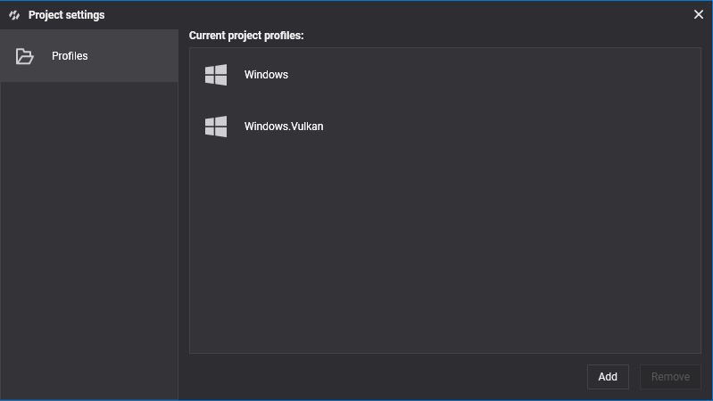
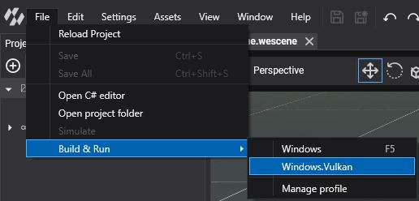

# Vulkan

---



**Vulkan** is the explicit, cross-platform graphics and compute API of the **Khronos Group**. It gives Evergine the same low-overhead model as DirectX 12, with multithreaded recording and separate queues, and it supports ray tracing and mesh shaders on devices that expose them.

It is the **default backend on Android**, including the **Meta Quest** and **Pico** standalone headsets, and it is also available on Windows through the **Windows (Vulkan)** template.

## Supported devices

* Android phones and tablets.
* Meta Quest and Pico headsets, through the OpenXR templates.
* Windows 10 and 11 PCs.

## Check your Vulkan version

Vulkan comes with the graphics driver. Update the driver to get the latest version, and install the [Vulkan SDK](https://vulkan.lunarg.com/) if you want the validation layers and debugging tools.

## Create a graphics context

```csharp
GraphicsContext graphicsContext = new Evergine.Vulkan.VKGraphicsContext();
graphicsContext.CreateDevice();
```

If your application needs Vulkan extensions beyond the ones Evergine enables, pass them to the constructor: device extensions first, then instance extensions. Evergine Studio does this to enable multiview, which it needs to generate IBL cube maps:

```csharp
GraphicsContext graphicsContext = new Evergine.Vulkan.VKGraphicsContext(
    deviceExtensionsToEnable: new[] { "VK_KHR_multiview" },
    instanceExtensionsToEnable: System.Array.Empty<string>());
graphicsContext.CreateDevice();
```

## Build & Run

New Android projects use Vulkan already. To add Vulkan on Windows, add a profile with the **Windows (Vulkan)** template from **Settings > Project Settings** (see [DirectX 12](directx12.md#build--run) for the steps):





Then run it from **File > Build & Run > Windows.Vulkan**:


