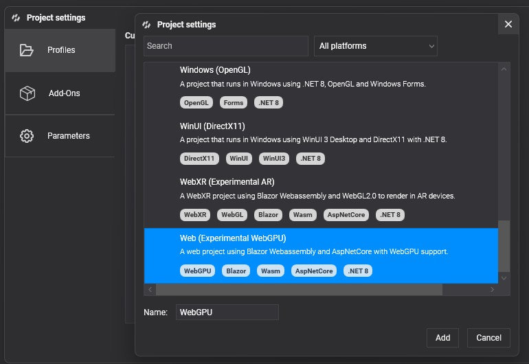

# WebGPU


**WebGPU** is a modern graphics API that provides developers with low-level access to the GPU, enabling advanced rendering techniques and computational capabilities.

It is developed by the **W3C** Web Community Group with engineers from **Apple**, **Mozilla**, **Microsoft**, **Google**, and others. This technology runs on top of the latest graphics APIs like DirectX 12, Vulkan, and Metal.

**Chrome**, **Edge**, and **Firefox** already support it as an experimental feature, so you need to switch to the beta channel and activate it. **Evergine** uses **WebGPU** on Web platforms when it is available; otherwise, it uses [WebGL](opengl.md), which is the most supported graphics technology today.

To check the implementation status of this technology, visit [caniuse.com/webgpu](https://caniuse.com/webgpu).

## Advantages of WebGPU Over WebGL

Unlike WebGL, which is based on OpenGL (an API that is now deprecated in favor of more efficient alternatives such as Vulkan and Metal) WebGPU addresses the limitations of traditional APIs by offering a more streamlined and efficient interface for graphics programming.

One of the key advantages of WebGPU over WebGL is its support for Compute Shaders. This capability enhances performance in graphics-heavy applications and opens new possibilities for creating complex visual effects and simulations. WebGPU is designed with modern programming paradigms in mind, enabling developers to write code that is not only performant but also maintainable.

WebGPU offers several notable advantages, making it a significant step forward in graphics programming:
- **Lower-level access to the GPU:** WebGPU provides developers with finer control over GPU resources, enabling more efficient rendering and computing tasks.
- **Support for Compute Shaders:** Unlike WebGL, WebGPU supports compute shaders, allowing for more complex computations and effects directly on the GPU.
- **Better performance:** With a more efficient architecture, WebGPU can leverage modern hardware capabilities, resulting in faster rendering and processing.

## Known limitations of the current WebGPU Evergine integration

The current WebGPU integration in Evergine has the following known limitations:

- `RGBA32Float` textures are not supported on most mobile devices, which means HDR textures are unavailable.
- The .NET 8 version of Emscripten does not support depth clip control, resulting in artifacts in shadow mapping for objects behind the camera that still cast visible shadows.
- GPU Particles & PostProcessing are not yet supported because the shader techniques they rely on are not precompiled.

## Supported WebGPU devices

* Chrome, Edge, Safari, and Firefox (Nightly only) browsers on Desktop, tablet, and mobile.

## Checking WebGPU version

| Browser | Check command |
| ---- | ---- | 
| **Chrome** |  The WebGPU flag must be enabled by writing this in your browser: <br/> `chrome://flags/#enable-unsafe-webgpu`
| **Edge** |  The WebGPU flag must be enabled by writing this in your browser: <br/> `edge://flags/#enable-unsafe-webgpu` | 

## Create a Graphics Context

### Create WGPUGraphicsContext
To create a graphics context based on **WebGPU**, just write:

```csharp  
GraphicsContext graphicsContext = new Evergine.WebGPU.WGPUGraphicsContext();
graphicsContext.CreateDevice();
```

### Setup WebGPU device in your Blazor application
To enable your application to run with the WebGPU backend, you first need to obtain the WebGPU device and set it in your Blazor code. Locate the ``Blazor.start().then...`` section in your project (by default in the ``index.html`` file), and add the following code just before ``app.startEvergine()``:

```javascript
// Set WebGPU device
const adapter = await navigator.gpu.requestAdapter();
const device = await adapter.requestDevice({
    requiredLimits: {
        maxStorageBuffersPerShaderStage: 10 // Request support for up to 10 storage buffers
    }
});

if (Blazor && Blazor.runtime && Blazor.runtime.Module) {
    Blazor.runtime.Module.preinitializedWebGPUDevice = device;
} else {
    window.Module.preinitializedWebGPUDevice = device;
}
```

The resulting code block should look similar to this:

```javascript
// previous initializing code...

Blazor.start().then(async function () {

    // Set WebGPU device
    const adapter = await navigator.gpu.requestAdapter();
    const device = await adapter.requestDevice({
        requiredLimits: {
            maxStorageBuffersPerShaderStage: 10 // Request support for up to 10 storage buffers
        }
    });

    if (Blazor && Blazor.runtime && Blazor.runtime.Module) {
        Blazor.runtime.Module.preinitializedWebGPUDevice = device;
    } else {
        window.Module.preinitializedWebGPUDevice = device;
    }

    // It is not mandatory to run Evergine now, but it must run after Blazor has started
    app.startEvergine();
});
```

## Build & Run on WebGPU

You can select **WebGPU** API support when creating a new project from the **Evergine** launcher.

If the project already exists, you can add **WebGPU** support from **Evergine Studio** by clicking on Settings -> Project Settings.


Select and add the profile for **Web (Experimental WebGPU)**.

