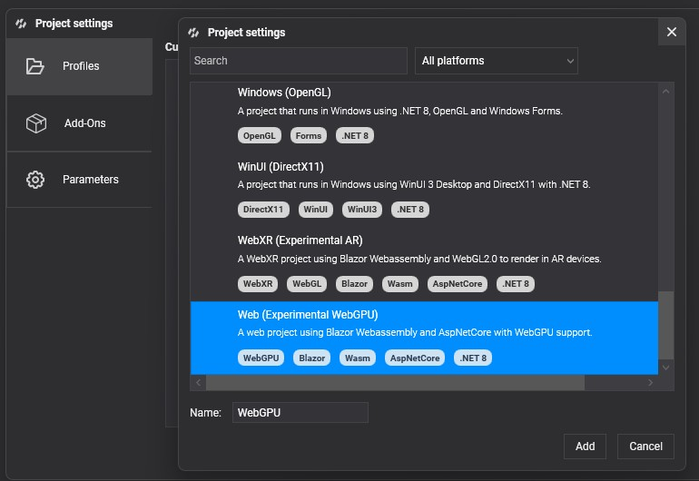

# WebGPU

---


**WebGPU** is the modern graphics and compute API of the web, designed by the W3C GPU for the Web group with engineers from Apple, Google, Microsoft, Mozilla and others. Browsers implement it on top of DirectX 12, Vulkan and Metal, so web applications get the explicit model of those APIs instead of the OpenGL-era model of WebGL.

Evergine supports WebGPU through the **Web (Experimental WebGPU)** template. The default web templates still use [WebGL 2](opengl.md), which more browsers and devices support today.

## WebGPU compared with WebGL

* **Compute shaders.** WebGL has none. With WebGPU, features that Evergine builds on compute shaders, such as [compute tasks](../compute_tasks/index.md), become available on the web.
* **Lower overhead.** Pipelines and resource bindings are validated when they are created, not on every draw, so the browser spends less CPU per frame.
* **Modern GPU features.** Storage buffers, more flexible texture formats and a programming model that matches the native explicit APIs.

## Supported browsers

WebGPU is enabled by default in current versions of Chrome and Edge on Windows, macOS, ChromeOS and Android, in Safari 26 and later, and in Firefox on Windows. Other platforms are rolling it out; check [caniuse.com/webgpu](https://caniuse.com/webgpu) for the current status.

## Known limitations

The WebGPU integration is experimental. At the time of writing:

- `RGBA32Float` textures are not supported on most mobile devices, so HDR textures are not available there.
- GPU particles and post-processing are not supported yet, because the shader techniques they rely on are not precompiled for WebGPU.

## Create a graphics context

```csharp
GraphicsContext graphicsContext = new Evergine.WebGPU.WGPUGraphicsContext();
graphicsContext.CreateDevice();
```

`WGPUGraphicsContext.PowerPreference` (default `HighPerformance`) tells the browser which GPU to prefer on machines with more than one.

### Set up the WebGPU device in your Blazor application

The browser creates the WebGPU device, and your page hands it to Evergine. The template does this in `wwwroot/index.html`, just before `app.startEvergine()`. Add to `requiredLimits` and `requiredFeatures` whatever your content needs:

```javascript
Blazor.start().then(async function () {

    // Set WebGPU device
    const adapter = await navigator.gpu.requestAdapter();
    const device = await adapter.requestDevice({
        requiredLimits: {
            maxStorageBuffersPerShaderStage: 10 // Up to 10 storage buffers in a single shader stage
        },
        requiredFeatures: [
            "depth32float-stencil8",
            "depth-clip-control"
        ]
    });

    if (Blazor && Blazor.runtime && Blazor.runtime.Module) {
        Blazor.runtime.Module.preinitializedWebGPUDevice = device;
    } else {
        window.Module.preinitializedWebGPUDevice = device;
    }

    // Evergine must start after Blazor has started.
    app.startEvergine();
});
```

### Frame pacing

The browser calls the render loop at the display's refresh rate whether or not the GPU keeps up. If every call submitted a frame, the GPU queue would grow, adding input lag and counting frames that are never shown. The template's `ts/app.ts` limits the number of frames the GPU can have queued:

```typescript
static maxFramesInFlight = 2;
```

Lower it to 1 for the lowest latency, or set it to 0 to submit on every call as before.

## Build & Run on WebGPU

Add a profile with the **Web (Experimental WebGPU)** template from **Settings > Project Settings** in Evergine Studio (see [DirectX 12](directx12.md#build--run) for the steps):


