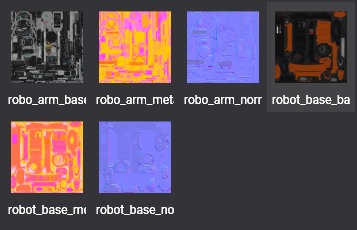
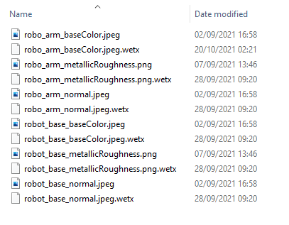
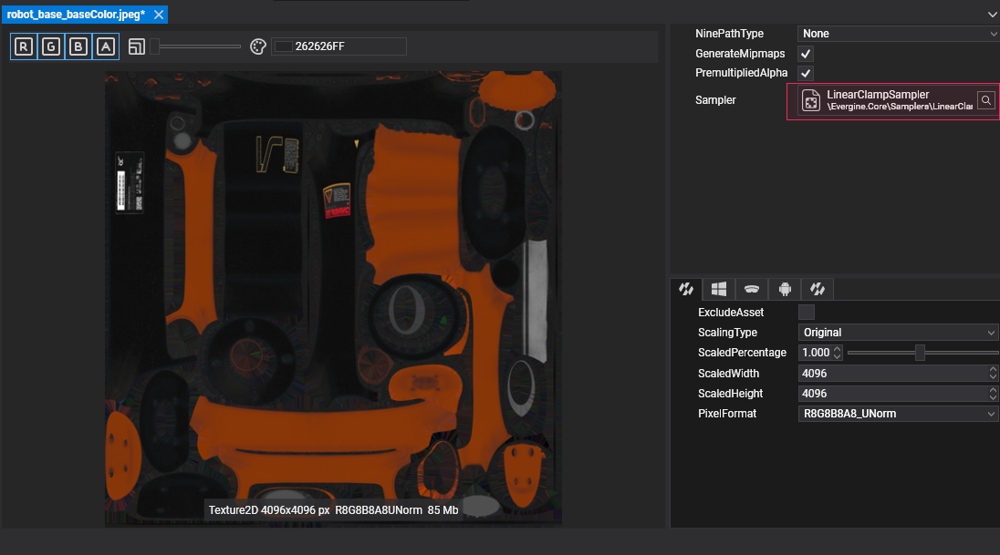

# Import a Texture

---

In Evergine Studio, importing an image file creates a **texture** asset, as explained in [Create Assets](../../evergine_studio/assets/create.md). Drag the file into the **Assets Details** panel or copy it into the project's `Content` folder.

## Textures in Assets Details

Texture assets appear in the Assets Details panel when you select their folder in the Project Explorer.

## Texture files in the Content folder

Each imported image gets a metadata file with the `.wetx` extension next to it, which stores the texture's import settings.

## Supported formats

| Extension | Compression | Alpha | Texture types |
| --- | --- | --- | --- |
| `.jpg`, `.jpeg` | Lossy | No | Texture2D |
| `.png` | Lossless | Yes | Texture2D |
| `.webp` | Lossy or lossless | Yes | Texture2D |
| `.bmp` | None | Rarely | Texture2D |
| `.tga` | None or RLE | Yes | Texture2D |
| `.hdr` | RLE, floating point | No | Texture2D |
| `.dds` | Block compression (BC1 to BC7) or none | Yes | All |
| `.ktx`, `.ktx2` | GPU compressed formats or none | Yes | All |

> [!TIP]
> Each [profile](../../evergine_studio/settings/project_profiles.md) sets the compressed formats its platform prefers (for example BC3 on Windows and ETC on Android), and the [Texture Editor](texture_editor.md) lets you override the pixel format per profile.

## Sampler

A texture asset references a [sampler](../samplers.md) asset, which says how it is filtered and wrapped by default. Change it in the Texture Editor; materials can still use a different sampler for the same texture.

