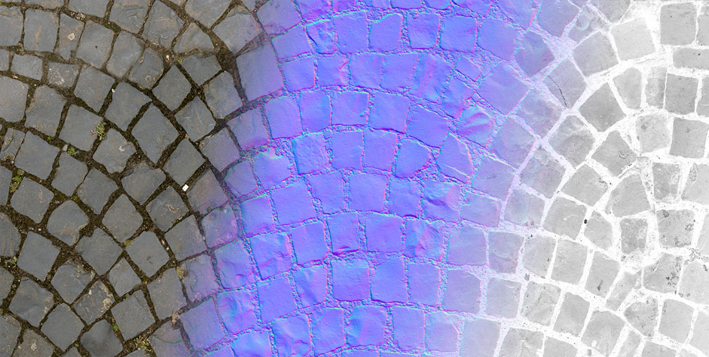
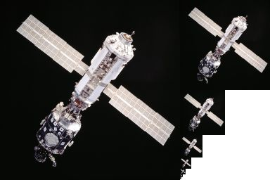

# Textures

---

A **texture** is an image the GPU can read: the color of a surface, its normals, its roughness, a light's cookie, a sprite, or data for a shader. Most textures are assets imported from image files and assigned to [materials](../materials/index.md); you can also [create textures from code](create_texture_from_code.md) and render into them.

## Mipmapping

A **mipmap** chain stores the texture at successively halved sizes. When a textured surface is far away or seen at an angle, the GPU reads the smaller levels, which avoids shimmering and reads less memory. Evergine can generate the chain on import or load it from `.dds` and `.ktx` files.

## Texture types

Evergine supports every basic GPU texture type, detailed in [Texture Types](textureTypes.md):

- Texture1D and Texture1DArray
- Texture2D and Texture2DArray
- TextureCube and TextureCubeArray
- Texture3D

## Supported file types

| Extension | Notes |
| --- | --- |
| `.png`, `.jpg`, `.jpeg`, `.bmp`, `.webp` | Common images, imported as Texture2D. |
| `.tga` | Truevision TGA, imported as Texture2D. |
| `.hdr` | Radiance HDR images, imported as floating point Texture2D. Use them for environment lighting. |
| `.dds` | DirectDraw Surface. Can hold any texture type, mipmaps and block-compressed formats. |
| `.ktx`, `.ktx2` | Khronos texture containers. Can hold any texture type, mipmaps and compressed formats. |

See [Import Textures](import_textures.md) for details.

## In this section

* [Texture Types](textureTypes.md)
* [Import Textures](import_textures.md)
* [Create a Texture from Code](create_texture_from_code.md)
* [Texture Editor](texture_editor.md)
