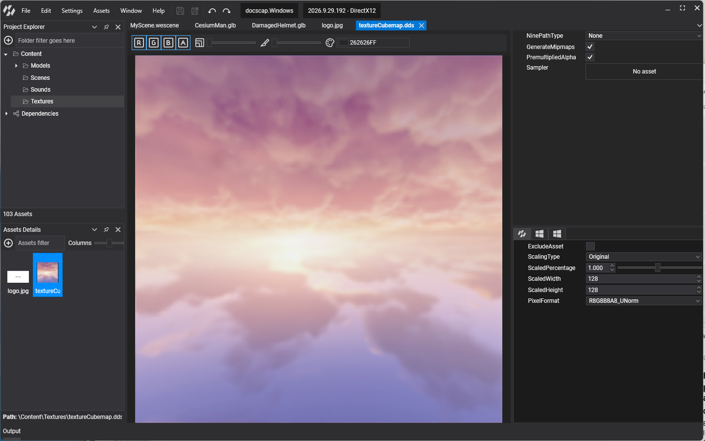
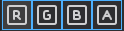
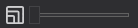
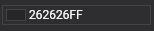

# Texture Editor

---

The **Texture Editor** previews a texture and edits its import settings. Double-click a texture in [Assets Details](../../evergine_studio/interface.md) to open it. It has three parts: the viewport, the toolbox and the properties.

## Viewport

Shows the texture with the current settings, and a label with its type, size in pixels, pixel format and size on disk, for example _Texture2D 4096x4096 px R8G8B8A8_UNorm_.

## Toolbox

| Item | Description |
| ---- | ----------- |
|  | Show or hide the red, green, blue and alpha channels. |
|  | Mip level to show. Hidden for textures without mipmaps. |
| Slice | Array slice or depth slice to show, for array and 3D textures. |
| Range | Range of values mapped to black and white. Use it to inspect HDR textures, whose values go beyond 1, and data textures that use a small part of the range. |
|  | Background color of the viewport, to judge transparency. |
| RenderDoc | Capture a frame of the viewport with [RenderDoc](../../evergine_studio/renderdoc.md). |

## Properties

These settings are the same for every profile:

| Property | Default | Description |
| -------- | ------- | ----------- |
| **GenerateMipmaps** | true | Generate the mipmap chain on import. Turn it off for UI images and textures always shown at their full size. |
| **PremultipliedAlpha** | true | Multiply the color channels by alpha on import, which gives correct filtering and blending at transparent edges. |
| **Sampler** | | The [sampler](../samplers.md) the texture uses by default. |
| **NinePatchType** | `None` | `None` or `FromTexture`. Reserved for nine-patch scaling of UI images; the engine does not use it yet. |

## Profile properties

These settings can differ per [profile](../../evergine_studio/settings/project_profiles.md):

| Property | Default | Description |
| -------- | ------- | ----------- |
| **ScalingType** | `Original` | How the image is resized on export: `Original` keeps its size; `Percentage` scales it by **ScaledPercentage**; `Freeform` sets **ScaledWidth** and **ScaledHeight**; `PowerOfTwo` rounds each side to a power of two; `SquarePowerOfTwo` makes it a square power of two. |
| **ScaledPercentage** | 1 | Scale factor for `Percentage`, from 0.1 to 2. |
| **ScaledWidth** | image width | Width for `Freeform`. |
| **ScaledHeight** | image height | Height for `Freeform`. |
| **PixelFormat** | from the image | Pixel format of the exported texture, for example `R8G8B8A8_UNorm` or a block-compressed format. Choosing an sRGB format tells the GPU the texture holds gamma-encoded color. |
