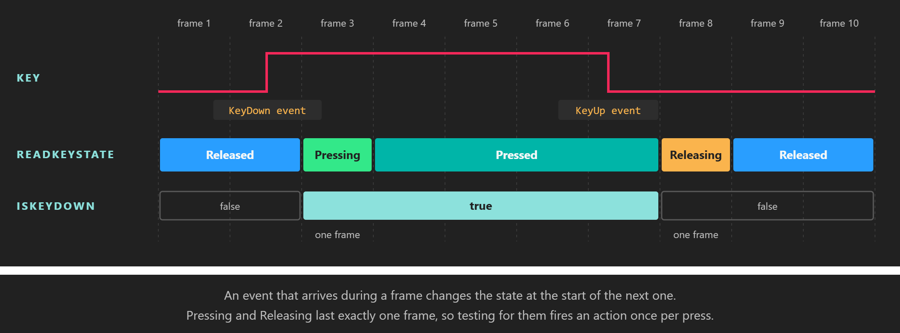

# Button States



*`Pressing` and `Releasing` are one-frame edges between the two resting states.*

Every key, mouse button and touch point in Evergine reports its state as a `ButtonState`. Besides telling you whether something is down, the state tells you whether it went down or up **this frame**, which is what you need to fire an action once per press instead of once per frame. The rules are the same on every platform, because a single class, `ButtonStateTracker<TButton>`, computes the states for all of them.

## ButtonState

`ButtonState` (namespace `Evergine.Common.Input`) is a `[Flags]` enumeration:

| Member | Value | Description |
| --- | --- | --- |
| **Undefined** | 0 | No state. The trackers never return it; it is the default value of a `ButtonState` field that has not been assigned. |
| **Released** | 1 | Up, and it was already up in the previous frame. This is what you get for any key or button that has never been touched. |
| **Pressing** | 2 | Went down this frame. Lasts exactly one frame (rising edge). |
| **Pressed** | 4 | Down, and it was already down in the previous frame. |
| **Releasing** | 8 | Went up this frame. Lasts exactly one frame (falling edge). |

| You want to know | Read |
| --- | --- |
| Is it down right now? | `IsKeyDown(key)` / `IsButtonDown(button)`, true for `Pressing` or `Pressed`. |
| Did it go down this frame? | `ReadKeyState(key) == ButtonState.Pressing` |
| Did it go up this frame? | `ReadKeyState(key) == ButtonState.Releasing` |
| Is it held since an earlier frame? | `ReadKeyState(key) == ButtonState.Pressed` |

Because the values are flags, you can test several states at once with a mask. This is exactly how `IsKeyDown` is implemented:

```csharp
ButtonState state = keyboard.ReadKeyState(Keys.Space);
bool isDown = (state & (ButtonState.Pressing | ButtonState.Pressed)) != 0;
```

> [!TIP]
> Use `Pressing` for anything that should happen once per press: jumping, firing, toggling a menu. Use `IsKeyDown` for anything that should continue while the key is held: moving, zooming, charging.

## How the states change

The dispatchers feed every down and up event to a `ButtonStateTracker<TButton>` while they empty their queues, and call `Commit()` once per frame (see [One frame of input](index.md#one-frame-of-input)). The tracker follows these rules:

- **A down event** on something `Released` or `Releasing` makes it `Pressing`. Down events on something already down are ignored, so keyboard auto-repeat never produces a second `Pressing`.
- **An up event** on something `Pressing` or `Pressed` makes it `Releasing`.
- **Only one change per frame.** If a key goes down and up between two frames, the frame sees `Pressing` and the next frame sees `Releasing`. A tap shorter than a frame is never lost, it just never reaches `Pressed`.
- **On `Commit()`,** anything that did not change this frame moves on: `Pressing` becomes `Pressed` if it is still held (or `Releasing` if it was released in the same frame it was pressed), and `Releasing` becomes `Released`.

The tracker is public, so you can use it to give a custom device the same semantics:

| Member | Description |
| --- | --- |
| **ButtonStateTracker(Action&lt;TButton&gt; onReleasing = null)** | Creates a tracker. The optional callback runs for each button that moves from `Releasing` to `Released` during `Commit()`. |
| **ButtonDown(TButton button)** | Reports that the button went down. |
| **ButtonUp(TButton button)** | Reports that the button went up. |
| **Commit()** | Advances the states for the next frame. Call it once per frame, after reporting the events. |
| **ReadButtonState(TButton button)** | Returns the current state. Unknown buttons return `Released`. |
| **IsButtonDown(TButton button)** | Returns true if the state is `Pressing` or `Pressed`. |

## Example: charge and release

This behavior uses all three edges of the Space key. Pressing starts a charge, holding it grows the entity, and releasing it reports how long it was held and resets the scale.

```csharp
using System;
using Evergine.Common.Input;
using Evergine.Common.Input.Keyboard;
using Evergine.Framework;
using Evergine.Framework.Graphics;
using Evergine.Framework.Services;
using Evergine.Mathematics;

public class ChargeOnSpace : Behavior
{
    [BindService]
    private GraphicsPresenter graphicsPresenter = null;

    [BindComponent]
    private Transform3D transform = null;

    private float chargeSeconds;

    public float MaxChargeSeconds { get; set; } = 2f;

    protected override void Update(TimeSpan gameTime)
    {
        KeyboardDispatcher keyboard = this.graphicsPresenter.FocusedDisplay?.KeyboardDispatcher;
        if (keyboard == null)
        {
            return;
        }

        switch (keyboard.ReadKeyState(Keys.Space))
        {
            case ButtonState.Pressing:
                this.chargeSeconds = 0f;
                break;

            case ButtonState.Pressed:
                // Pressed is reported every frame the key is held, so it accumulates elapsed time.
                this.chargeSeconds = Math.Min(this.chargeSeconds + (float)gameTime.TotalSeconds, this.MaxChargeSeconds);
                this.transform.LocalScale = Vector3.One * (1f + this.chargeSeconds);
                break;

            case ButtonState.Releasing:
                System.Diagnostics.Debug.WriteLine($"Released after {this.chargeSeconds:0.00} s of charge");
                this.transform.LocalScale = Vector3.One;
                break;
        }
    }
}
```

## See also

* [Keyboard](keyboard.md): `ReadKeyState` and `IsKeyDown`.
* [Mouse](mouse.md): `ReadButtonState` and `IsButtonDown`.
* [Touch](touch.md): `PointerPoint.State`.
