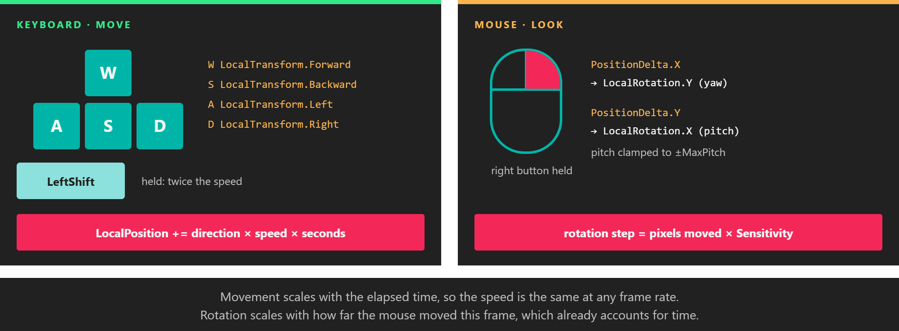

# Example: Camera Controller



*Keys move the camera, the mouse turns it. Each input is scaled by the quantity that makes it frame-rate independent.*

This example builds a first-person camera controller: W, A, S and D move the camera, Left Shift makes it faster, and dragging with the right mouse button turns it. It is short enough to read in one go, and it uses the pieces of the input API that most games need: `IsKeyDown` for continuous actions, `Pressing` and `Releasing` for one-off ones, and `PositionDelta` for mouse-look.

> [!TIP]
> Evergine ships a complete controller, `FreeCamera3D` in `Evergine.Components.Cameras`, with keyboard, mouse and touch support. Use it when you need a camera that just works, and use this example when you want to write your own.

## The behavior

```csharp
using System;
using Evergine.Common.Input;
using Evergine.Common.Input.Keyboard;
using Evergine.Common.Input.Mouse;
using Evergine.Framework;
using Evergine.Framework.Graphics;
using Evergine.Mathematics;

public class CameraController : Behavior
{
    [BindComponent]
    private Transform3D transform = null;

    // isExactType: false accepts any Camera subclass, such as Camera3D.
    [BindComponent(isExactType: false)]
    private Camera camera = null;

    public float MoveSpeed { get; set; } = 3f;

    public float Sensitivity { get; set; } = 0.005f;

    public float MaxPitch { get; set; } = MathHelper.PiOver2 * 0.95f;

    protected override void Update(TimeSpan gameTime)
    {
        // The camera's own display: with several windows, each camera listens to the window it renders to.
        Display display = this.camera.Display;
        if (display == null)
        {
            return;
        }

        KeyboardDispatcher keyboard = display.KeyboardDispatcher;
        if (keyboard != null)
        {
            Matrix4x4 local = this.transform.LocalTransform;
            Vector3 direction = Vector3.Zero;

            if (keyboard.IsKeyDown(Keys.W))
            {
                direction += local.Forward;
            }

            if (keyboard.IsKeyDown(Keys.S))
            {
                direction += local.Backward;
            }

            if (keyboard.IsKeyDown(Keys.A))
            {
                direction += local.Left;
            }

            if (keyboard.IsKeyDown(Keys.D))
            {
                direction += local.Right;
            }

            if (direction != Vector3.Zero)
            {
                // Normalized so that moving diagonally is not faster than moving straight.
                direction = Vector3.Normalize(direction);
                float speed = keyboard.IsKeyDown(Keys.LeftShift) ? this.MoveSpeed * 2f : this.MoveSpeed;

                // Scaled by the elapsed time: the speed is in units per second at any frame rate.
                this.transform.LocalPosition += direction * speed * (float)gameTime.TotalSeconds;
            }
        }

        MouseDispatcher mouse = display.MouseDispatcher;
        if (mouse != null)
        {
            // The edges fire once each, so the cursor is hidden and shown once per drag.
            ButtonState right = mouse.ReadButtonState(MouseButtons.Right);
            if (right == ButtonState.Pressing)
            {
                mouse.TrySetCursorType(CursorTypes.None);
            }
            else if (right == ButtonState.Releasing)
            {
                mouse.TrySetCursorType(CursorTypes.Arrow);
            }

            if (mouse.IsButtonDown(MouseButtons.Right))
            {
                // PositionDelta is the movement of this frame, so it is not scaled by the elapsed time.
                Point delta = mouse.PositionDelta;
                Vector3 rotation = this.transform.LocalRotation;

                rotation.Y -= delta.X * this.Sensitivity;

                // Screen Y grows downward: moving the mouse up gives a negative delta and pitches up.
                // The clamp stops the camera just short of looking straight up or down, where it would flip.
                rotation.X = MathHelper.Clamp(rotation.X - (delta.Y * this.Sensitivity), -this.MaxPitch, this.MaxPitch);

                this.transform.LocalRotation = rotation;
            }
        }
    }
}
```

| Property | Default | Description |
| --- | --- | --- |
| **MoveSpeed** | 3 | Movement speed in units per second. Left Shift doubles it. |
| **Sensitivity** | 0.005 | Radians of rotation per pixel of mouse movement. |
| **MaxPitch** | 0.95 × π/2 | Largest angle, in radians, that the camera can look up or down. |

## Add it to a camera

In code, add the behavior to the entity that holds the camera:

```csharp
Entity cameraEntity = new Entity("camera")
    .AddComponent(new Transform3D() { Position = new Vector3(0f, 2f, 6f) })
    .AddComponent(new Camera3D())
    .AddComponent(new CameraController());

this.Managers.EntityManager.Add(cameraEntity);
```

In Evergine Studio, build the project so the new behavior is available, select the camera entity in the scene and add `CameraController` to it. If the camera already has a `FreeCamera3D`, remove it, or both controllers will move the camera at the same time.

## Why it is written this way

- **`IsKeyDown` for movement.** Movement continues for as long as the key is held, so the controller asks every frame whether the key is down. It does not use `KeyDown` events, which only arrive when the key goes down and on auto-repeat.
- **`Pressing` and `Releasing` for the cursor.** Hiding the cursor is a one-off action at the start of the drag, and showing it is a one-off action at the end. The one-frame edges of the [button states](button_states.md) make that a simple comparison.
- **The drag always ends.** When the cursor leaves the window, the mouse dispatcher releases the buttons that are still down, so the `Releasing` frame arrives and the cursor comes back even if the user lets go outside the window.
- **Local vectors from `LocalTransform`.** `Forward`, `Right` and the others follow the camera's rotation, so W always moves where the camera is looking. This assumes the camera entity has no rotated parent; for a child camera, use the vectors of `WorldTransform` instead.

> [!NOTE]
> A hidden cursor still moves and still stops at the edge of the screen, where `PositionDelta` becomes zero. Games that need unlimited mouse-look usually move the cursor back to the centre of the surface every frame with `TrySetCursorPosition`. The dispatcher applies that jump to `Position` and `PositionDelta` immediately, so recentre after you have read the delta for the frame.

## Beyond keyboard and mouse

- [Touch](touch.md) shows how to read fingers and pinches, for the same controller on a tablet.
- In XR the headset moves the camera for you, and the hands and motion controllers are read through tracking components rather than dispatchers. See [XR input tracking](../xr/input_tracking/index.md).
