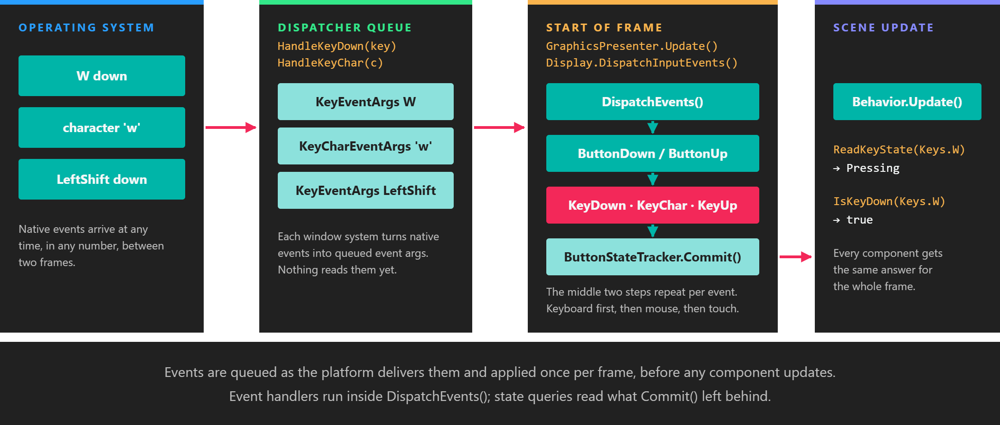
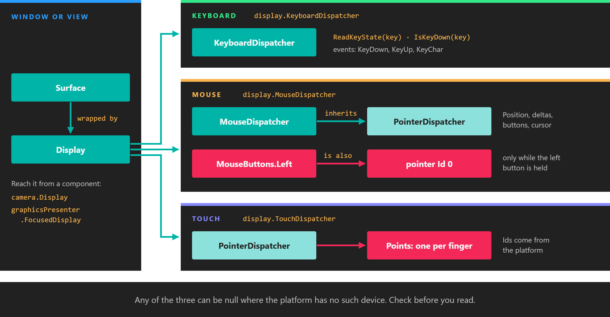

# Input



*Input is collected between frames and applied once, at the start of the next frame, before any component updates.*

Evergine reads the keyboard, the mouse and touch screens through three **dispatchers** that every display exposes. The API is the same on every platform: the same `Keys` and `MouseButtons` values, the same [button states](button_states.md), and the same order of events. You query the dispatchers from a component's `Update`, or subscribe to their events.

## Where input comes from



*Input belongs to a surface. Each window or embedded view has its own three dispatchers, reached through its `Display`.*

Every window or embedded view that Evergine renders to is a `Surface`. The application wraps each surface in a `Display` and registers it with the `GraphicsPresenter` service. Input is tied to the surface, so an application with two windows has two sets of dispatchers, and each one only receives what happens over its own window.

| Member (on `Display` and `Surface`) | Type | Description |
| --- | --- | --- |
| **KeyboardDispatcher** | `KeyboardDispatcher` | Key states and the `KeyDown`, `KeyUp` and `KeyChar` events. See [Keyboard](keyboard.md). |
| **MouseDispatcher** | `MouseDispatcher` | Cursor position, movement, wheel, buttons and cursor shape. See [Mouse](mouse.md). |
| **TouchDispatcher** | `PointerDispatcher` | One `PointerPoint` per finger on the surface. See [Touch](touch.md). |

A component usually reaches the display in one of two ways:

- **`Camera.Display`**: the display a camera renders to. Use it when the input drives that camera or its view, as in the [camera controller example](camera_controller.md).
- **`GraphicsPresenter.FocusedDisplay`**: the display that has the focus. When no display has been marked as focused, it returns the first one registered, which in a single-window application is the only one.

> [!IMPORTANT]
> Any of the three dispatchers can be `null` when the platform has no such device. Use the null-conditional operator (`?.`) or check for `null` before reading them.

## One frame of input

The platform delivers native events whenever they happen, often several between two frames. The window system does not act on them immediately. It converts each one into an event argument object and stores it in the dispatcher's queue.

At the start of every frame the `GraphicsPresenter` service calls `Display.DispatchInputEvents()` on each display. That calls `DispatchEvents()` on the keyboard, the mouse and the touch dispatcher, in that order. Each dispatcher empties its queue: for every event it updates its `ButtonStateTracker` and raises the matching C# event. Once the queue is empty it calls `ButtonStateTracker.Commit()`, which moves every key, button and pointer to its state for this frame.

Services update before scenes, so all of this has finished before the first component runs. That has three consequences:

- `ReadKeyState`, `ReadButtonState` and `PointerPoint.State` return the same value in every component during the whole frame.
- Event handlers run on the update thread, inside `DispatchEvents()`, before any `Update` method of that frame.
- A press shorter than a frame is never lost. The state still goes through `Pressing` and `Releasing`, one frame each. See [Button states](button_states.md).

## Dispatchers per window system

Which dispatchers a display provides depends on the window system package that created its surface:

| Window system | Used for | Keyboard | Mouse | Touch |
| --- | --- | --- | --- | --- |
| `Evergine.Forms` | Windows desktop (the default Windows template) | Yes | Yes | Yes |
| `Evergine.WPF` | WPF windows and embedded controls | Yes | Yes | Yes |
| `Evergine.WinUI` | WinUI 3 `SwapChainPanel` (also MAUI on Windows) | Yes | Yes | Yes |
| `Evergine.SDL` | SDL windows | Yes | Yes | Yes |
| `Evergine.Avalonia` | Avalonia controls | Yes | Yes | Yes |
| `Evergine.Web` | Blazor WebAssembly canvas | Yes | Yes | Yes |
| `Evergine.Android` | Android (also MAUI on Android) | Yes | Yes | Yes |
| `Evergine.iOS` | iOS (also MAUI on iOS) | Present, raises no events | `null` | Yes |
| `Evergine.MacOS` | macOS | Yes | Yes | `null` |

On Android the mouse dispatcher only reports events whose source is a mouse; finger contacts go to the touch dispatcher.

## Example: react to any device

This behavior toggles the entity's mesh when the user presses Space, clicks the left mouse button or touches the screen. It reads the focused display and tolerates any dispatcher being absent.

```csharp
using System;
using Evergine.Common.Input;
using Evergine.Common.Input.Keyboard;
using Evergine.Common.Input.Mouse;
using Evergine.Common.Input.Pointer;
using Evergine.Components.Graphics3D;
using Evergine.Framework;
using Evergine.Framework.Graphics;
using Evergine.Framework.Services;

public class ToggleOnInput : Behavior
{
    [BindService]
    private GraphicsPresenter graphicsPresenter = null;

    [BindComponent]
    private MeshRenderer meshRenderer = null;

    protected override void Update(TimeSpan gameTime)
    {
        Display display = this.graphicsPresenter.FocusedDisplay;
        if (display == null)
        {
            return;
        }

        // Pressing lasts one frame, so the mesh toggles once per press instead of every frame.
        bool toggle = display.KeyboardDispatcher?.ReadKeyState(Keys.Space) == ButtonState.Pressing
                   || display.MouseDispatcher?.ReadButtonState(MouseButtons.Left) == ButtonState.Pressing;

        PointerDispatcher touch = display.TouchDispatcher;
        if (touch != null)
        {
            foreach (PointerPoint point in touch.Points)
            {
                toggle |= point.State == ButtonState.Pressing;
            }
        }

        if (toggle)
        {
            this.meshRenderer.IsEnabled = !this.meshRenderer.IsEnabled;
        }
    }
}
```

Add it to any entity that has a `MeshRenderer`, for example in your scene's `CreateScene` method:

```csharp
Entity cube = new Entity("cube")
    .AddComponent(new Transform3D())
    .AddComponent(new MaterialComponent() { Material = material })
    .AddComponent(new CubeMesh())
    .AddComponent(new MeshRenderer())
    .AddComponent(new ToggleOnInput());

this.Managers.EntityManager.Add(cube);
```

## XR controllers and hands

Motion controllers, articulated hands and other tracked devices are not dispatchers. They are read through XR tracking components. See [XR input tracking](../xr/input_tracking/index.md).

## In this section

* [Button states](button_states.md)
* [Keyboard](keyboard.md)
* [Mouse](mouse.md)
* [Touch](touch.md)
* [Example: camera controller](camera_controller.md)
