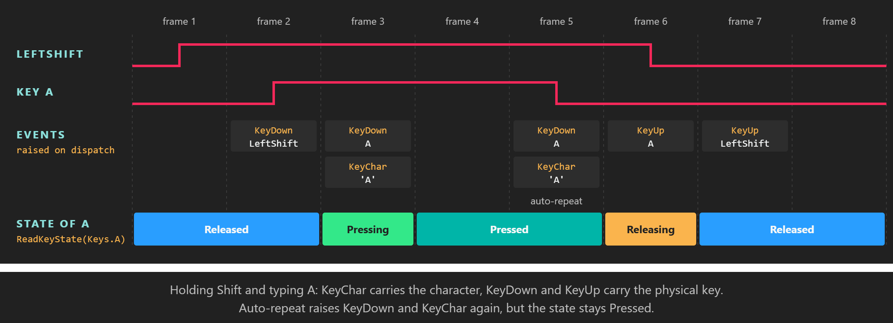

# Keyboard



*Key states answer "is this key down"; `KeyChar` answers "what did the user type".*

The keyboard is the main input device on desktop platforms. `KeyboardDispatcher` tracks the state of every physical key, identified by the `Keys` enumeration, and raises events for key presses and for typed characters. Use the states for game controls and shortcuts, and the `KeyChar` event for text input.

## KeyboardDispatcher

Get it from `display.KeyboardDispatcher` (see [Where input comes from](index.md#where-input-comes-from)). It lives in the `Evergine.Common.Input.Keyboard` namespace, together with `Keys`.

### Methods

| Member | Description |
| --- | --- |
| **ReadKeyState(Keys key)** | Returns the [state](button_states.md) of the key in this frame: `Released`, `Pressing`, `Pressed` or `Releasing`. |
| **IsKeyDown(Keys key)** | Returns true when the key is `Pressing` or `Pressed`. |

### Events

| Event | Arguments | Description |
| --- | --- | --- |
| **KeyDown** | `KeyEventArgs` | A key went down. Raised again for every auto-repeat the platform reports while the key is held, even though the state stays `Pressed`. |
| **KeyUp** | `KeyEventArgs` | A key went up. |
| **KeyChar** | `KeyCharEventArgs` | A character was typed. It carries the character that the platform produced from the keyboard layout and modifiers (`'A'` with Shift, `'a'` without), and repeats with auto-repeat. |

| Event argument | Member | Description |
| --- | --- | --- |
| `KeyEventArgs` | **Key** | The `Keys` value of the physical key. Left and right modifiers are distinct: `LeftShift`, `RightShift`, `LeftControl`, `RightControl`, `LeftAlt`, `RightAlt`. |
| `KeyEventArgs` | **IsDown** | True for `KeyDown`, false for `KeyUp`. |
| `KeyCharEventArgs` | **Character** | The typed `char`. |

All three events are raised during `DispatchEvents()`, at the start of the frame and before any component updates, in the order the platform delivered them.

> [!NOTE]
> `KeyChar` skips characters with codes up to 13, which include Backspace, Tab and Enter. Handle those keys with `KeyDown` or `ReadKeyState`.

> [!NOTE]
> The Windows Forms, WPF and Web window systems release every held key when the window loses focus, so a key never stays stuck down after the user switches to another application.

## Example: controls from key states

This behavior moves its entity on the XZ plane with the arrow keys and resets its position with R. It polls states every frame and uses no events.

```csharp
using System;
using Evergine.Common.Input;
using Evergine.Common.Input.Keyboard;
using Evergine.Framework;
using Evergine.Framework.Graphics;
using Evergine.Framework.Services;
using Evergine.Mathematics;

public class ArrowKeysMover : Behavior
{
    [BindService]
    private GraphicsPresenter graphicsPresenter = null;

    [BindComponent]
    private Transform3D transform = null;

    public float Speed { get; set; } = 2f;

    protected override void Update(TimeSpan gameTime)
    {
        KeyboardDispatcher keyboard = this.graphicsPresenter.FocusedDisplay?.KeyboardDispatcher;
        if (keyboard == null)
        {
            return;
        }

        Vector3 direction = Vector3.Zero;
        if (keyboard.IsKeyDown(Keys.Up))
        {
            direction.Z -= 1f;
        }

        if (keyboard.IsKeyDown(Keys.Down))
        {
            direction.Z += 1f;
        }

        if (keyboard.IsKeyDown(Keys.Left))
        {
            direction.X -= 1f;
        }

        if (keyboard.IsKeyDown(Keys.Right))
        {
            direction.X += 1f;
        }

        // Scaling by the elapsed time keeps the speed in units per second at any frame rate.
        this.transform.LocalPosition += direction * this.Speed * (float)gameTime.TotalSeconds;

        // Pressing, not IsKeyDown: holding R resets once instead of pinning the entity in place.
        if (keyboard.ReadKeyState(Keys.R) == ButtonState.Pressing)
        {
            this.transform.LocalPosition = Vector3.Zero;
        }
    }
}
```

## Example: text input with events

Text belongs to `KeyChar`, because only it knows the keyboard layout and the modifiers. This component collects what the user types into a string, and uses `KeyDown` for Backspace, which `KeyChar` does not report. It subscribes when it is activated and unsubscribes when it is deactivated, so a disabled component stops listening.

```csharp
using System.Text;
using Evergine.Common.Input.Keyboard;
using Evergine.Framework;
using Evergine.Framework.Services;

public class TextCapture : Component
{
    [BindService]
    private GraphicsPresenter graphicsPresenter = null;

    private readonly StringBuilder text = new StringBuilder();

    private KeyboardDispatcher keyboard;

    public string Text => this.text.ToString();

    protected override void OnActivated()
    {
        base.OnActivated();

        this.keyboard = this.graphicsPresenter.FocusedDisplay?.KeyboardDispatcher;
        if (this.keyboard != null)
        {
            this.keyboard.KeyChar += this.OnKeyChar;
            this.keyboard.KeyDown += this.OnKeyDown;
        }
    }

    protected override void OnDeactivated()
    {
        base.OnDeactivated();

        if (this.keyboard != null)
        {
            this.keyboard.KeyChar -= this.OnKeyChar;
            this.keyboard.KeyDown -= this.OnKeyDown;
            this.keyboard = null;
        }
    }

    private void OnKeyChar(object sender, KeyCharEventArgs e)
    {
        this.text.Append(e.Character);
    }

    private void OnKeyDown(object sender, KeyEventArgs e)
    {
        // KeyDown repeats while Backspace is held, which gives the usual "hold to delete" behavior.
        if (e.Key == Keys.Back && this.text.Length > 0)
        {
            this.text.Length--;
        }
    }
}
```

## See also

* [Button states](button_states.md): what each state means and when it changes.
* [Example: camera controller](camera_controller.md): WASD movement with `IsKeyDown`.
