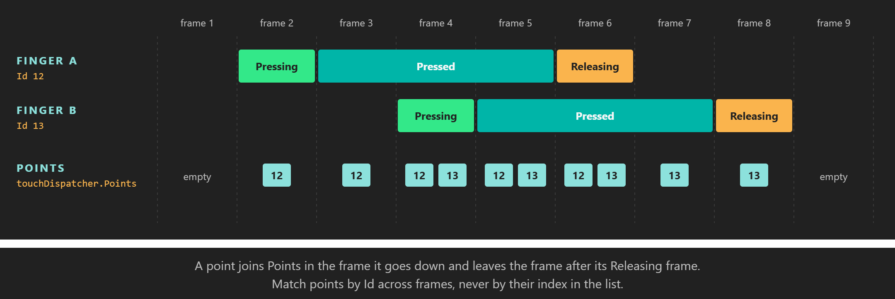

# Touch



*Each finger is one `PointerPoint` in `Points`, from the frame it goes down until the frame after it lifts.*

Touch is the main input on phones and tablets, and many desktop screens support it too. Every finger on the surface is a **pointer** with its own Id, position and [button state](button_states.md), so multi-touch gestures come down to reading a list of points every frame. The touch dispatcher is a `PointerDispatcher`, the same base class the [mouse](mouse.md) uses for its left button.

## TouchDispatcher

Get it from `display.TouchDispatcher` (see [Where input comes from](index.md#where-input-comes-from)). The property is of type `PointerDispatcher`, in the `Evergine.Common.Input.Pointer` namespace, together with `PointerPoint` and `PointerEventArgs`. It is `null` on macOS, which has no touch screen support.

### Properties

| Member | Description |
| --- | --- |
| **Points** | `IList<PointerPoint>` with every pointer tracked in this frame, including the ones in their `Releasing` frame. Empty when nothing touches the surface. |

### Events

| Event | Arguments | Description |
| --- | --- | --- |
| **PointerDown** | `PointerEventArgs` | A new pointer touched the surface. |
| **PointerMove** | `PointerEventArgs` | A pointer changed position. Not raised when the position is the same. |
| **PointerUp** | `PointerEventArgs` | A pointer left the surface. |

| Event argument | Member | Description |
| --- | --- | --- |
| `PointerEventArgs` | **Id** | The Id of the pointer, as in `PointerPoint.Id`. |
| `PointerEventArgs` | **Position** | Position of the pointer, in pixels from the top-left corner of the surface. |

### PointerPoint

| Member | Description |
| --- | --- |
| **Id** | A `long` that identifies the contact while it lasts. It comes from the platform. |
| **Position** | Position in this frame, as a `Point` in pixels from the top-left corner of the surface. |
| **State** | The [button state](button_states.md) of the contact: `Pressing` in its first frame, `Pressed` while it stays down, `Releasing` in the frame it lifts. |

## How points come and go

- A new contact joins `Points` in the frame its down event is dispatched, with the state `Pressing`.
- It stays in the list as `Pressed` while the finger is down, and its `Position` follows the finger.
- In the frame it lifts it is still listed, as `Releasing`, so you can react to the end of a touch. It leaves the list at the next frame.
- The same `PointerPoint` object represents the contact for its whole life. You can keep a reference to it, or use it as a dictionary key, from one frame to the next.

> [!IMPORTANT]
> Ids come from the platform. They are unique among the contacts that are down at the same time, but they are not guaranteed to start at 0, to be consecutive, or to stay unused after a finger lifts. Match points by Id or by reference across frames, never by their index in `Points`.

> [!NOTE]
> The mouse reports its left button as pointer `0` in `display.MouseDispatcher.Points`, a separate list (see [The mouse as a pointer](mouse.md#the-mouse-as-a-pointer)). The WinUI and Android window systems only pass genuine mouse input to the mouse dispatcher. On other window systems the operating system may also report a touch as mouse input, so one finger can show up in both lists. Code that accepts clicks and taps should prefer the touch list and fall back to the mouse one.

## Example: drag and pinch

This behavior turns its entity with a one-finger drag and scales it with a two-finger pinch. It reads the touch points, or the mouse pointer when nothing touches the screen, so a left-button drag turns the entity on desktop too.

```csharp
using System;
using System.Collections.Generic;
using Evergine.Common.Input;
using Evergine.Common.Input.Pointer;
using Evergine.Framework;
using Evergine.Framework.Graphics;
using Evergine.Framework.Services;
using Evergine.Mathematics;

public class DragAndPinch : Behavior
{
    [BindService]
    private GraphicsPresenter graphicsPresenter = null;

    [BindComponent]
    private Transform3D transform = null;

    private readonly List<PointerPoint> points = new List<PointerPoint>();

    // Keyed by the PointerPoint itself, which represents one contact for its whole life.
    private readonly Dictionary<PointerPoint, Point> previousPositions = new Dictionary<PointerPoint, Point>();

    public float RadiansPerPixel { get; set; } = 0.01f;

    protected override void Update(TimeSpan gameTime)
    {
        Display display = this.graphicsPresenter.FocusedDisplay;
        if (display == null)
        {
            return;
        }

        // Prefer touch: some platforms also report a finger as the mouse pointer.
        IList<PointerPoint> source = display.TouchDispatcher?.Points.Count > 0
            ? display.TouchDispatcher.Points
            : display.MouseDispatcher?.Points;

        this.points.Clear();
        if (source != null)
        {
            this.points.AddRange(source);
        }

        // A Releasing point is still listed for one frame, but it no longer touches the surface.
        this.points.RemoveAll(p => p.State == ButtonState.Releasing);

        if (this.points.Count == 1 &&
            this.previousPositions.TryGetValue(this.points[0], out Point last))
        {
            Vector3 rotation = this.transform.LocalRotation;
            rotation.Y += (this.points[0].Position.X - last.X) * this.RadiansPerPixel;
            this.transform.LocalRotation = rotation;
        }
        else if (this.points.Count >= 2 &&
                 this.previousPositions.TryGetValue(this.points[0], out Point last0) &&
                 this.previousPositions.TryGetValue(this.points[1], out Point last1))
        {
            Point p0 = this.points[0].Position;
            Point p1 = this.points[1].Position;
            float distance = Vector2.Distance(new Vector2(p0.X, p0.Y), new Vector2(p1.X, p1.Y));
            float lastDistance = Vector2.Distance(new Vector2(last0.X, last0.Y), new Vector2(last1.X, last1.Y));

            // Scaling by the ratio of distances makes the pinch feel the same at any screen size.
            if (lastDistance > 0f)
            {
                this.transform.LocalScale *= distance / lastDistance;
            }
        }

        this.previousPositions.Clear();
        foreach (PointerPoint point in this.points)
        {
            this.previousPositions[point] = point.Position;
        }
    }
}
```

A point that is new this frame has no previous position, so the gesture starts on the next frame instead of jumping. When one finger of a pinch lifts, the other one already has a previous position and the drag continues smoothly.

## See also

* [Button states](button_states.md): what `PointerPoint.State` means and when it changes.
* [Mouse](mouse.md): the left button as pointer `0`.
* [XR input tracking](../xr/input_tracking/index.md): hands and controllers in XR.
