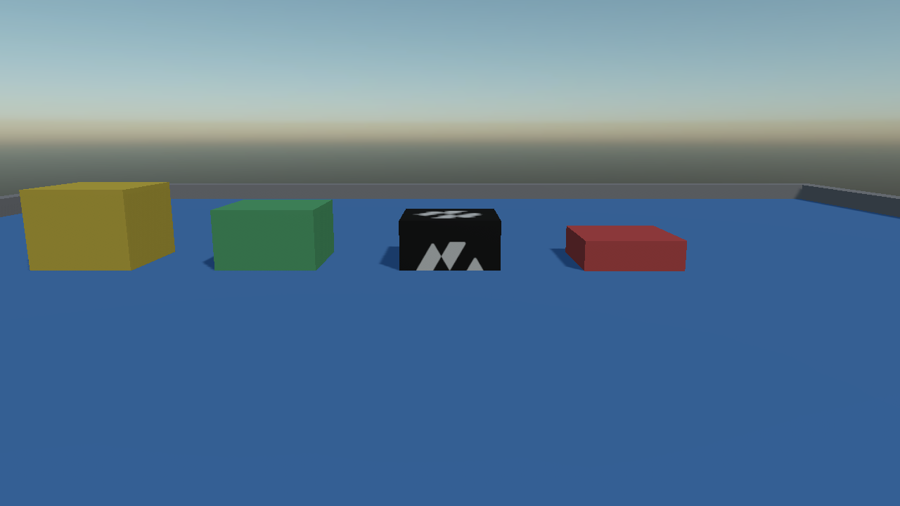
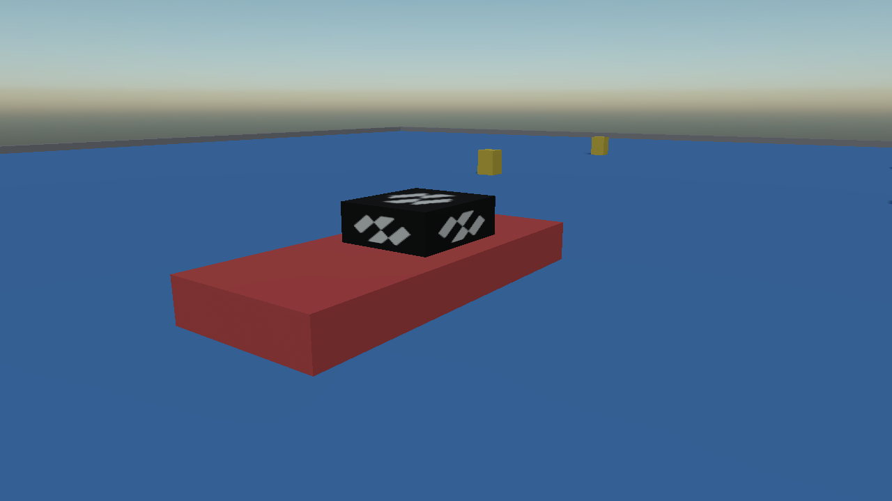

# Buoyancy and Water
---

<video autoplay loop muted playsinline width="100%" height="auto">
  <source src="images/buoyancy_densities.mp4" type="video/mp4">
</video>

There is no water body in the simulation and no buoyancy component. What there is instead is one method on [`RigidBody`](physics_bodies/rigid_body.md), which a body applies to itself once per step:

```csharp
bool submerged = body.ApplyBuoyancy(
    surfacePosition,   // any point on the surface of the fluid
    surfaceNormal,     // which way is up out of it
    buoyancy,          // fluid density over body density
    linearDrag,        // how much the fluid slows it down
    angularDrag,       // how much it stops it turning
    fluidVelocity,     // how fast the fluid itself moves: a current
    deltaTime);        // the length of the step this is applied for
```

It works out how much of the shape is under the surface and pushes accordingly, so a shape half in the water is pushed half as hard, and it applies the drag that makes something moving through water slow down and stop wobbling.

| Point | Detail |
| --- | --- |
| **Dynamic only** | Returns `false` for a static or kinematic body, and for a dynamic one with nothing submerged. A kinematic body has an inverse mass of zero, so the impulse would come to nothing anyway. |
| **Once per fixed step** | The impulse is scaled by the step it is applied for. Driven off the frame instead, it pushes harder on a slow frame than on a fast one — a boat that accelerates when the window is busy. |
| **It wakes the body** | A body asleep on the surface is woken when an impulse is applied to it. |

## There Is No Fluid Density

The parameter that catches people out is `buoyancy`. It is **not** a density; it is a ratio:

```
buoyancy = density of the fluid / density of the body
```

One neither floats nor sinks. Above one floats. And the same number answers the other question you were going to ask, because a floating body settles with **1 / ratio** of itself submerged:

| Body density | `buoyancy` against fresh water | Where it settles |
| --- | --- | --- |
| 200 kg/m³ | 5.0 | a fifth of it under water |
| 500 kg/m³ | 2.0 | half of it under water |
| 800 kg/m³ | 1.25 | four fifths of it under water |
| 1000 kg/m³ | 1.0 | neutral — it hangs wherever it is put |
| 1200 kg/m³ | 0.83 | it sinks |



## Making Something Float

Set the density on the **collider** and let the body work its own mass out. Then the one number decides both how heavy the body is and how high it floats, and the two cannot drift apart:

```csharp
Entity crate = new Entity("crate")
    .AddComponent(new Transform3D() { Position = position, Scale = new Vector3(1.2f) })
    .AddComponent(new MaterialComponent() { Material = woodMaterial })
    .AddComponent(new CubeMesh() { Size = 1f })
    .AddComponent(new MeshRenderer())

    // Mass left at zero, which means "work it out from the colliders".
    .AddComponent(new RigidBody() { LinearDamping = 0.1f })
    .AddComponent(new BoxCollider() { Density = 400f });
```

and then, per step:

```csharp
const float WaterDensity = 1000f;

float density = body.Colliders[0].Density;

body.ApplyBuoyancy(
    new Vector3(0f, surfaceHeight, 0f),
    Vector3.Up,
    WaterDensity / density,
    0.5f,
    0.2f,
    current,
    fixedTimeStep);
```

> [!TIP]
> `linearDrag` around **0.5** and `angularDrag` around **0.2** are a reasonable starting pair. Without them a floating body oscillates about its waterline for ever: buoyancy is a spring, and a spring with no damper does not settle.

## A Plane Has No Edges

The surface is given as a point and a normal — in other words as an **infinite plane**. A crate sitting on dry ground two hundred metres away is below that same plane, so it floats too.

Something therefore has to say where the pool stops, and the natural answer is an [overlap query](queries.md) against the volume of water:

```csharp
private readonly List<OverlapHit> inTheWater = new List<OverlapHit>();

private void OnPhysicsStepStarting(object sender, float fixedTimeStep)
{
    this.inTheWater.Clear();

    this.Physics.OverlapBox(poolCentre, poolHalfExtent, Quaternion.Identity, this.inTheWater, QueryFilter.Default);

    for (int i = 0; i < this.inTheWater.Count; i++)
    {
        RigidBody body = this.inTheWater[i].Body;

        if (body == null || body.BodyType != RigidBodyType.Dynamic)
        {
            continue;
        }

        float density = body.Colliders.Count > 0 ? body.Colliders[0].Density : 0f;

        if (density > 0f)
        {
            body.ApplyBuoyancy(surface, Vector3.Up, WaterDensity / density, 0.5f, 0.2f, this.current, fixedTimeStep);
        }
    }
}
```

The box the query uses **is** the pool: its top face is the water line, and only what comes back out of it is pushed up.

> [!NOTE]
> Give the query box the full depth of the water, not a thin slab at the surface. A body that has sunk to the bottom is still in the water, and dropping out of the query is what makes a heavy crate rest on the floor of the pool with no drag on it at all.

## Loading a Hull

<video autoplay loop muted playsinline width="100%" height="auto">
  <source src="images/buoyancy_raft.mp4" type="video/mp4">
</video>

A raft floats until it is loaded past its own displacement, and this falls out of the same numbers with nothing extra to write: the cargo's weight goes through the contact, the raft sits lower, more of it is submerged, and the push grows until the two balance. Add enough and the waterline reaches the deck.

## Building a Motorboat

<video autoplay loop muted playsinline width="100%" height="auto">
  <source src="images/boat_drive.mp4" type="video/mp4">
</video>

There is no boat controller, and a motorboat does not need one. Everything it does comes out of three forces on an ordinary rigid body that buoyancy is already holding up.

| Piece | How |
| --- | --- |
| **Floating** | `ApplyBuoyancy`, with a hull density around 340 kg/m³ — a ratio near 3, so it rides high. |
| **Thrust** | `ApplyForce(force, worldPosition)` at the **stern**. |
| **Steering** | Rotate the thrust vector by the rudder angle. That is all. |
| **Not sliding sideways** | Resist the lateral part of the hull's velocity — a keel. |
| **Not rolling over** | `CenterOfMassOffset` below the centre of buoyancy. |
| **Stopping** | The drag from `ApplyBuoyancy`, plus `LinearDamping`. |

### Thrust and the rudder

Applying the force **off centre already produces the turning moment**, which is literally what an outboard motor does: the propeller pushes at the back of the boat and the whole hull swings round it. So steering is nothing more than turning one vector:

```csharp
Matrix4x4 world = this.transform.WorldTransform;
Vector3 forward = Vector3.Normalize(world.Forward);
Vector3 up = Vector3.Normalize(world.Up);

// The stern, in world space. Negative offset, because the motor is behind the middle: push from in
// front of the centre of mass and the boat is stable in reverse and unsteerable forwards.
Vector3 stern = this.transform.Position + (forward * this.SternOffset);

Quaternion steer = Quaternion.CreateFromAxisAngle(up, rudderAngle);
Vector3 push = Vector3.Transform(forward, steer) * (this.MaxThrust * throttle);

this.body.ApplyForce(push, stern);
```

### The keel

A box in water has no grip. Without this the boat drifts through its own turns like a puck on ice, which reads as ice rather than as water. Measure the velocity of a point on the keel, take the part of it across the hull, and push the opposite way:

```csharp
Vector3 right = Vector3.Normalize(world.Right);
float sideways = Vector3.Dot(this.body.GetPointVelocity(stern), right);

this.body.ApplyForce(right * (-sideways * this.KeelDamping), stern);
```

### Staying upright

Nothing is driven every step for this. A hull rights itself when its **centre of mass sits below its centre of buoyancy**, which is one property on the body:

```csharp
new RigidBody()
{
    CenterOfMassOffset = new Vector3(0f, -0.45f, 0f),
    LinearDamping = 0.15f,
    AngularDamping = 0.6f,
}
```



> [!TIP]
> Tune the hull density before anything else. Too dense and the boat wallows with its deck awash and the thrust barely moves it; too light and it skitters across the surface with the propeller half out of the water. Around a third of the fluid's density is a sensible place to start.

## In this section
* [Rigid Body](physics_bodies/rigid_body.md)
* [Queries](queries.md)
* [Vehicles](vehicles/index.md)
