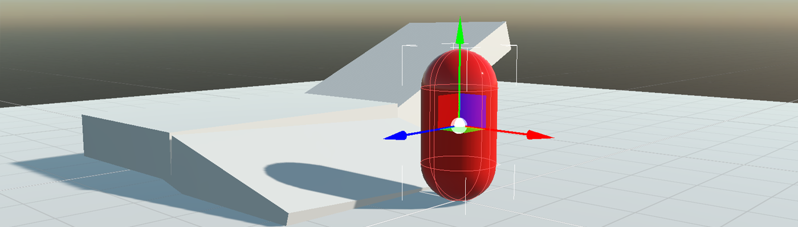
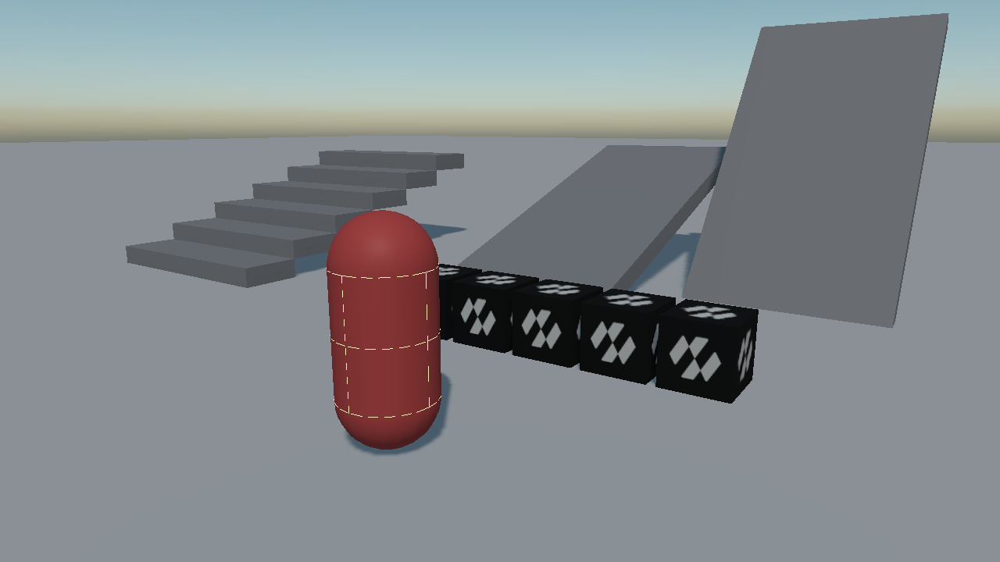
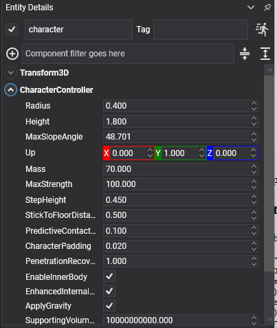

# Character Controller



<video autoplay loop muted playsinline width="100%" height="auto">
  <source src="images/character_walk.mp4" type="video/mp4">
</video>

A **character controller** moves a player or an NPC the way a game expects: it walks at the speed you ask for, climbs steps without jumping, slides off slopes that are too steep, rides moving platforms, and stops dead against walls instead of bouncing off them.

## A character is not a rigid body

This is the thing to understand first, and everything else follows from it.

A [`RigidBody`](physics_bodies/rigid_body.md) is moved by forces. Push it and it accelerates; let go and it keeps going; walk it into a wall and it either bounces or tips over. None of that is what a character should do — a character should move at exactly the speed the player is holding, stop the instant they let go, and stay upright whatever it walks into.

So `CharacterController` is **not** a rigid body. Do not add a `RigidBody` or a `Collider` to the same entity: the component owns its own capsule and moves it by sweeping and sliding rather than by integrating forces.

> [!IMPORTANT]
> The entity's origin is at the character's **feet**, not at the middle of its capsule. Standing on a floor whose top is at y = 0, the entity sits at exactly y = 0. Primitive meshes are centred, so a `CapsuleMesh` drawn on the same entity is buried half way into the ground — put the visual on a child entity lifted by half the height.



*The character's capsule, drawn by [debug rendering](debug_rendering.md). Its origin is at the bottom of it.*

## CharacterController Component



```csharp
const float Height = 1.8f;
const float Radius = 0.4f;

Entity player = new Entity("player")
    .AddComponent(new Transform3D() { Position = new Vector3(0f, 2f, 0f) })
    .AddComponent(new CharacterController()
    {
        Height = Height,
        Radius = Radius,
        StepHeight = 0.45f,
        MaxSlopeAngle = MathHelper.ToRadians(48f),
    })
    .AddComponent(new PlayerInput());

// The visual hangs off a child lifted by half the height, because the controller's origin is at the
// feet while a CapsuleMesh is centred on its own middle.
player.AddChild(new Entity("visual")
    .AddComponent(new Transform3D() { LocalPosition = new Vector3(0f, Height * 0.5f, 0f) })
    .AddComponent(new MaterialComponent() { Material = material })
    .AddComponent(new CapsuleMesh() { Radius = Radius, Height = Height - (2f * Radius) })
    .AddComponent(new MeshRenderer()));

this.Managers.EntityManager.Add(player);
```

## Shape Properties

| Property | Default | Description |
| --- | --- | --- |
| **Radius** | 0.4 | The radius of the capsule. |
| **Height** | 1.8 | The **total** height of the capsule, caps included, from the feet up. |
| **Up** | 0,1,0 | Which way is up for this character. |
| **Mass** | 70 | How heavy the character is when it pushes a dynamic body. |
| **Orientation** | identity | Turns the capsule itself. It does not turn the entity — a character's facing is the entity's business. |
| **EnableInnerBody** | true | Gives the character a body inside its capsule, so other bodies and [queries](queries.md) can see it. Without it the character is invisible to the rest of the simulation. |
| **CharacterPadding** | 0.02 | A small skin kept between the capsule and the world. |

## Movement Properties

<video autoplay loop muted playsinline width="100%" height="auto">
  <source src="images/character_steps.mp4" type="video/mp4">
</video>

| Property | Default | Description |
| --- | --- | --- |
| **StepHeight** | 0.4 | The tallest step the character walks up without jumping. Above this it is a wall. |
| **MaxSlopeAngle** | π/4 (45°) | The steepest slope it can stand on. Steeper than this and it slides back down. |
| **StickToFloorDistance** | 0.5 | How far down the character reaches for the floor when walking over a crest, so it follows the ground instead of launching off it. |
| **MaxStrength** | 100 | The strongest force it may use to push dynamic bodies out of the way, in newtons. |
| **ApplyGravity** | true | Whether gravity is applied. Turn it off for swimming or flying. |
| **PenetrationRecoverySpeed** | 1 | How quickly the character pushes itself out of anything it has ended up inside. |
| **PredictiveContactDistance** | 0.1 | How far ahead contacts are looked for, so a fast character is stopped before it overlaps rather than after. |
| **SupportingVolumeOffset** | 1e10 | How far below the character a contact still counts as ground. The default accepts every contact; around `Radius` is the usual value when a character should not be held up by something it merely brushed. |
| **EnhancedInternalEdgeRemoval** | true | Stops the character catching on the seams between the triangles of a mesh collider. |
| **CollisionCategory** | `Cat1` | Which [category](collision_filtering.md) the character belongs to. |

> [!NOTE]
> `MaxSlopeAngle` is held in **radians** in code and shown in **degrees** in the inspector, as every angle in Evergine is. `MathHelper.ToRadians(48f)` in code and `48` in the inspector are the same value.

## Velocity

| Property | Description |
| --- | --- |
| **LinearVelocity** | The character's velocity. |

> [!IMPORTANT]
> Write only the **horizontal** part of `LinearVelocity`. The component owns the vertical: gravity, landing, jumping and being carried by a moving platform all live there, and overwriting Y every frame is what makes a character that cannot fall, or one that falls at a constant speed. Read the current value, replace X and Z, write it back.

## Ground State

| Property | Description |
| --- | --- |
| **GroundState** | `OnGround`, `OnSteepGround`, `NotSupported` or `InAir`. |
| **IsOnGround** | Shorthand for `GroundState == OnGround`. |
| **GroundNormal** | The normal of whatever it is standing on. |
| **GroundVelocity** | How fast that surface is moving, which is what carries the character on a moving platform. |
| **GroundBody** | The body it is standing on, if there is one. |
| **IsCrouching** | Whether it is currently crouched. |

## Methods and Events

| Member | Description |
| --- | --- |
| **Jump(speed)** | Jumps at the given upward speed. Returns `false`, and does nothing, if the character is not on the ground. |
| **SetCrouching(crouching, crouchHeight = 0.9)** | Crouches or stands. Returns `false` if standing up is blocked by a low ceiling. |
| **Resize(newHeight)** | Changes the capsule's height. Returns `false` if the new size does not fit. |
| **Teleport(position)** | Puts the character somewhere immediately. |
| **ContactAdded** | Raised for each new contact, with a `CharacterContact` carrying the body, entity, normal and surface velocity. |

## Building a Player Controller

<video autoplay loop muted playsinline width="100%" height="auto">
  <source src="images/character_jump.mp4" type="video/mp4">
</video>

```csharp
public class PlayerInput : Behavior
{
    [BindComponent]
    private CharacterController character = null;

    public float Speed { get; set; } = 4.5f;

    public float JumpSpeed { get; set; } = 6f;

    protected override void Update(TimeSpan gameTime)
    {
        KeyboardDispatcher keyboard = this.Managers.RenderManager.ActiveCamera3D?.Display?.KeyboardDispatcher;

        if (keyboard == null)
        {
            return;
        }

        Vector3 direction = new Vector3(
            (keyboard.IsKeyDown(Keys.D) ? 1f : 0f) - (keyboard.IsKeyDown(Keys.A) ? 1f : 0f),
            0f,
            (keyboard.IsKeyDown(Keys.S) ? 1f : 0f) - (keyboard.IsKeyDown(Keys.W) ? 1f : 0f));

        if (direction.LengthSquared() > 0.000001f)
        {
            // Normalized, or holding two keys at once walks a diagonal forty per cent faster than a
            // straight line.
            direction = Vector3.Normalize(direction);
        }

        Vector3 velocity = this.character.LinearVelocity;

        // X and Z replaced, Y left exactly as it was: that is the component's, and writing it here is
        // what produces a character that cannot fall.
        this.character.LinearVelocity = new Vector3(
            direction.X * this.Speed,
            velocity.Y,
            direction.Z * this.Speed);

        // Jump refuses in mid air by itself, so there is no need to check IsOnGround first.
        if (keyboard.IsKeyDown(Keys.Space))
        {
            this.character.Jump(this.JumpSpeed);
        }

        // Crouching can fail: SetCrouching(false) under a low ceiling returns false and stays down,
        // which is exactly the behaviour a crawlspace needs.
        this.character.SetCrouching(keyboard.IsKeyDown(Keys.LeftControl));
    }
}
```

### Riding a moving platform

Nothing extra is needed: the controller reads the surface's velocity and carries the character with it. `GroundVelocity` is there for when gameplay has to know:

```csharp
if (this.character.IsOnGround && this.character.GroundVelocity.LengthSquared() > 0.01f)
{
    this.animation.Play("ride");
}
```

> [!TIP]
> Two settings between them decide how a character feels on rough ground. `StepHeight` is how tall a step it walks up, and `StickToFloorDistance` is how well it stays glued going over a crest. A character that launches off every bump wants more of the second; one that stops at kerbs wants more of the first.
