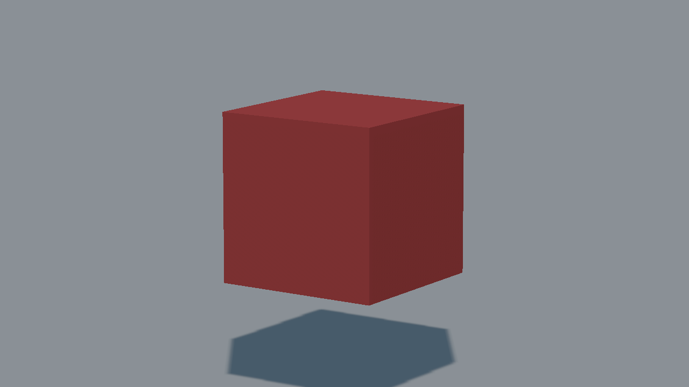
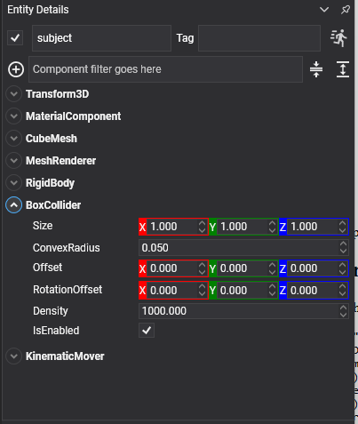

# Box Collider



A box-shaped collider, and the cheapest shape the solver has. Crates, walls, platforms, floors: most of a level is boxes.

## BoxCollider Component



Add a `BoxCollider` to an entity that has a [`RigidBody`](../physics_bodies/rigid_body.md), or to any descendant of one.

```csharp
Entity crate = new Entity("crate")
    .AddComponent(new Transform3D() { Position = position })
    .AddComponent(new MaterialComponent() { Material = material })
    .AddComponent(new CubeMesh())
    .AddComponent(new MeshRenderer())
    .AddComponent(new RigidBody())
    .AddComponent(new BoxCollider() { Size = new Vector3(1f, 1f, 1f) });

this.Managers.EntityManager.Add(crate);
```

## Properties

| Property | Default | Description |
| --- | --- | --- |
| **Size** | 1,1,1 | The **full** size of the box, not its half extents, in local units before the entity's scale is applied.<br/><video width="600" height="340" autoplay loop muted playsinline><source src="images/box_collider_size.mp4" type="video/mp4"></video> |
| **ConvexRadius** | 0.05 | Rounds the edges of the box by this much, which is what lets the solver find contacts cheaply and reliably. It is clamped to half of the smallest half extent, so a small box quietly gets a smaller radius. |
| **Offset** | 0,0,0 | Moves the shape relative to the entity.<br/><video width="600" height="340" autoplay loop muted playsinline><source src="images/box_collider_offset.mp4" type="video/mp4"></video> |
| **RotationOffset** | 0,0,0 | Rotates the shape relative to the entity.<br/><video width="600" height="340" autoplay loop muted playsinline><source src="images/box_collider_rotationoffset.mp4" type="video/mp4"></video> |
| **Density** | 1000 | Density in kg/m³, used to compute the body's mass when its `Mass` is 0. |

> [!NOTE]
> `Size` is combined with the entity's scale, so a box of size 1 on an entity scaled to 4×0.2×4 is a 4×0.2×4 slab. That is what makes the one-line floor in [Using Physics Bodies](../physics_bodies/using_physics_bodies.md) work.

> [!TIP]
> The convex radius is real: it makes the simulated box very slightly smaller and rounder than the drawn one. It only shows on small boxes, where the fix is to lower `ConvexRadius` rather than to grow the box.
