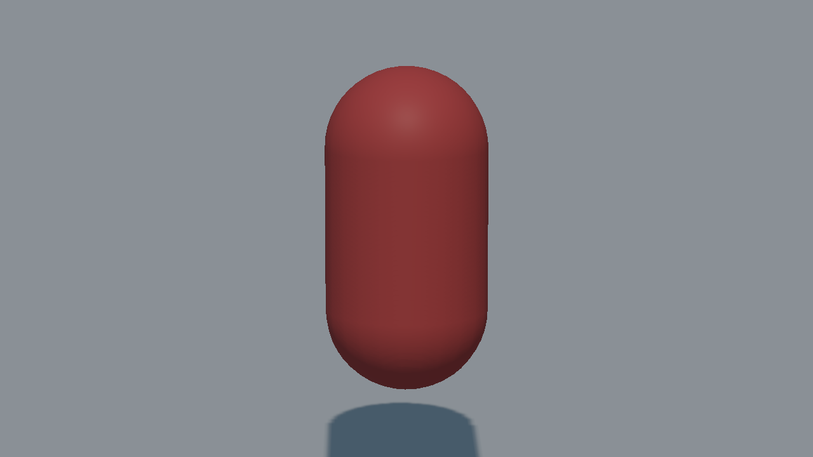
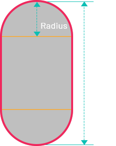
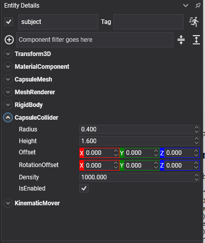

# Capsule Collider



A cylinder with a hemisphere at each end, standing along the local **Y** axis. It is the standard shape for anything upright (characters, barrels, limbs) because it has no edges to catch on and slides smoothly over steps and seams.



## CapsuleCollider Component



```csharp
Entity barrel = new Entity("barrel")
    .AddComponent(new Transform3D() { Position = position })
    .AddComponent(new MaterialComponent() { Material = material })

    // CapsuleMesh.Height is the straight section only, so the caps are added on top of it: a total
    // height of 1.6 with a radius of 0.4 is a mesh height of 1.6 - (2 * 0.4) = 0.8.
    .AddComponent(new CapsuleMesh() { Radius = 0.4f, Height = 0.8f })
    .AddComponent(new MeshRenderer())
    .AddComponent(new RigidBody())
    .AddComponent(new CapsuleCollider() { Radius = 0.4f, Height = 1.6f });

this.Managers.EntityManager.Add(barrel);
```

## Properties

| Property | Default | Description |
| --- | --- | --- |
| **Radius** | 0.5 | The radius of the cylinder and of both caps.<br/><video width="600" height="340" autoplay loop muted playsinline><source src="images/capsule_collider_radius.mp4" type="video/mp4"></video> |
| **Height** | 2 | The **total** height, caps included, from the bottom of the lower hemisphere to the top of the upper one.<br/><video width="600" height="340" autoplay loop muted playsinline><source src="images/capsule_collider_height.mp4" type="video/mp4"></video> |
| **Offset** | 0,0,0 | Moves the shape relative to the entity. |
| **RotationOffset** | 0,0,0 | Rotates the shape relative to the entity. A capsule stands along Y, so this is how a capsule is laid on its side. |
| **Density** | 1000 | Density in kg/m³, used to compute the body's mass when its `Mass` is 0. |

> [!IMPORTANT]
> `CapsuleCollider.Height` and `CapsuleMesh.Height` do not mean the same thing. The collider's is the total including the caps; the mesh's is only the straight section between them. Feeding the same number to both draws a capsule one radius taller at each end than the one being simulated, which usually shows up as a body apparently sunk into the floor.

> [!TIP]
> A capsule is nearly always the right shape for a character body. See the [Character Controller](../character_controller.md), which builds one for you and takes the same `Radius` and total `Height`.
