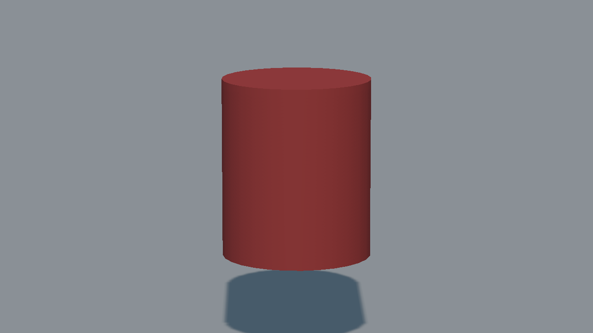
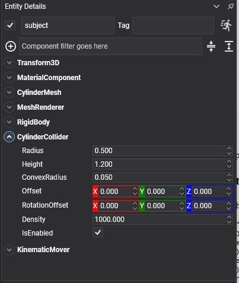

# Cylinder Collider



A cylinder standing along the local **Y** axis, with flat caps at each end. Wheels, barrels, columns, coins.

## CylinderCollider Component



```csharp
Entity column = new Entity("column")
    .AddComponent(new Transform3D() { Position = position })
    .AddComponent(new MaterialComponent() { Material = material })
    .AddComponent(new CylinderMesh() { Diameter = 1f, Height = 1.2f })
    .AddComponent(new MeshRenderer())
    .AddComponent(new RigidBody())
    .AddComponent(new CylinderCollider() { Radius = 0.5f, Height = 1.2f });

this.Managers.EntityManager.Add(column);
```

## Properties

| Property | Default | Description |
| --- | --- | --- |
| **Radius** | 0.5 | The radius of the cylinder. A `CylinderMesh` is measured by its **diameter**, so a mesh of diameter 1 matches a collider of radius 0.5.<br/><video width="600" height="340" autoplay loop muted playsinline><source src="images/cylinder_collider_radius.mp4" type="video/mp4"></video> |
| **Height** | 1 | The full height along Y. The mesh and the collider agree about this one.<br/><video width="600" height="340" autoplay loop muted playsinline><source src="images/cylinder_collider_height.mp4" type="video/mp4"></video> |
| **ConvexRadius** | 0.05 | Rounds the rim where the caps meet the side. |
| **Offset** | 0,0,0 | Moves the shape relative to the entity. |
| **RotationOffset** | 0,0,0 | Rotates the shape relative to the entity. A cylinder stands along Y, so this is how one is laid on its side to become a wheel or a roller. |
| **Density** | 1000 | Density in kg/m³, used to compute the body's mass when its `Mass` is 0. |

> [!TIP]
> For anything that has to roll smoothly over uneven ground, a [capsule](capsule_collider.md) beats a cylinder: the cylinder's rim is a hard edge, and a hard edge is what catches on the seam between two triangles. For a wheel on a vehicle, use [`VehicleWheel`](../vehicles/vehicle_wheel.md) instead, which is not a collider at all.
