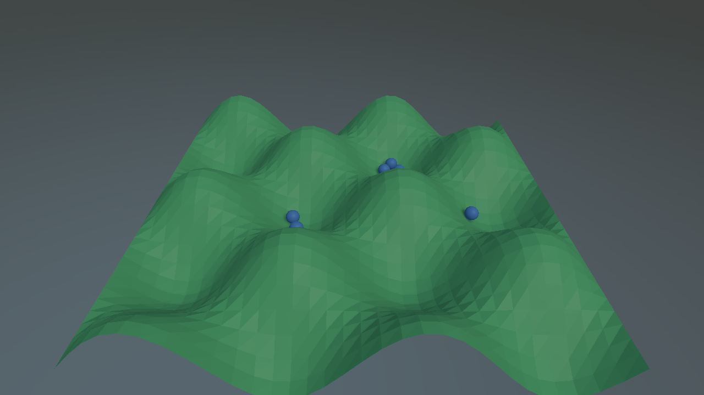
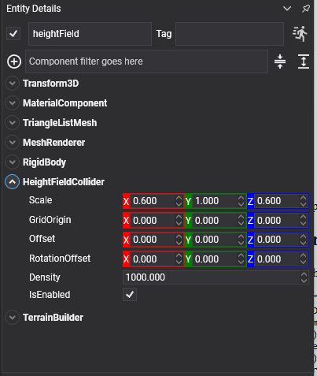
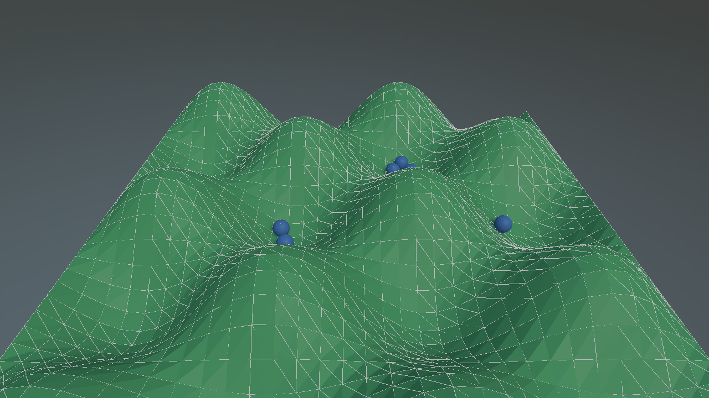

# Height Field Collider



A terrain built from a square grid of heights. For the same ground it is far cheaper than a [triangle mesh](mesh_collider.md), one float per sample instead of three vertices per triangle, and it is the only collider that can be **deformed while the simulation runs**.

## HeightFieldCollider Component



The heights cannot come from the inspector, so they are always set from code:

```csharp
public class TerrainBuilder : Behavior
{
    [BindComponent]
    private HeightFieldCollider collider = null;

    public uint Samples { get; set; } = 64;

    public float Amplitude { get; set; } = 2f;

    protected override void Start()
    {
        float[] heights = new float[this.Samples * this.Samples];

        for (uint z = 0; z < this.Samples; z++)
        {
            for (uint x = 0; x < this.Samples; x++)
            {
                heights[(z * this.Samples) + x] =
                    (float)(Math.Sin(x * 0.2f) * Math.Cos(z * 0.2f)) * this.Amplitude;
            }
        }

        this.collider.SetHeights(heights, this.Samples);
    }
}
```

<video autoplay loop muted playsinline width="100%" height="auto">
  <source src="images/heightfield_balls.mp4" type="video/mp4">
</video>



*The same field with `PhysicsDebugFlags.Colliders` on. A height field is stored as a grid of heights rather than as triangles, and the wireframe is where that grid actually is.*

## Properties

| Property | Default | Description |
| --- | --- | --- |
| **Scale** | 1,1,1 | The size of one grid cell along X and Z, and the vertical scale applied to the stored heights. |
| **GridOrigin** | 0,0,0 | Where the first sample sits relative to the collider. This is the corner the grid grows from, and is separate from `Offset`, which moves the whole shape. |
| **SampleCount** | *read-only* | How many samples there are along each side, as given to `SetHeights`. |
| **Offset** | 0,0,0 | Moves the shape relative to the entity. |
| **RotationOffset** | 0,0,0 | Rotates the shape relative to the entity. |
| **Density** | 1000 | Unused: a height field has no volume. |

> [!IMPORTANT]
> A height field cannot back a **dynamic** body: static and kinematic only. Its sample count must also be a **power of two**, which is what the acceleration structure is built around. `SetHeights` throws if it is not.

## Methods

| Method | Description |
| --- | --- |
| **SetHeights(samples, sampleCount)** | Replaces the whole grid. One height per grid point, row major, `sampleCount` squared entries. |
| **SetHeights(x, z, sizeX, sizeZ, regionHeights)** | Deforms a rectangle **in place**, without rebuilding the shape or the body. Returns whether the deformation reached the simulation. |
| **GetHeight(x, z)** | The height stored at one grid point, before the vertical scale. |
| **GetHeights(x, z, sizeX, sizeZ, destination)** | Reads a rectangle back **from the simulation**, quantization included. That is what a ray actually hits, and it may differ slightly from what was written. |

## Deforming Terrain at Run Time

The region overload is what craters, wheel ruts and excavation are made of. Nothing is rebuilt and no body is recreated, so it can be done every frame:

```csharp
public void Crater(uint centreX, uint centreZ, uint size, float depth)
{
    float[] region = new float[size * size];

    // Read what is there now, then push it down. Reading through the collider rather than from a copy
    // kept alongside means the dents accumulate instead of each one starting from the original ground.
    this.collider.GetHeights(centreX, centreZ, size, size, region);

    for (int i = 0; i < region.Length; i++)
    {
        region[i] -= depth;
    }

    this.collider.SetHeights(centreX, centreZ, size, size, region);
}
```

> [!IMPORTANT]
> Two rules for the region overload. The rectangle must be **aligned to the internal block size**, so both its position and its size have to be multiples of it, and heights are **quantized into the range the shape was created with**. Terrain that will be raised later needs that headroom present in the grid it was first built from, or the raised part is clipped flat.

<video autoplay loop muted playsinline width="100%" height="auto">
  <source src="images/terrain_grounds.mp4" type="video/mp4">
</video>

*The three grounds that are not primitives, in one scene: a height field on the left, a triangle mesh in the middle, and an infinite plane under all of it.*

> [!NOTE]
> The collider is only the physics side. Drawing the terrain is a separate job: generate a mesh from the same heights, and regenerate the part of it that a deformation touched.
