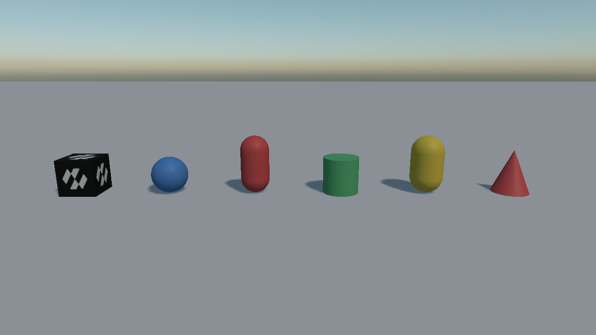
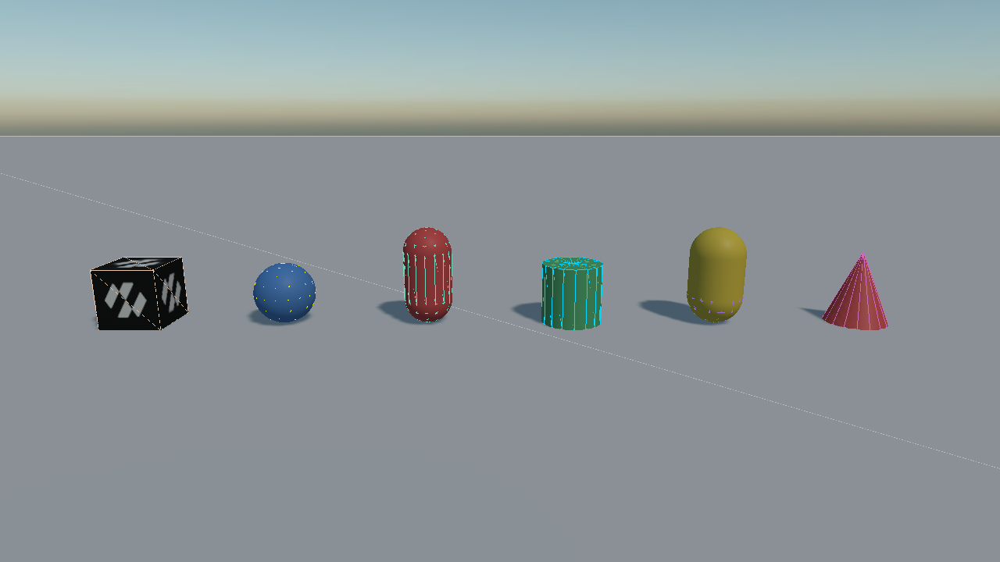

# Colliders
---



A [`RigidBody`](../physics_bodies/rigid_body.md) has no shape of its own. **Colliders** are what give it one: where it is solid, what it can hit, and, through their density, how heavy it is.

A body collects **every collider on its own entity and on its descendants** when it is created, and builds one shape from them. The walk stops at any descendant that carries a `RigidBody` of its own, since that entity is a separate body.


*Two bodies, drawn with `PhysicsDebugFlags.Colliders` on. **Left**: the ordinary case, one `RigidBody`
and one `BoxCollider` on the same entity, and the body's shape is that collider. **Right**: a table
whose `RigidBody` is on the root and whose five `BoxCollider` components are on its children. The
children carry no body of their own, and there is no compound collider component to add: the
hierarchy is the compound.*

<video autoplay loop muted playsinline width="100%" height="auto">
  <source src="images/compound_collider_drop.mp4" type="video/mp4">
</video>

*Which is what "one body" means in practice: shoved over, the table tips as a single object rather
than coming apart into a top and four legs.*



*Every collider shape in the gallery scene with its wireframe drawn over it. This is the flag worth
leaving on while a scene is being built: it says whether each shape is the size, and in the place,
that you think it is.*

## Base Properties

Every collider has these, whatever its shape:

| Property | Default | Description |
| --- | --- | --- |
| **Offset** | 0,0,0 | Moves the shape relative to the entity, in local space. The drawn mesh does not move with it. |
| **RotationOffset** | 0,0,0 | Rotates the shape relative to the entity. Shown in degrees in the inspector and held in radians in code. |
| **Density** | 1000 | Density in kg/m³, used to work out the body's mass when its `Mass` is left at 0. Water is 1000; oak is about 700; steel is about 7850. |

<video autoplay loop muted playsinline width="100%" height="auto">
  <source src="images/box_collider_offset.mp4" type="video/mp4">
</video>

*`Offset` in action. The mesh stays where the entity is and only the shape moves, which is what the gap between the two shows.*

## Choosing a Collider

| Collider | Convex | Bodies | Notes |
| --- | --- | --- | --- |
| [Box](box_collider.md) | yes | any | The cheapest shape there is. Reach for it first. |
| [Sphere](sphere_collider.md) | yes | any | Cheaper still to test, and rolls. |
| [Capsule](capsule_collider.md) | yes | any | The standard shape for anything that stands up. Never catches on a seam. |
| [Cylinder](cylinder_collider.md) | yes | any | Wheels, barrels, columns. |
| [Tapered Capsule](tapered_capsule_collider.md) | yes | any | A capsule with a different radius at each end. |
| [Tapered Cylinder](tapered_cylinder_collider.md) | yes | any | A truncated cone, and a plain cone when its top radius is 0. |
| [Mesh (convex hull)](mesh_collider.md) | yes | any | The convex wrapping of a model. Anything hollow or concave is filled in. |
| [Mesh (triangle mesh)](mesh_collider.md) | no | **not dynamic** | Every triangle of a model, concavities and all. Static or kinematic bodies only. |
| [Plane](plane_collider.md) | no | **not dynamic** | An infinite ground plane, and the cheapest ground there is. |
| [Height Field](heightfield_collider.md) | no | **not dynamic** | A grid of heights: terrain, deformable at run time. |

<video autoplay loop muted playsinline width="100%" height="auto">
  <source src="images/colliders_drop.mp4" type="video/mp4">
</video>

*Every convex collider dropped side by side: box, sphere, capsule, cylinder, tapered capsule, and a cone (a tapered cylinder with its top radius at zero).*

> [!TIP]
> A pile of primitives beats a mesh collider nearly every time. A convex hull is more expensive to test than a box, a triangle mesh cannot go on a moving body at all, and three boxes describe most props well enough that no one will notice the difference.

## Compound Shapes from Code

```csharp
// A table: one top and four legs, all on one body. The child entities carry the colliders; only the
// root carries the RigidBody, so the five shapes end up as one compound body.
Entity table = new Entity("table")
    .AddComponent(new Transform3D())
    .AddComponent(new RigidBody())
    .AddComponent(new BoxCollider() { Size = new Vector3(2f, 0.1f, 1.2f), Offset = new Vector3(0f, 0.7f, 0f) });

foreach (Vector3 corner in legs)
{
    table.AddChild(new Entity()
        .AddComponent(new Transform3D() { LocalPosition = corner })
        .AddComponent(new BoxCollider() { Size = new Vector3(0.1f, 0.7f, 0.1f) }));
}

this.Managers.EntityManager.Add(table);
```

Colliders added or changed after the body exists need the shape rebuilding:

```csharp
this.body.InvalidateShape();
```

## In this section
* [Box Collider](box_collider.md)
* [Sphere Collider](sphere_collider.md)
* [Capsule Collider](capsule_collider.md)
* [Cylinder Collider](cylinder_collider.md)
* [Tapered Capsule Collider](tapered_capsule_collider.md)
* [Tapered Cylinder Collider](tapered_cylinder_collider.md)
* [Mesh Collider](mesh_collider.md)
* [Plane Collider](plane_collider.md)
* [Height Field Collider](heightfield_collider.md)
