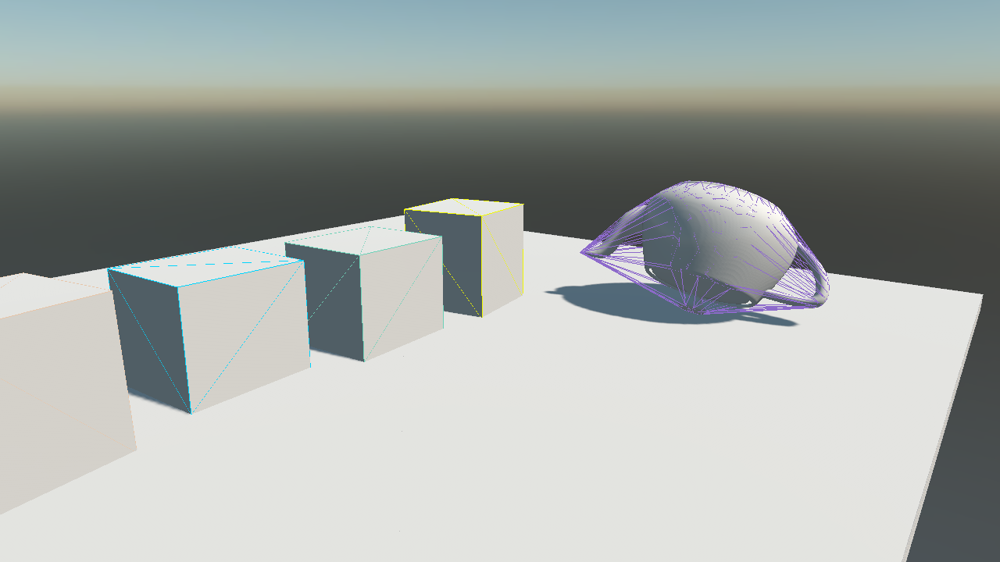
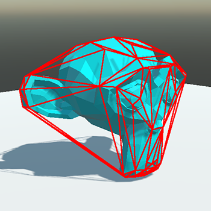
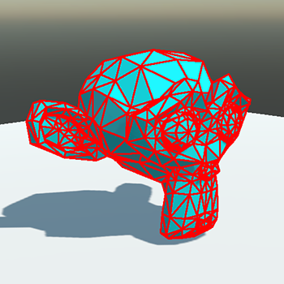
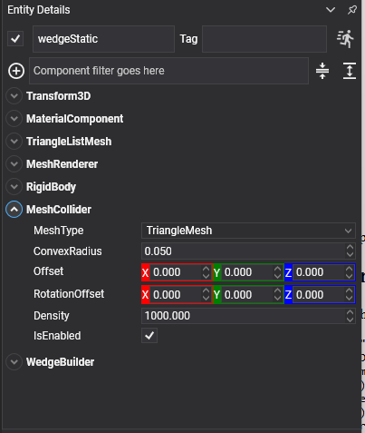

# Mesh Collider



*A convex hull drawn over the mesh it was built from. The two are visibly not the same object, which is the whole idea of a hull in one picture: the spout and the handle are inside it, not part of it.*

<video autoplay loop muted playsinline width="100%" height="auto">
  <source src="images/mesh_collider_hull.mp4" type="video/mp4">
</video>

A collider built from triangle geometry: either the model already on the entity, or vertices handed over from code. It is how a prop gets a shape that primitives cannot describe.

## Convex Hull or Triangle Mesh

`MeshCollider` has two modes, and the difference between them decides what the collider can be used for.

| | Mode | Shape | Bodies |
| --- | --- | --- | --- |
|  | **ConvexHull** | The convex wrapping of the geometry. Every dent, hole and cavity is filled in. | Any body, including dynamic ones. |
|  | **TriangleMesh** | Every triangle, concavities and all. | **Static or kinematic bodies only**, never dynamic. |

<video autoplay loop muted playsinline width="100%" height="auto">
  <source src="images/mesh_collider_types.mp4" type="video/mp4">
</video>

*The same wedge twice. On the left, as a triangle mesh: the balls settle into the dip. On the right, as a convex hull: the hull has put a lid over the dip and they roll straight off.*

> [!IMPORTANT]
> A triangle mesh is a surface, not a solid. It has no volume, so it has no mass and no inertia, and the solver has no way to tell inside from outside, which is why it is rejected on dynamic bodies. For a moving object, use a convex hull, or better, a handful of primitives.

## MeshCollider Component



Put it on an entity that already carries a model and it reads the model's meshes:

```csharp
Entity rock = new Entity("rock")
    .AddComponent(new Transform3D() { Position = position })
    .AddComponent(new MaterialComponent() { Material = material })
    .AddComponent(new MeshComponent() { Model = rockModel })
    .AddComponent(new MeshRenderer())
    .AddComponent(new RigidBody())
    .AddComponent(new MeshCollider() { MeshType = MeshColliderType.ConvexHull });

this.Managers.EntityManager.Add(rock);
```

## Properties

| Property | Default | Description |
| --- | --- | --- |
| **MeshType** | `ConvexHull` | `ConvexHull` wraps the geometry and works on any body; `TriangleMesh` keeps every triangle and works on static and kinematic bodies only. |
| **ConvexRadius** | 0.05 | Rounds the hull's edges. Ignored in `TriangleMesh` mode. |
| **Offset** | 0,0,0 | Moves the shape relative to the entity. |
| **RotationOffset** | 0,0,0 | Rotates the shape relative to the entity. |
| **Density** | 1000 | Density in kg/m³, used to compute the body's mass when its `Mass` is 0. Only meaningful for a convex hull, which is the only one of the two with a volume. |

## Reading the Model

With no geometry set from code, the collider reads the meshes of the `BaseModel` on the same entity and merges all of them into one shape. There are three requirements:

* the meshes must be **triangle lists**;
* their positions must be `Float3` or `Float4`;
* their vertex buffers must be **readable by the CPU**.

A convex hull needs at least four points to enclose a volume.

## Setting Geometry from Code

Generated geometry (terrain, a procedural mesh, a shape assembled at run time) is handed over directly, and takes precedence over the model:

```csharp
public class WedgeBuilder : Behavior
{
    [BindComponent]
    private MeshCollider collider = null;

    protected override void Start()
    {
        Vector3[] vertices = BuildVertices();
        int[] indices = BuildIndices();

        // Vertices in the entity's local space. The collider applies the entity's scale itself, so
        // geometry baked at world scale ends up scaled twice.
        this.collider.SetGeometry(vertices, indices);
    }
}
```

| Method | Description |
| --- | --- |
| **SetGeometry(vertices, indices)** | Uses this geometry instead of the model's. |
| **ClearGeometry()** | Goes back to reading the model. |

> [!TIP]
> For a heightmap, [`HeightFieldCollider`](heightfield_collider.md) beats a triangle mesh: it stores one float per sample instead of three vertices per triangle, tests faster, and can be deformed at run time without rebuilding the shape.
