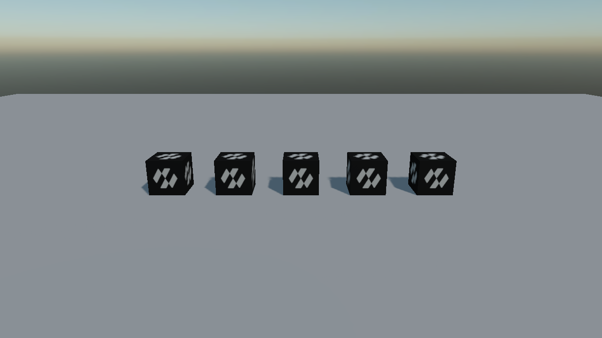
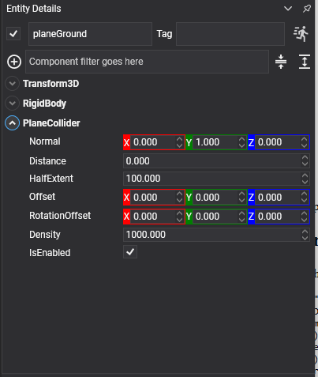

# Plane Collider



An infinite plane, and the cheapest ground there is. Nothing can fall off it and nothing can fall through it, so it makes an excellent floor for a test scene, a safety net under a level, or a water surface for buoyancy.

It has no geometry to draw. The picture above is the bodies resting on it and the floor mesh placed at the same height; the plane itself is invisible.

## PlaneCollider Component



```csharp
Entity ground = new Entity("ground")
    .AddComponent(new Transform3D())
    .AddComponent(new RigidBody() { BodyType = RigidBodyType.Static, Friction = 0.6f })
    .AddComponent(new PlaneCollider()
    {
        Normal = Vector3.Up,
        Distance = 0f,
    });

this.Managers.EntityManager.Add(ground);
```

<video autoplay loop muted playsinline width="100%" height="auto">
  <source src="images/plane_collider_drop.mp4" type="video/mp4">
</video>

## Properties

| Property | Default | Description |
| --- | --- | --- |
| **Normal** | 0,1,0 | Which way the plane faces. It is normalized for you, so it need not be a unit vector. |
| **Distance** | 0 | The constant of the plane equation, the same convention as `Plane.D`: the surface is where `Normal · point + Distance` is zero. With an up normal, `-3` puts the plane three metres **above** the entity origin. |
| **HalfExtent** | 1000 | How large the plane claims to be **for the broad phase only**. The plane itself is still infinite; this is the size of the box the world uses to decide what might be near it. |
| **Offset** | 0,0,0 | Moves the shape relative to the entity. |
| **RotationOffset** | 0,0,0 | Rotates the shape relative to the entity. |
| **Density** | 1000 | Unused: a plane has no volume, so it can carry no mass. |

> [!IMPORTANT]
> A plane collider cannot back a **dynamic** body — static and kinematic only. Like a triangle mesh it is a surface with no volume, so it has no mass and no inside. A dynamic body given one traces a warning and ignores it.

> [!TIP]
> Leave `HalfExtent` alone unless the scene is very large. It costs nothing to have it bigger than the level, and a value smaller than the area bodies actually reach means they stop being tested against the plane once they leave it — which looks exactly like the floor having a hole in it.
