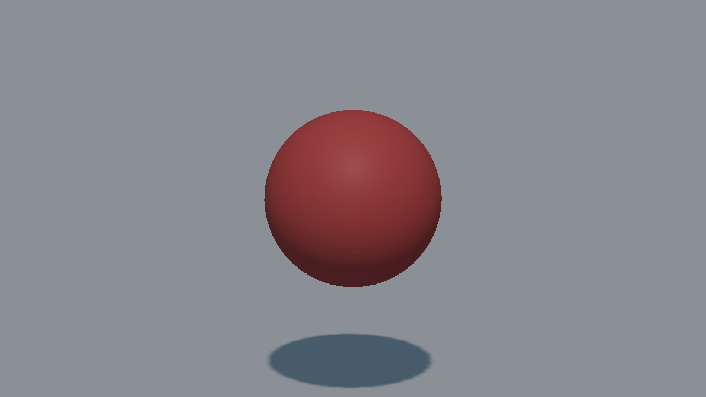
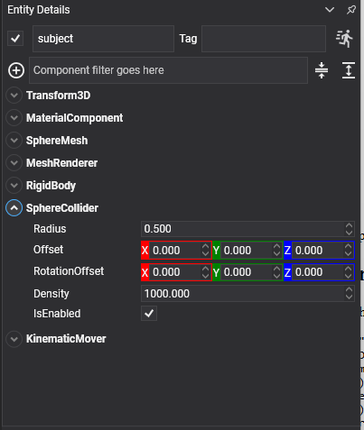

# Sphere Collider



A sphere. The cheapest shape to test after a box, the only one with no orientation to get wrong, and the only primitive that rolls convincingly.

## SphereCollider Component



```csharp
Entity ball = new Entity("ball")
    .AddComponent(new Transform3D() { Position = position })
    .AddComponent(new MaterialComponent() { Material = material })
    .AddComponent(new SphereMesh() { Diameter = 1f })
    .AddComponent(new MeshRenderer())
    .AddComponent(new RigidBody() { Restitution = 0.6f })
    .AddComponent(new SphereCollider() { Radius = 0.5f });

this.Managers.EntityManager.Add(ball);
```

## Properties

| Property | Default | Description |
| --- | --- | --- |
| **Radius** | 0.5 | The radius of the sphere. A `SphereMesh` is measured by its **diameter**, so a mesh of diameter 1 matches a collider of radius 0.5.<br/><video width="600" height="340" autoplay loop muted playsinline><source src="images/sphere_collider_radius.mp4" type="video/mp4"></video> |
| **Offset** | 0,0,0 | Moves the shape relative to the entity.<br/><video width="600" height="340" autoplay loop muted playsinline><source src="images/sphere_collider_offset.mp4" type="video/mp4"></video> |
| **RotationOffset** | 0,0,0 | Rotates the shape relative to the entity. It has no visible effect on a sphere on its own, but it still applies inside a compound shape. |
| **Density** | 1000 | Density in kg/m³, used to compute the body's mass when its `Mass` is 0. |

> [!NOTE]
> A sphere needs no convex radius: it is already round everywhere, which is also why it is the shape least likely to catch on the seam between two triangles of a mesh collider.

> [!TIP]
> A sphere that will never stop rolling is usually asking for `AngularDamping` on its body rather than more friction.
