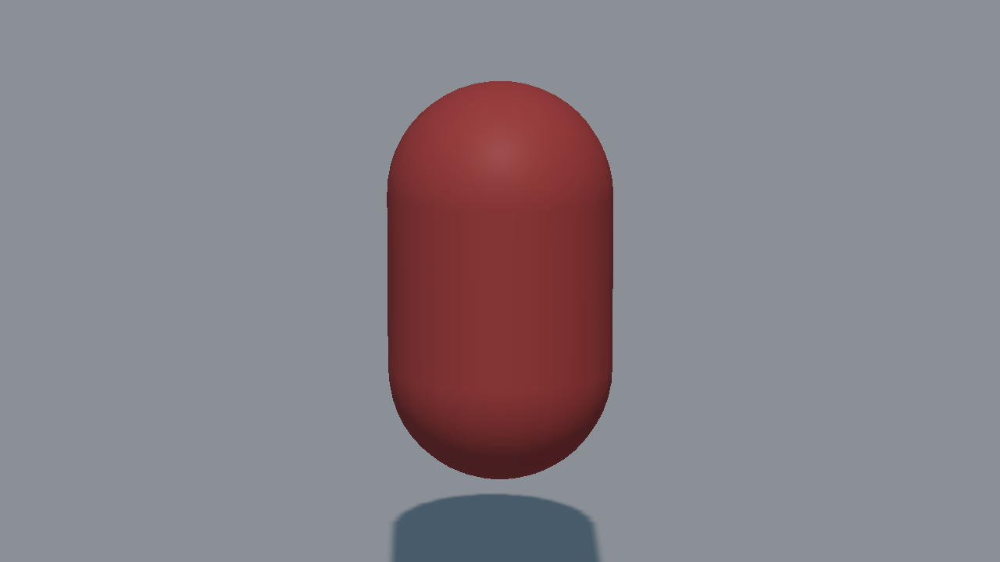
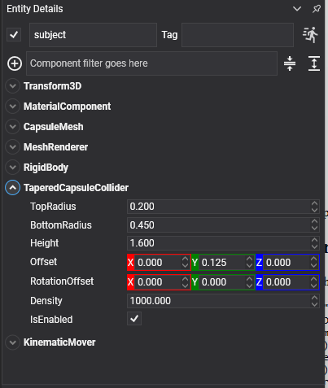

# Tapered Capsule Collider



A capsule with a different radius at each end: two spheres of different sizes with the surface stretched between them. Limbs, tapered bottles, pear-shaped props — anything that is broadly a capsule but thicker at one end.

This shape had no equivalent in the previous API.

## TaperedCapsuleCollider Component



```csharp
Entity limb = new Entity("limb")
    .AddComponent(new Transform3D() { Position = position })
    .AddComponent(new RigidBody())
    .AddComponent(new TaperedCapsuleCollider()
    {
        BottomRadius = 0.45f,
        TopRadius = 0.2f,
        Height = 1.6f,
    });

this.Managers.EntityManager.Add(limb);
```

## Properties

| Property | Default | Description |
| --- | --- | --- |
| **BottomRadius** | 0.5 | The radius of the lower sphere. |
| **TopRadius** | 0.25 | The radius of the upper sphere.<br/><video width="600" height="340" autoplay loop muted playsinline><source src="images/tapered_capsule_collider_radii.mp4" type="video/mp4"></video> |
| **Height** | 2 | The **total** height along Y, both caps included — the same convention as [`CapsuleCollider`](capsule_collider.md). |
| **Offset** | 0,0,0 | Moves the shape relative to the entity. |
| **RotationOffset** | 0,0,0 | Rotates the shape relative to the entity. |
| **Density** | 1000 | Density in kg/m³, used to compute the body's mass when its `Mass` is 0. |

> [!IMPORTANT]
> A tapered capsule is **not symmetric about the entity's origin**. Its two sphere centres sit at plus and minus half of the *straight* section — `(Height − TopRadius − BottomRadius) / 2` — so the shape reaches that plus `BottomRadius` downwards and only that plus `TopRadius` upwards. With a height of 1.6, a bottom radius of 0.45 and a top of 0.2, that is 0.925 down against 0.675 up, so the shape's middle sits 0.125 below the entity. Since every primitive mesh is centred, a drawn capsule placed on the same entity will look as though it is floating. Lifting the collider by half the difference of the radii — `Offset = (0, (BottomRadius - TopRadius) / 2, 0)` — puts the two back on top of each other.

> [!NOTE]
> There is no tapered capsule primitive mesh, so the picture above is the collider's own wireframe from [debug rendering](../debug_rendering.md). To draw one, use a model, or a straight `CapsuleMesh` if the taper is slight.
