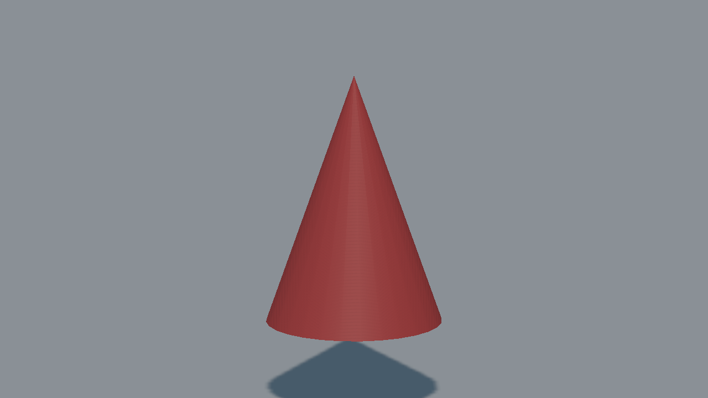
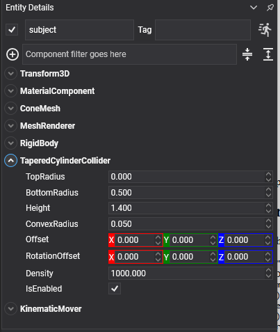

# Tapered Cylinder Collider



A cylinder with a different radius at each end: a truncated cone. Setting its top radius to **zero** makes a plain cone, which is how cones are built now: there is no separate cone collider any more.

## TaperedCylinderCollider Component



```csharp
// A cone: top radius zero.
Entity cone = new Entity("cone")
    .AddComponent(new Transform3D() { Position = position })
    .AddComponent(new MaterialComponent() { Material = material })
    .AddComponent(new ConeMesh() { Diameter = 1f, Height = 1.4f })
    .AddComponent(new MeshRenderer())
    .AddComponent(new RigidBody())
    .AddComponent(new TaperedCylinderCollider()
    {
        BottomRadius = 0.5f,
        TopRadius = 0f,
        Height = 1.4f,
    });

this.Managers.EntityManager.Add(cone);
```

## Properties

| Property | Default | Description |
| --- | --- | --- |
| **BottomRadius** | 0.5 | The radius of the lower cap. |
| **TopRadius** | 0 | The radius of the upper cap. **Zero makes a cone.**<br/><video width="600" height="340" autoplay loop muted playsinline><source src="images/tapered_cylinder_collider_top_radius.mp4" type="video/mp4"></video> |
| **Height** | 1 | The full height along Y. |
| **ConvexRadius** | 0.05 | Rounds the rims. |
| **Offset** | 0,0,0 | Moves the shape relative to the entity. |
| **RotationOffset** | 0,0,0 | Rotates the shape relative to the entity. |
| **Density** | 1000 | Density in kg/m³, used to compute the body's mass when its `Mass` is 0. |

The clip above sweeps `TopRadius` from 0 to the bottom radius and back: a cone at one end of the swing, a plain cylinder at the other, and every truncated cone in between.

> [!NOTE]
> This shape replaces the `ConeCollider3D` of the previous API. A cone is a tapered cylinder whose top radius happens to be zero, so one component covers both and the awkward middle ground between them. See [Migrating from Bullet](../migrating_from_bullet.md).

> [!NOTE]
> There is no tapered cylinder primitive mesh. The picture above is the collider's own wireframe from [debug rendering](../debug_rendering.md); the hero image is a `ConeMesh`, which matches only the `TopRadius = 0` case.
