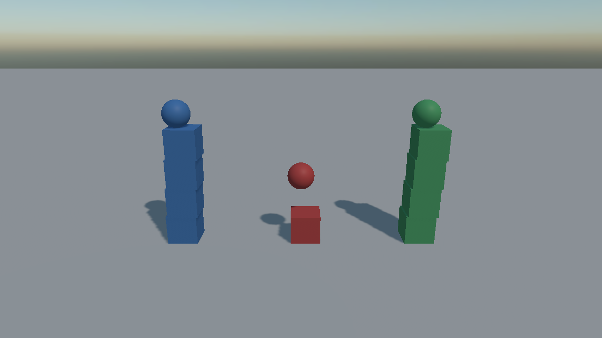

# Collision Filtering

<video autoplay loop muted playsinline width="100%" height="auto">
  <source src="images/filtering_matrix.mp4" type="video/mp4">
</video>

Not everything should touch everything. Filtering is how a projectile passes through debris, how the player's own shots ignore the player, and how a trigger volume notices only what it is meant to.

Evergine does it with **32 categories** and a **matrix** on the world saying which pairs of categories collide.

## Collision Categories

Every [`RigidBody`](physics_bodies/rigid_body.md) belongs to exactly **one** category:

```csharp
body.CollisionCategory = CollisionCategory.Cat3;
```

`CollisionCategory` is a flags enum with `Cat1` through `Cat32`, plus `None` and `All`. A body takes a single one; the combinations are for query filters and for the matrix.

Categories are numbers, and numbers are unreadable in an inspector six months later, so the world lets you name them:

```csharp
public override void RegisterManagers()
{
    base.RegisterManagers();

    var physics = new PhysicsManager();

    physics.SetCategoryName(CollisionCategory.Cat1, "Level");
    physics.SetCategoryName(CollisionCategory.Cat2, "Player");
    physics.SetCategoryName(CollisionCategory.Cat3, "Enemies");
    physics.SetCategoryName(CollisionCategory.Cat4, "Debris");
    physics.SetCategoryName(CollisionCategory.Cat5, "Projectiles");

    this.Managers.AddManager(physics);
}
```

| Member | Description |
| --- | --- |
| **CategoryNames** | The 32 names, defaulting to `"Category 1"` … `"Category 32"`. |
| **SetCategoryName(category, name)** | Names one category. |
| **GetCategoryName(category)** | Reads one back. |

## The Collision Matrix

The matrix is a symmetric 32 × 32 table of which categories touch. Everything collides with everything by default; you switch off the pairs you do not want.

```csharp
// Debris is scenery: it lands on the level and gets in the way visually, and nothing else has to
// waste a contact on it.
physics.SetCollisionEnabled(CollisionCategory.Cat4, CollisionCategory.Cat2, false);
physics.SetCollisionEnabled(CollisionCategory.Cat4, CollisionCategory.Cat3, false);
physics.SetCollisionEnabled(CollisionCategory.Cat4, CollisionCategory.Cat5, false);
```

| Member | Description |
| --- | --- |
| **CollisionMatrix** | The raw table: 32 masks, one per category. |
| **SetCollisionEnabled(a, b, enabled)** | Switches one pair on or off. Symmetric, and takes effect immediately. |
| **GetCollisionEnabled(a, b)** | Reads one pair back. |

> [!NOTE]
> Two **static** bodies never collide with each other, whatever the matrix says. That is what makes a level built from a thousand static bodies free rather than a million pair tests.

> [!TIP]
> A scene that carries its own `PhysicsManager` in its `.wescene` file has its matrix editable from the inspector, which is much easier than maintaining it in code. Scenes without one get a default manager from `RegisterManagers` instead.

## Ignoring a Single Pair of Bodies

Categories are for kinds of thing. For two specific bodies that should ignore each other — the two halves of a hinge, a turret and the vehicle carrying it — there is a per-pair exclusion:

```csharp
physics.SetPairCollisionEnabled(turretBody, hullBody, false);
```

| Member | Description |
| --- | --- |
| **SetPairCollisionEnabled(first, second, enabled)** | Switches collision between two specific bodies. |
| **GetPairCollisionEnabled(first, second)** | Reads it back. |
| **WereBodiesInContact(first, second)** | Whether the two touched in the last step. |

This is what [`Constraint.CollideConnected`](constraints/index.md) uses under the hood: a hinge whose two halves overlap would otherwise spend every step fighting its own contact.

## Filtering Beyond the Matrix

Some rules cannot be expressed as "these two kinds do or do not touch" — a platform solid only from above, a shot that passes through its own team. For those the world takes a callback consulted for every candidate pair:

```csharp
physics.ContactValidator = (first, second) => !this.SameTeam(first, second);
```

> [!IMPORTANT]
> `ContactValidator` runs on the solver's worker threads. It must be cheap, must not allocate, and must not touch the scene.

## Filtering Queries

[Queries](queries.md) are filtered separately, and there a mask can name several categories at once:

```csharp
// A shot that can hit enemies and the level, and passes through everything else.
QueryFilter filter = QueryFilter.FromCategories(CollisionCategory.Cat1 | CollisionCategory.Cat3);

if (this.physicsManager.RayCast(origin, direction, 200f, filter, out RayCastHit hit))
{
    this.Damage(hit.Entity);
}
```

> [!NOTE]
> A `CategoryMask` of zero means **every** category, not none. The default `QueryFilter` is therefore "everything solid", which is what a query usually wants.

## A Worked Example



Three columns of boxes, one per category, and three balls fired across them. Cat1 against Cat2 has been switched off in the matrix, so the Cat2 column falls straight through the Cat1 floor and through the Cat1 boxes, while Cat3 collides with everything.

```csharp
var physics = new PhysicsManager();

physics.SetCategoryName(CollisionCategory.Cat1, "Ground and props");
physics.SetCategoryName(CollisionCategory.Cat2, "Passes through");
physics.SetCategoryName(CollisionCategory.Cat3, "Collides with all");

physics.SetCollisionEnabled(CollisionCategory.Cat1, CollisionCategory.Cat2, false);

this.Managers.AddManager(physics);
```
