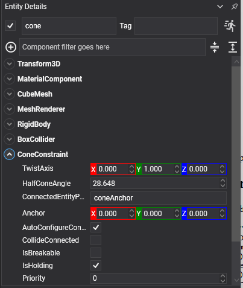

# Cone Constraint

<video autoplay loop muted playsinline width="100%" height="auto">
  <source src="images/cone_constraint.mp4" type="video/mp4">
</video>

A **cone constraint** pins two bodies at a point, like a [point constraint](point_constraint.md), and then limits how far the joint may bend: its axis must stay inside a cone.

It is the simplest of the limited ball joints. Twisting about the axis is left free — for a joint that limits that too, use a [swing twist constraint](swing_twist_constraint.md).

This constraint had no equivalent in the previous API.

## ConeConstraint Component



```csharp
Entity lamp = new Entity("lampHead")
    .AddComponent(new Transform3D() { Position = new Vector3(0f, 2f, 0f) })
    .AddComponent(new RigidBody())
    .AddComponent(new SphereCollider() { Radius = 0.25f })
    .AddComponent(new ConeConstraint()
    {
        ConnectedEntityPath = "lampArm",
        TwistAxis = Vector3.UnitY,

        // Thirty degrees of play in any direction, and no more.
        HalfConeAngle = MathHelper.ToRadians(30f),
    });

this.Managers.EntityManager.Add(lamp);
```

## Properties

| Property | Default | Description |
| --- | --- | --- |
| **TwistAxis** | 0,1,0 | The axis at the centre of the cone, in this body's local space. The joint may bend away from it by up to the half angle. |
| **HalfConeAngle** | π/4 | The half angle of the cone, in radians. `0` locks the axis in place; π/2 allows a right angle in any direction. |

Plus the [common properties](index.md#common-properties).

## Using Cone Constraint

A cone constraint is the right tool whenever something is attached at a point but must not fold all the way over: a rear-view mirror, a lamp head, a tow hitch, the segments of a robotic tentacle.

```csharp
private void CreateTentacle(Vector3 root, int segments)
{
    string previous = "tentacleRoot";

    for (int i = 0; i < segments; i++)
    {
        Entity segment = new Entity($"segment{i}")
            .AddComponent(new Transform3D() { Position = root - (Vector3.UnitY * (i * 0.5f)) })
            .AddComponent(new RigidBody())
            .AddComponent(new CapsuleCollider() { Radius = 0.12f, Height = 0.5f })
            .AddComponent(new ConeConstraint()
            {
                ConnectedEntityPath = previous,
                Anchor = new Vector3(0f, 0.25f, 0f),
                TwistAxis = Vector3.UnitY,

                // Kept well inside a right angle. A chain whose every joint may fold to ninety degrees
                // can turn back on itself, and a tentacle tied in a knot never comes out of it.
                HalfConeAngle = MathHelper.ToRadians(25f),
            });

        this.Managers.EntityManager.Add(segment);
        previous = segment.Name;
    }
}
```

> [!IMPORTANT]
> Build the chain **already inside its limits**. A joint created bent further than its half angle starts the simulation fighting itself, and the first step snaps it into range, which reads as the chain exploding on frame one.

> [!TIP]
> Nothing stops the bodies spinning about the cone's axis. If a segment should not be able to corkscrew, use a [swing twist constraint](swing_twist_constraint.md), which limits the swing and the twist separately.
