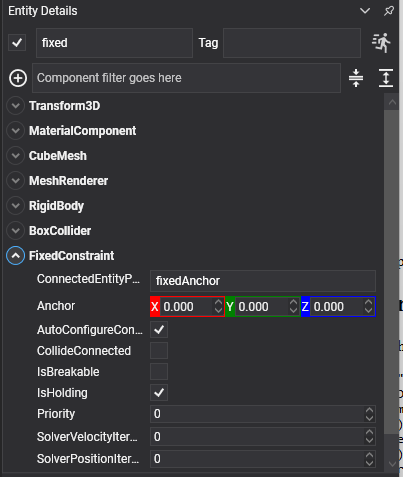

# Fixed Constraint

<video autoplay loop muted playsinline width="100%" height="auto">
  <source src="images/fixed_constraint.mp4" type="video/mp4">
</video>

A **fixed constraint** welds two bodies together: no relative movement and no relative rotation. They behave as one body until the weld gives way.

## When to use it

If two things are permanently attached, the cheaper answer is usually one body with two colliders, a [compound shape](../colliders/index.md), since the solver then has nothing to solve at all.

A fixed constraint earns its place when the join has to be **breakable**, when the two halves need different physical properties, or when they are separate entities that come and go independently: a crate strapped to a pallet, a wing that can be torn off, a barrel welded to a truck bed until it is hit hard enough.

## FixedConstraint Component



```csharp
Entity load = new Entity("load")
    .AddComponent(new Transform3D() { Position = new Vector3(0f, 1.5f, 0f) })
    .AddComponent(new RigidBody())
    .AddComponent(new BoxCollider())
    .AddComponent(new FixedConstraint()
    {
        ConnectedEntityPath = "pallet",

        // Welds break rather than bend, which is the reason to use one instead of a compound shape.
        IsBreakable = true,
        BreakForce = 4000f,
        BreakTorque = 2500f,
    });

this.Managers.EntityManager.Add(load);
```

## Properties

A fixed constraint adds nothing of its own: it uses only the [common properties](index.md#common-properties). The two that matter most here are:

| Property | Default | Description |
| --- | --- | --- |
| **ConnectedEntityPath** | null | The entity to weld to. Left empty, the body is welded **to the world**: pinned in place, unable to move or turn. |
| **Anchor** | 0,0,0 | Where the weld sits. It does not change what the constraint allows (nothing at all) but it is the point the breaking force is measured about. |

> [!TIP]
> Welding a body to the world with an empty `ConnectedEntityPath` is a quick way to pin a dynamic body in place while keeping it dynamic, so it can still be broken loose, pushed once released, or have forces read off it.

## Using Fixed Constraint

The weld gives way when it is loaded past its threshold:

```csharp
public class Strap : Behavior
{
    [BindComponent]
    private FixedConstraint constraint = null;

    protected override void OnActivated()
    {
        base.OnActivated();

        this.constraint.Broken += this.OnBroken;
    }

    protected override void OnDeactivated()
    {
        base.OnDeactivated();

        this.constraint.Broken -= this.OnBroken;
    }

    private void OnBroken(object sender, EventArgs e)
    {
        // Fires once. The bodies are already free by the time this runs, so there is nothing to undo,
        // only something to react to.
        this.PlaySnap();
    }
}
```
