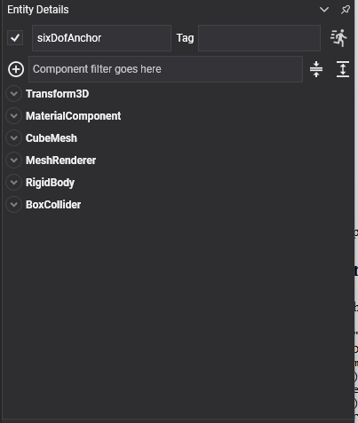

# Gear Constraint

<video autoplay loop muted playsinline width="100%" height="auto">
  <source src="images/gear_constraint.mp4" type="video/mp4">
</video>

A **gear constraint** couples the rotations of two bodies: turn one and the other turns with it, at a fixed ratio and in the opposite direction. Gear trains, geared doors, a differential, a hand on a clock face.

## It only couples rotations

A gear constraint says nothing about **where** the two bodies are. It relates how fast they turn, and nothing else. Each body still needs its own [hinge constraint](hinge_constraint.md) to hold it in place and give it an axis to turn about.

A gear is therefore always three components across two entities: a hinge on each body, and the gear between them.

## GearConstraint Component



```csharp
// The driven gear: a hinge to hold it on its axle, and a motor to turn it.
Entity driver = new Entity("driver")
    .AddComponent(new Transform3D() { Position = new Vector3(0f, 2f, 0f) })
    .AddComponent(new RigidBody())
    .AddComponent(new CylinderCollider() { Radius = 0.8f, Height = 0.3f })
    .AddComponent(new HingeConstraint()
    {
        Axis = Vector3.UnitY,
        NormalAxis = Vector3.UnitX,
        MotorMode = MotorMode.Velocity,
        TargetAngularVelocity = 2f,
        MaxMotorTorque = 500f,
    });

// The follower: its own hinge to hold it, plus the gear that ties the two rotations together.
Entity follower = new Entity("follower")
    .AddComponent(new Transform3D() { Position = new Vector3(1.8f, 2f, 0f) })
    .AddComponent(new RigidBody())
    .AddComponent(new CylinderCollider() { Radius = 0.8f, Height = 0.3f })
    .AddComponent(new HingeConstraint() { Axis = Vector3.UnitY, NormalAxis = Vector3.UnitX })
    .AddComponent(new GearConstraint()
    {
        ConnectedEntityPath = "driver",
        Axis = Vector3.UnitY,
        ConnectedAxis = Vector3.UnitY,
        Ratio = 1f,
    });

this.Managers.EntityManager.Add(driver);
this.Managers.EntityManager.Add(follower);
```

## Properties

| Property | Default | Description |
| --- | --- | --- |
| **Axis** | 0,0,1 | This body's rotation axis, in its local space. It must match the axis of its own hinge. |
| **ConnectedAxis** | 0,0,1 | The other body's rotation axis, in **its** local space. |
| **Ratio** | 1 | How many turns of this body make one turn of the other. |

Plus the [common properties](index.md#common-properties).

## Ratios

The ratio is the gear ratio, and it is what a difference in tooth count would give you on real gears:

| Ratio | Effect |
| --- | --- |
| 1 | Both turn at the same speed, in opposite directions. |
| 2 | This body turns twice for each turn of the other — a small gear driven by a large one. |
| 0.5 | This body turns half as fast — a large gear driven by a small one. |
| -1 | Both turn at the same speed, in the **same** direction, as though there were an idler between them. |

```csharp
// Radius decides the ratio on real gears, so deriving it from the radii keeps the teeth in step
// however the two are resized.
gear.Ratio = otherRadius / thisRadius;
```

> [!IMPORTANT]
> The two `Axis` values are each in their **own** body's local space, and each has to match the axis of that body's hinge. A gear whose axis disagrees with its hinge fights the hinge every step, which shows up as the pair juddering rather than turning.

> [!TIP]
> A gear train is a chain of gear constraints: gear A to B, B to C, C to D. Only the first needs a motor; the rest are driven through the chain. If the far end of a long train lags, give the gears nearest the motor a higher `Priority` — higher is solved last, and the last one solved is the one that wins.
