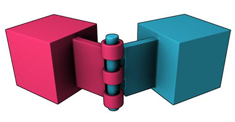
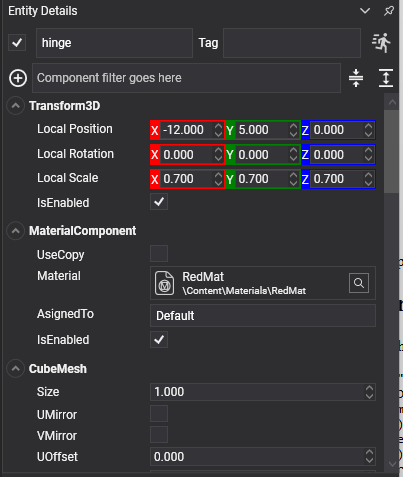

# Hinge Constraint

<video autoplay loop muted playsinline width="100%" height="auto">
  <source src="images/hinge_constraint.mp4" type="video/mp4">
</video>

A **hinge constraint** lets a body rotate about one axis and nothing else. Doors, lids, levers, wheels, pendulums, drawbridges — anything that swings.



## HingeConstraint Component



```csharp
Entity door = new Entity("door")
    .AddComponent(new Transform3D() { Position = new Vector3(1f, 1f, 0f) })
    .AddComponent(new MaterialComponent() { Material = material })
    .AddComponent(new CubeMesh())
    .AddComponent(new MeshRenderer())
    .AddComponent(new RigidBody() { Mass = 30f })
    .AddComponent(new BoxCollider() { Size = new Vector3(1f, 2f, 0.1f) })
    .AddComponent(new HingeConstraint()
    {
        ConnectedEntityPath = "frame",

        // Hung on its left edge, turning about the vertical.
        Anchor = new Vector3(-0.5f, 0f, 0f),
        Axis = Vector3.UnitY,
        NormalAxis = Vector3.UnitX,

        // A door that opens one way, ninety degrees, and stops.
        MinAngle = 0f,
        MaxAngle = MathHelper.PiOver2,
    });

this.Managers.EntityManager.Add(door);
```

## Axis Properties

| Property | Default | Description |
| --- | --- | --- |
| **Axis** | 0,1,0 | The axis the body turns about, in its local space. |
| **NormalAxis** | 1,0,0 | A reference direction perpendicular to `Axis`. It is what **zero degrees** means, so the limits below are measured from it. |

## Limit Properties

| Property | Default | Description |
| --- | --- | --- |
| **MinAngle** | -π | The lowest angle, in radians, measured from `NormalAxis`. |
| **MaxAngle** | π | The highest angle. Leaving both at ±π lets the hinge spin freely. |
| **LimitsSpring** | *hard* | Makes the limits soft, so the hinge can be forced past them and springs back. See [Springs](index.md#springs). |
| **MaxFrictionTorque** | 0 | Friction in the hinge, in newton-metres. This is how a door stays where it is put instead of swinging shut. |
| **CurrentAngle** | *read-only* | The hinge's angle right now, in radians. |

## Motor Properties

<video autoplay loop muted playsinline width="100%" height="auto">
  <source src="images/hinge_constraint_motor.mp4" type="video/mp4">
</video>

| Property | Default | Description |
| --- | --- | --- |
| **MotorMode** | `Off` | `Velocity` drives towards `TargetAngularVelocity`; `Position` drives towards `TargetAngle` and holds there. |
| **TargetAngularVelocity** | 0 | The speed the velocity motor aims for, in radians per second. |
| **TargetAngle** | 0 | The angle the position motor aims for, in radians. |
| **MaxMotorTorque** | 1000 | The strongest torque the motor may apply. A motor that cannot reach its target simply falls short. |

Plus the [common properties](index.md#common-properties).

## Using Hinge Constraint

### A powered door

```csharp
public class PoweredDoor : Behavior
{
    [BindComponent]
    private HingeConstraint hinge = null;

    public float OpenAngleDegrees { get; set; } = 95f;

    protected override void Start()
    {
        // A position motor: it drives to an angle and holds there, which is what a powered door does.
        // Velocity mode would open the door and then keep pushing against the limit for ever.
        this.hinge.MotorMode = MotorMode.Position;
        this.hinge.MaxMotorTorque = 250f;
        this.hinge.TargetAngle = 0f;
    }

    public void SetOpen(bool open)
    {
        this.hinge.TargetAngle = open ? MathHelper.ToRadians(this.OpenAngleDegrees) : 0f;
    }
}
```

### A driven wheel

```csharp
hinge.Axis = Vector3.UnitZ;
hinge.MinAngle = -MathHelper.Pi;   // Free to spin: the limits are opened right up...
hinge.MaxAngle = MathHelper.Pi;
hinge.MotorMode = MotorMode.Velocity;
hinge.TargetAngularVelocity = 6f;  // ...and the motor sets the speed.
hinge.MaxMotorTorque = 400f;
```

> [!TIP]
> `MaxMotorTorque` is what makes a motor feel physical. A door with a low limit can be held shut by hand; a winch with a high one lifts whatever is on the end of it. Setting it very high makes the motor effectively unstoppable, which usually reads as the rest of the scene being pushed around by it.

> [!IMPORTANT]
> A hinge with `MinAngle` and `MaxAngle` set to the same value is not the same thing as a [fixed constraint](fixed_constraint.md): it is a hinge continually correcting itself towards one angle. If nothing should ever turn, weld it.
