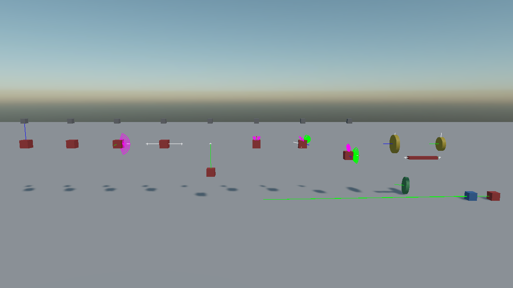
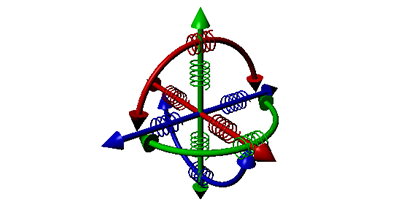

# Constraints
---

<video autoplay loop muted playsinline width="100%" height="auto">
  <source src="images/constraints_overview.mp4" type="video/mp4">
</video>

A **constraint** ties two bodies together and limits how they may move relative to each other. A door is a body on a hinge, a piston is a body on a slider, a rope is a chain of bodies on point constraints, and a ragdoll is a skeleton of swing-twist constraints.

Every constraint is a component you add to the entity of the body it moves. That body is the **source**; the one it is tied to is the **connected body**.



*One rig per constraint type. In each of them the grey block is bolted to the world and the red one is held by the constraint; the coloured arcs and lines are the constraints themselves, drawn by [debug rendering](../debug_rendering.md).*

> [!NOTE]
> These replace the `*Joint3D` components of the previous API, with several renamed and three new ones. See [Migrating from Bullet](../migrating_from_bullet.md).

## Common Properties

Every constraint has these. The pages that follow list only what is specific to each one.

| Property | Default | Description |
| --- | --- | --- |
| **ConnectedEntityPath** | null | The entity holding the other body. **Left empty, the constraint anchors to the world**, which is how a door is hung on a wall that is not itself a body. |
| **ConnectedBody** | null | The other body, set directly from code. Takes precedence over the path. |
| **Anchor** | 0,0,0 | Where the constraint attaches on this body, in its local space. |
| **AutoConfigureConnectedAnchor** | true | Works out the matching anchor on the other body from where the two are standing when the constraint is created. |
| **ConnectedAnchor** | 0,0,0 | Where it attaches on the other body, when the above is off. |
| **CollideConnected** | false | Whether the two bodies still collide with each other. Off by default, because two bodies bolted together usually overlap and would otherwise fight their own contact every step. |
| **IsHolding** | true | Whether the constraint is holding at all. Turning it off releases the bodies **without moving the anchors**, so turning it back on picks up where it left off. |
| **Priority** | 0 | The order the solver works through constraints in. Higher is solved **last**, and the last one solved is the one that tends to win, which is what settles a fight between two constraints pulling the same body different ways. Leave it at zero otherwise. |
| **SolverVelocityIterationsOverride** | 0 | Per-constraint solver override. `0` uses the world's. |
| **SolverPositionIterationsOverride** | 0 | The same for position iterations. |

Read-only:

| Property | Description |
| --- | --- |
| **AppliedForce** | How hard the constraint is currently pulling, in newtons. |
| **AppliedTorque** | How hard it is currently twisting. |
| **IsBroken** | Whether it has given way. |

| Method | Description |
| --- | --- |
| **Recreate()** | Rebuilds the constraint, picking up the bodies' current poses as the new rest state. |

> [!IMPORTANT]
> Anchors are captured **when the constraint is created**. Move a body afterwards and the constraint pulls it back to where the anchor says it should be. Position both bodies where they belong before adding the constraint, or call `Recreate()` after moving them.

## Breakable Constraints

A constraint can be told to give way under load:

| Property | Default | Description |
| --- | --- | --- |
| **IsBreakable** | false | Whether the constraint can break. |
| **BreakForce** | 5000 | The pull, in newtons, that breaks it. |
| **BreakTorque** | 5000 | The twist, in newton-metres, that breaks it. |

<video autoplay loop muted playsinline width="100%" height="auto">
  <source src="images/breakable_constraint.mp4" type="video/mp4">
</video>

```csharp
PointConstraint rope = entity.FindComponent<PointConstraint>();

rope.IsBreakable = true;
rope.BreakForce = 900f;
rope.Broken += (sender, e) => this.PlaySnap();
```

The **Broken** event fires once, when it gives way.

> [!NOTE]
> Jolt does not break constraints by itself. Evergine reads the impulse the constraint applied after each step and turns it into a force, which is what the threshold is compared against.

There are three different ways to stop a constraint holding, and they are not interchangeable: `IsHolding = false` releases it but keeps the anchors, so it can be resumed; `IsEnabled = false` disables the component; and breaking it destroys it for good.

## Motors

A motor drives a constraint towards a speed or a position instead of leaving it to gravity. `HingeConstraint`, `SliderConstraint`, `SwingTwistConstraint` and `SixDOFConstraint` have one.

| Mode | What it does |
| --- | --- |
| **Off** | No motor. The constraint only restricts. |
| **Velocity** | Drives towards a target velocity: a wheel, a fan, a conveyor drum. |
| **Position** | Drives towards a target position or angle and holds there: a powered door, a piston, a servo. |

Every motor has a limit on how hard it may push: `MaxMotorTorque` or `MaxMotorForce`, and on a swing twist constraint the separate `MaxSwingTorque` and `MaxTwistTorque`. A motor that cannot reach its target falls short, which is what makes a powered door stoppable by something heavy enough.

<video autoplay loop muted playsinline width="100%" height="auto">
  <source src="images/hinge_constraint_motor.mp4" type="video/mp4">
</video>

## Springs



Several constraints take a `SpringParameters`, which makes their limits soft instead of hard. There is no separate spring constraint: a spring is a property of a limit.

| Field | Description |
| --- | --- |
| **Mode** | `FrequencyAndDamping`, how many times a second it wants to oscillate, or `StiffnessAndDamping`, in newtons per metre. |
| **FrequencyOrStiffness** | The frequency or the stiffness, depending on the mode. **Zero means a hard limit**, with no spring at all. |
| **Damping** | How quickly the oscillation dies away. `1` is critical damping, which settles without overshooting. |

```csharp
// A suspension-like limit: two oscillations a second, well damped.
slider.LimitsSpring = SpringParameters.FromFrequency(2f, 0.7f);
```

| Factory | Description |
| --- | --- |
| **SpringParameters.FromFrequency(frequency, damping)** | A spring described by how fast it wants to bounce. |
| **SpringParameters.FromStiffness(stiffness, damping)** | A spring described by its stiffness in N/m. |

## Choosing a Constraint

| I want | Use |
| --- | --- |
| Two bodies welded together | [Fixed](fixed_constraint.md) |
| A ball joint: free to rotate, fixed in place | [Point](point_constraint.md) |
| A rope or a rod holding two bodies apart or together | [Distance](distance_constraint.md) |
| A door, a wheel, a lever, a pendulum on an axis | [Hinge](hinge_constraint.md) |
| A piston, a drawer, a lift on rails | [Slider](slider_constraint.md) |
| A ball joint that may not bend past a cone | [Cone](cone_constraint.md) |
| A shoulder, a hip, a ragdoll joint | [Swing Twist](swing_twist_constraint.md); see [Ragdolls](../ragdolls.md) for a whole figure |
| Anything else: per-axis limits and motors | [Six DOF](six_dof_constraint.md) |
| Two rotations geared together | [Gear](gear_constraint.md) |
| A rotation driving a linear motion | [Rack and Pinion](rack_and_pinion_constraint.md) |
| One body rising as another falls | [Pulley](pulley_constraint.md) |

## In this section
* [Fixed Constraint](fixed_constraint.md)
* [Point Constraint](point_constraint.md)
* [Distance Constraint](distance_constraint.md)
* [Hinge Constraint](hinge_constraint.md)
* [Slider Constraint](slider_constraint.md)
* [Cone Constraint](cone_constraint.md)
* [Swing Twist Constraint](swing_twist_constraint.md)
* [Six DOF Constraint](six_dof_constraint.md)
* [Gear Constraint](gear_constraint.md)
* [Rack and Pinion Constraint](rack_and_pinion_constraint.md)
* [Pulley Constraint](pulley_constraint.md)
