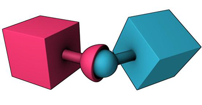
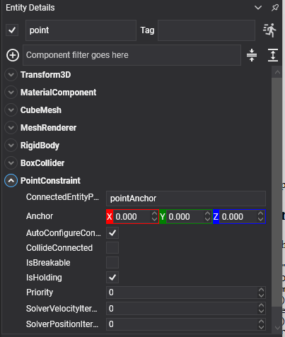

# Point Constraint

<video autoplay loop muted playsinline width="100%" height="auto">
  <source src="images/point_constraint.mp4" type="video/mp4">
</video>

A **point constraint** pins two bodies together at a single point and lets them rotate freely about it. It is the ball-and-socket joint: the point cannot move, the rotation is unrestricted.



## PointConstraint Component



```csharp
Entity pendulum = new Entity("pendulum")
    .AddComponent(new Transform3D() { Position = new Vector3(0f, 4f, 0f) })
    .AddComponent(new RigidBody())
    .AddComponent(new BoxCollider())
    .AddComponent(new PointConstraint()
    {
        ConnectedEntityPath = "anchor",
        Anchor = new Vector3(0f, 0.5f, 0f),
    });

this.Managers.EntityManager.Add(pendulum);
```

## Properties

A point constraint adds nothing of its own beyond the [common properties](index.md#common-properties). The whole shape of the joint is in where its anchors sit:

| Property | Default | Description |
| --- | --- | --- |
| **Anchor** | 0,0,0 | The pin point on this body, in its local space. |
| **ConnectedAnchor** | 0,0,0 | The pin point on the other body, when `AutoConfigureConnectedAnchor` is off. |
| **ConnectedEntityPath** | null | Left empty, the body is pinned **to a point in the world** and swings freely from it. |

## Building a Chain

A rope or a chain is a row of bodies, each pinned to the one above it at the point where they meet:

```csharp
private void CreateChain(Vector3 top, int links)
{
    const float LinkLength = 0.6f;

    string previous = null;

    for (int i = 0; i < links; i++)
    {
        Entity link = new Entity($"link{i}")
            .AddComponent(new Transform3D() { Position = top - (Vector3.UnitY * (i * LinkLength)) })
            .AddComponent(new MaterialComponent() { Material = this.material })
            .AddComponent(new CapsuleMesh() { Radius = 0.1f, Height = LinkLength - 0.2f })
            .AddComponent(new MeshRenderer())

            // The first link is static, so the chain has something to hang from. Everything below it
            // is dynamic and held only by the constraint above it.
            .AddComponent(new RigidBody()
            {
                BodyType = i == 0 ? RigidBodyType.Static : RigidBodyType.Dynamic,
            })
            .AddComponent(new CapsuleCollider() { Radius = 0.1f, Height = LinkLength });

        if (previous != null)
        {
            // Anchored at the top of this link and, by AutoConfigureConnectedAnchor, at the bottom of
            // the one above: the two anchors meet exactly where the links touch.
            link.AddComponent(new PointConstraint()
            {
                ConnectedEntityPath = previous,
                Anchor = new Vector3(0f, LinkLength * 0.5f, 0f),
            });
        }

        this.Managers.EntityManager.Add(link);
        previous = link.Name;
    }
}
```

> [!TIP]
> A long chain of point constraints stretches under load, because each link is solved in turn and the error accumulates. Three fixes, in order of cheapness: raise the world's `SolverVelocityIterations`, give the links nearest the anchor a higher `Priority` so they are solved last and win the argument, or use fewer, longer links.

> [!NOTE]
> A point constraint puts no limit on rotation at all, so a chain built from them can fold back on itself and spin about its own axis. For a joint that may only bend so far, use a [Cone](cone_constraint.md) or [Swing Twist](swing_twist_constraint.md) constraint.
