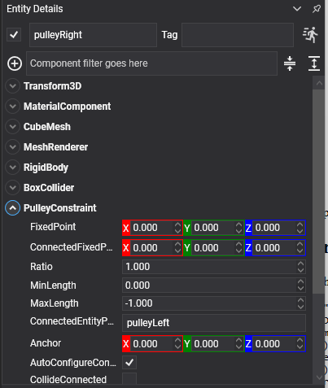

# Pulley Constraint

<video autoplay loop muted playsinline width="100%" height="auto">
  <source src="images/pulley_constraint.mp4" type="video/mp4">
</video>

A **pulley constraint** runs a rope of fixed length from one body, up over a fixed point, across to a second fixed point and down to another body. As one end goes down the other comes up. Counterweights, lifts, drawbridges, a bucket in a well.

This constraint had no equivalent in the previous API.

## What it holds

The rope's total length is what stays constant:

```
distance(bodyA, fixedPoint) + Ratio * distance(bodyB, connectedFixedPoint) = constant
```

The two fixed points are the pulley wheels, in **world space**. They are not bodies and nothing has to exist at them — but putting something visible there is usually worth doing, since a rope going over nothing is hard to read.

## PulleyConstraint Component



```csharp
Entity counterweight = new Entity("counterweight")
    .AddComponent(new Transform3D() { Position = new Vector3(-1f, 4f, 0f) })
    .AddComponent(new RigidBody() { Mass = 40f })
    .AddComponent(new BoxCollider())
    .AddComponent(new PulleyConstraint()
    {
        ConnectedEntityPath = "platform",

        // The two pulley wheels, in world space, up at the top of the shaft.
        FixedPoint = new Vector3(-1f, 8f, 0f),
        ConnectedFixedPoint = new Vector3(1f, 8f, 0f),

        Ratio = 1f,
        MinLength = 0.5f,
    });

this.Managers.EntityManager.Add(counterweight);
```

## Properties

| Property | Default | Description |
| --- | --- | --- |
| **FixedPoint** | 0,0,0 | The pulley wheel this body's end of the rope runs over, **in world space**. |
| **ConnectedFixedPoint** | 0,0,0 | The pulley wheel the other body's end runs over, in world space. |
| **Ratio** | 1 | How much rope the other side takes up for each unit this side takes up. Above 1 **this** body moves further than the other one and pulls with correspondingly less force — the hauling end of a block and tackle. |
| **MinLength** | 0 | The shortest the rope may become. |
| **MaxLength** | -1 | The longest. **Negative means "the length it has when the constraint is created"**, which is the usual case. |

Plus the [common properties](index.md#common-properties).

## Using Pulley Constraint

### A counterweighted lift

```csharp
// The platform and its counterweight, over two wheels at the top of the shaft. Matched masses make
// the lift neutral: it stays wherever it is left, and a small push moves it.
pulley.FixedPoint = new Vector3(platformX, shaftTop, 0f);
pulley.ConnectedFixedPoint = new Vector3(counterweightX, shaftTop, 0f);
pulley.Ratio = 1f;
```

Give the counterweight slightly less mass than the platform and the lift settles down; give it slightly more and it rises on its own.

### A block and tackle

```csharp
// Two to one, with the component on the hauling end: this body travels twice as far as the load on
// the other side, and needs half the force to move it.
pulley.Ratio = 2f;
```

> [!IMPORTANT]
> The fixed points are in **world space** and are captured when the constraint is created. Moving the entity that represents the pulley wheel afterwards does not move the constraint's idea of where the rope runs — update `FixedPoint` and call `Recreate()`.

> [!TIP]
> A pulley is a length limit, not a rope: it stops the two ends going too far apart and does nothing to hold them up. A body whose end of the rope goes slack simply falls, which is correct, and is why `MinLength` is worth setting on anything that could otherwise be pulled all the way into its wheel.
