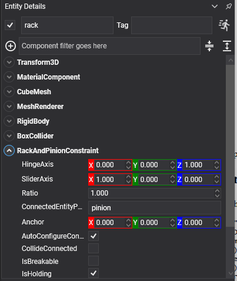

# Rack and Pinion Constraint

<video autoplay loop muted playsinline width="100%" height="auto">
  <source src="images/rack_and_pinion_constraint.mp4" type="video/mp4">
</video>

A **rack and pinion constraint** turns rotation into straight-line movement: a turning pinion drives a sliding rack along its axis. Steering columns, sliding gates, screw jacks, a lift driven by a winch drum.

It is the [gear constraint](gear_constraint.md)'s cousin — one couples two rotations, this one couples a rotation to a translation.

This constraint had no equivalent in the previous API.

## It only couples the two motions

Like a gear, this constraint says nothing about where either body is. The pinion needs its own [hinge](hinge_constraint.md) to hold it on its axle, and the rack needs its own [slider](slider_constraint.md) to hold it on its rails. The rack and pinion constraint only ties their two motions together.

That makes it four components across two entities.

## RackAndPinionConstraint Component



The constraint goes on the **pinion**, and names the rack as its connected entity.

```csharp
// The rack: a slider to keep it on its rails, and nothing else.
Entity rack = new Entity("rack")
    .AddComponent(new Transform3D() { Position = new Vector3(0f, 1.6f, 0f) })
    .AddComponent(new RigidBody())
    .AddComponent(new BoxCollider() { Size = new Vector3(2.5f, 0.25f, 0.4f) })
    .AddComponent(new SliderConstraint()
    {
        Axis = Vector3.UnitX,
        NormalAxis = Vector3.UnitY,
        MinDistance = -1.5f,
        MaxDistance = 1.5f,
    });

// The pinion: a hinge to hold it, a motor to turn it, and the constraint that drives the rack.
Entity pinion = new Entity("pinion")
    .AddComponent(new Transform3D() { Position = new Vector3(0f, 2f, 0f) })
    .AddComponent(new RigidBody())
    .AddComponent(new CylinderCollider() { Radius = 0.3f, Height = 0.2f })
    .AddComponent(new HingeConstraint()
    {
        Axis = Vector3.UnitZ,
        NormalAxis = Vector3.UnitX,
        MotorMode = MotorMode.Velocity,
        TargetAngularVelocity = 1.5f,
        MaxMotorTorque = 400f,
    })
    .AddComponent(new RackAndPinionConstraint()
    {
        ConnectedEntityPath = "rack",
        HingeAxis = Vector3.UnitZ,
        SliderAxis = Vector3.UnitX,
        Ratio = 1f,
    });

this.Managers.EntityManager.Add(rack);
this.Managers.EntityManager.Add(pinion);
```

## Properties

| Property | Default | Description |
| --- | --- | --- |
| **HingeAxis** | 0,0,1 | The pinion's rotation axis, in **this** body's local space — this body is the pinion. It must match the axis of its own hinge. |
| **SliderAxis** | 1,0,0 | The direction the rack travels along, in the **connected** body's local space. It must match the axis of the rack's own slider. |
| **Ratio** | 1 | How many radians the pinion turns for each metre the rack travels. |

Plus the [common properties](index.md#common-properties).

## Choosing the Ratio

For real teeth to mesh, one full turn of the pinion moves the rack by its circumference, so the ratio follows from the pinion's radius:

```csharp
// 2π radians per 2πr metres, which is 1/r radians per metre.
rackAndPinion.Ratio = 1f / pinionRadius;
```

Raise it above that and the rack moves less per turn — a slower, stronger drive. Lower it and the rack moves further per turn.

Steering is the everyday case: a steering wheel that turns two and a half times lock to lock, driving a rack that travels fifteen centimetres each way.

> [!IMPORTANT]
> The component goes on the **pinion**, not on the rack, and `ConnectedEntityPath` names the rack. That is also why `HingeAxis` is read in this entity's space and `SliderAxis` in the connected one's. Getting them the wrong way round leaves the constraint trying to slide the pinion and turn the rack.

> [!TIP]
> Turn on `PhysicsDebugFlags.Constraints` while wiring one up. The four axes — the slider's, the hinge's, and this constraint's two — all have to agree, and seeing them drawn is much quicker than working out which of the four is wrong. See [Debug Rendering](../debug_rendering.md).
