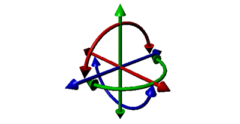
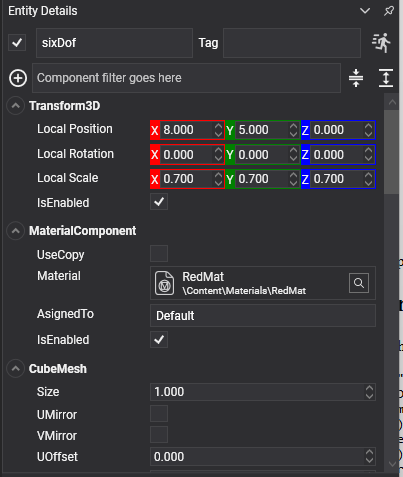

# Six DOF Constraint

<video autoplay loop muted playsinline width="100%" height="auto">
  <source src="images/six_dof_constraint.mp4" type="video/mp4">
</video>

The **six degrees of freedom constraint** is the general case. Every other constraint is a special case of it: three translation axes and three rotation axes, each of which can be free, limited or locked, each with its own motor and its own spring.



Reach for it when nothing more specific fits. A [hinge](hinge_constraint.md) or a [slider](slider_constraint.md) says what it is at a glance and is cheaper to solve, so prefer those where they apply.

> [!NOTE]
> This replaces both `Generic6DofJoint3D` and `Generic6DofSpringJoint3D` of the previous API: the springs are built in rather than being a separate component.

## SixDOFConstraint Component



```csharp
Entity carriage = new Entity("carriage")
    .AddComponent(new Transform3D() { Position = new Vector3(0f, 2f, 0f) })
    .AddComponent(new RigidBody())
    .AddComponent(new BoxCollider())
    .AddComponent(new SixDOFConstraint()
    {
        ConnectedEntityPath = "rail",

        // Free to slide along X and to turn about Y; locked in every other direction.
        FreeAxes = DegreesOfFreedom.TranslationX | DegreesOfFreedom.RotationY,

        TranslationMin = new Vector3(-2f, 0f, 0f),
        TranslationMax = new Vector3(2f, 0f, 0f),
    });

this.Managers.EntityManager.Add(carriage);
```

## Degrees of Freedom

`DegreesOfFreedom` is a flags enum: `TranslationX`, `TranslationY`, `TranslationZ`, `RotationX`, `RotationY`, `RotationZ`, plus `None`, `All`, and `Plane2D`, which is `TranslationX | TranslationY | RotationZ`: everything a body needs to live in a flat world.

| Property | Default | Description |
| --- | --- | --- |
| **FreeAxes** | `All` | Which axes are not locked outright. An axis absent from this set is fixed and its limits are ignored. |
| **TranslationMin** | -1,-1,-1 | The lowest each free translation axis may reach, in metres. |
| **TranslationMax** | 1,1,1 | The highest. |
| **RotationMin** | -π/4 each | The lowest each free rotation axis may reach, in radians. |
| **RotationMax** | π/4 each | The highest. |
| **LimitsSpring** | *hard* | Makes every limit soft. See [Springs](index.md#springs). |

## Motor Properties

Each axis has its own motor, set through methods rather than properties because there are six of them.

| Member | Description |
| --- | --- |
| **SetMotorMode(axis, mode)** | Sets one axis's motor to `Off`, `Velocity` or `Position`. |
| **GetMotorMode(axis)** | Reads it back. |
| **SetTargetVelocity(linear, angular)** | The targets for every velocity motor at once. |
| **SetMaxFriction(axis, value)** | Friction on one axis. |
| **TargetPosition** | Where the linear position motors drive to. |
| **TargetOrientation** | Where the angular position motors drive to. |
| **MaxMotorForce** | The strongest force the linear motors may apply. Default 1000. |
| **MaxMotorTorque** | The strongest torque the angular motors may apply. Default 1000. |
| **MotorSpring** | How the position motors approach their targets. Default 20 Hz, damping 1. |
| **MotorForce** / **MotorTorque** | *Read-only.* How hard the motors are working. |

Plus the [common properties](index.md#common-properties).

## Replacing the Old Spring Joint

There is no dedicated spring constraint. A sprung joint is a six DOF constraint with soft limits:

```csharp
SixDOFConstraint spring = entity.FindComponent<SixDOFConstraint>();

// Free along Y only, with half a metre of travel each way, held by a soft limit rather than a hard
// one: the body bounces about the middle instead of stopping dead at the ends.
spring.FreeAxes = DegreesOfFreedom.TranslationY;
spring.TranslationMin = new Vector3(0f, -0.5f, 0f);
spring.TranslationMax = new Vector3(0f, 0.5f, 0f);
spring.LimitsSpring = SpringParameters.FromFrequency(2f, 0.3f);
```

For a spring between two points rather than along an axis, the [distance constraint](distance_constraint.md) is simpler.

## A Servo on One Axis

```csharp
public class TurretYaw : Behavior
{
    [BindComponent]
    private SixDOFConstraint constraint = null;

    protected override void Start()
    {
        this.constraint.FreeAxes = DegreesOfFreedom.RotationY;
        this.constraint.RotationMin = new Vector3(0f, -MathHelper.Pi, 0f);
        this.constraint.RotationMax = new Vector3(0f, MathHelper.Pi, 0f);

        this.constraint.SetMotorMode(DegreesOfFreedom.RotationY, MotorMode.Position);
        this.constraint.MaxMotorTorque = 2000f;
    }

    public void AimAt(float yawRadians)
    {
        this.constraint.TargetOrientation = Quaternion.CreateFromAxisAngle(Vector3.Up, yawRadians);
    }
}
```

> [!NOTE]
> Like the slider, a six DOF constraint's values are expressed **from the point of view of the body carrying the component**. A positive `TranslationMax.X` is a metre along this body's own X.

> [!TIP]
> Locking an axis through `FreeAxes` is not the same as giving it a zero-width limit. A locked axis is removed from the problem; a limit of zero is a constraint the solver has to keep satisfying every step, which is both slower and slightly springy.
