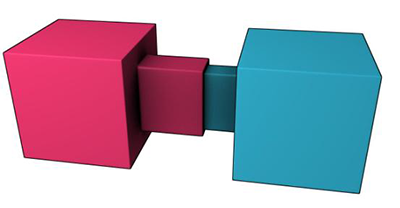
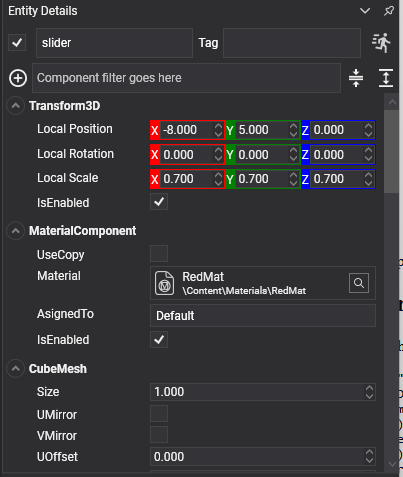

# Slider Constraint

<video autoplay loop muted playsinline width="100%" height="auto">
  <source src="images/slider_constraint.mp4" type="video/mp4">
</video>

A **slider constraint** lets a body move along one axis and nothing else — no other translation and no rotation at all. Pistons, drawers, lifts on rails, sliding doors.



It is the linear mirror of the [hinge](hinge_constraint.md): the same limits, friction and motors, measured in metres and newtons instead of radians and newton-metres.

## SliderConstraint Component



```csharp
Entity drawer = new Entity("drawer")
    .AddComponent(new Transform3D() { Position = new Vector3(0f, 1f, 0f) })
    .AddComponent(new MaterialComponent() { Material = material })
    .AddComponent(new CubeMesh())
    .AddComponent(new MeshRenderer())
    .AddComponent(new RigidBody() { Mass = 8f })
    .AddComponent(new BoxCollider() { Size = new Vector3(0.8f, 0.3f, 1f) })
    .AddComponent(new SliderConstraint()
    {
        ConnectedEntityPath = "cabinet",
        Axis = Vector3.UnitZ,
        NormalAxis = Vector3.UnitY,

        MinDistance = 0f,        // Shut...
        MaxDistance = 0.8f,      // ...to fully out.
        MaxFrictionForce = 12f,  // Stays where it is left.
    });

this.Managers.EntityManager.Add(drawer);
```

## Axis Properties

| Property | Default | Description |
| --- | --- | --- |
| **Axis** | 1,0,0 | The direction the body may slide along, in its local space. |
| **NormalAxis** | 0,1,0 | A reference direction perpendicular to `Axis`, used to fix the orientation. |

## Limit Properties

| Property | Default | Description |
| --- | --- | --- |
| **MinDistance** | -1 | How far the body may travel backwards along the axis, in metres, measured from where the constraint was created. |
| **MaxDistance** | 1 | How far forwards. |
| **LimitsSpring** | *hard* | Makes the limits soft, which turns the slider into a suspension strut. See [Springs](index.md#springs). |
| **MaxFrictionForce** | 0 | Friction along the axis, in newtons. Without it a vertical slider falls to its bottom limit and a horizontal one never stops. |
| **CurrentPosition** | *read-only* | Where along the axis the body is right now, in metres. |

## Motor Properties

<video autoplay loop muted playsinline width="100%" height="auto">
  <source src="images/slider_constraint_motor.mp4" type="video/mp4">
</video>

| Property | Default | Description |
| --- | --- | --- |
| **MotorMode** | `Off` | `Velocity` drives towards `TargetVelocity`; `Position` drives towards `TargetPosition` and holds there. |
| **TargetVelocity** | 0 | The speed the velocity motor aims for, in metres per second. |
| **TargetPosition** | 0 | The place the position motor aims for, in metres along the axis. |
| **MaxMotorForce** | 1000 | The strongest force the motor may apply. |

Plus the [common properties](index.md#common-properties).

## Using Slider Constraint

### A hydraulic piston

```csharp
public class Piston : Behavior
{
    [BindComponent]
    private SliderConstraint slider = null;

    public float Period { get; set; } = 3f;

    public float Stroke { get; set; } = 1.2f;

    private float elapsed;

    protected override void Start()
    {
        this.slider.MotorMode = MotorMode.Position;
        this.slider.MaxMotorForce = 4000f;
    }

    protected override void Update(TimeSpan gameTime)
    {
        this.elapsed += (float)gameTime.TotalSeconds;

        // The motor is asked for a place and finds its own way there, so whatever is in the piston's
        // path is pushed with up to MaxMotorForce and no more. Driving the transform instead would
        // shove everything aside regardless of mass.
        this.slider.TargetPosition = (float)Math.Sin(this.elapsed * MathHelper.TwoPi / this.Period) * this.Stroke;
    }
}
```

### A suspension strut

```csharp
slider.Axis = Vector3.Up;
slider.MinDistance = -0.25f;
slider.MaxDistance = 0.05f;

// Soft limits rather than hard: the strut compresses under load and pushes back, instead of the
// body simply stopping dead when it reaches the bottom of its travel.
slider.LimitsSpring = SpringParameters.FromFrequency(2.5f, 0.5f);
```

> [!NOTE]
> A slider's values are expressed **from the point of view of the body carrying the component**. A positive `TargetPosition` moves this body along its own `Axis`, whichever of the two bodies happens to be the heavier.

> [!TIP]
> For a lift that should travel a fixed path and carry whatever stands on it, a kinematic body driven with `MoveTo` is simpler than a motorised slider — see [Rigid Body](../physics_bodies/rigid_body.md). Use a slider when the lift should be stoppable, should sag under load, or should be pushed by something else.
