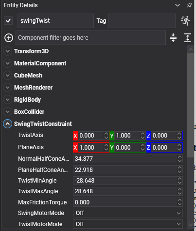

# Swing Twist Constraint

<video autoplay loop muted playsinline width="100%" height="auto">
  <source src="images/swing_twist_constraint.mp4" type="video/mp4">
</video>

A **swing twist constraint** is the anatomical joint: a ball joint that limits how far it may bend (**swing**) and how far it may rotate about its own axis (**twist**), each separately, and with a different limit in each swing direction.

It is what ragdolls are built from. Shoulders, hips, necks and wrists all bend further one way than another and all have a limit to how far they may screw round, and a swing twist constraint is the only one that can express all of that at once.

> [!NOTE]
> This replaces the `ConeTwistJoint3D` of the previous API, with the two swing directions now limited independently.

## SwingTwistConstraint Component



```csharp
Entity upperArm = new Entity("upperArm")
    .AddComponent(new Transform3D() { Position = shoulder })
    .AddComponent(new RigidBody())
    .AddComponent(new CapsuleCollider() { Radius = 0.08f, Height = 0.34f })
    .AddComponent(new SwingTwistConstraint()
    {
        ConnectedEntityPath = "torso",
        Anchor = new Vector3(0f, 0.17f, 0f),

        TwistAxis = Vector3.UnitY,
        PlaneAxis = Vector3.UnitX,

        // A shoulder: a wide swing forwards and back, less to the side, and very little screw.
        NormalHalfConeAngle = MathHelper.ToRadians(75f),
        PlaneHalfConeAngle = MathHelper.ToRadians(45f),
        TwistMinAngle = MathHelper.ToRadians(-30f),
        TwistMaxAngle = MathHelper.ToRadians(30f),
    });

this.Managers.EntityManager.Add(upperArm);
```

## Axis and Limit Properties

| Property | Default | Description |
| --- | --- | --- |
| **TwistAxis** | 0,1,0 | The axis the joint twists about, and the centre of the swing cone. For a limb, this points down the bone. |
| **PlaneAxis** | 1,0,0 | A reference direction perpendicular to `TwistAxis`, which fixes which way "plane" means. |
| **NormalHalfConeAngle** | π/4 | How far the joint may swing perpendicular to the plane axis, in radians. |
| **PlaneHalfConeAngle** | π/4 | How far it may swing in the plane, in radians. Two different half angles are what make the swing limit an **ellipse** rather than a circle. |
| **TwistMinAngle** | -π/4 | How far it may twist one way, in radians. |
| **TwistMaxAngle** | π/4 | How far the other way. |
| **MaxFrictionTorque** | 0 | Friction in the joint. A little of it is what stops a ragdoll's limbs swinging for ever. |

## Motor Properties

| Property | Default | Description |
| --- | --- | --- |
| **SwingMotorMode** | `Off` | Drives the swing towards `TargetOrientation` or `TargetAngularVelocity`. |
| **TwistMotorMode** | `Off` | Drives the twist the same way. The two are set separately. |
| **TargetOrientation** | identity | The orientation a position motor drives towards. |
| **TargetAngularVelocity** | 0,0,0 | The angular velocity a velocity motor drives towards. |
| **MaxSwingTorque** | 1000 | The strongest torque the swing motor may apply. |
| **MaxTwistTorque** | 1000 | The strongest torque the twist motor may apply. |
| **MotorSpring** | 20 Hz, damping 1 | How the position motor approaches its target. See [Springs](index.md#springs). |
| **MotorTorque** | *read-only* | How hard the motors are working right now. |

Plus the [common properties](index.md#common-properties).

## Building a Ragdoll

<video autoplay loop muted playsinline width="100%" height="auto">
  <source src="../images/ragdoll_joints.mp4" type="video/mp4">
</video>

This is the constraint a ragdoll is mostly made of: a swing twist at every hip, shoulder, waist and
neck, with a [hinge](hinge_constraint.md) at the elbows and knees. The anchor goes in the child limb's
own space, at the point where the two bones meet:

```csharp
var shoulder = new SwingTwistConstraint()
{
    ConnectedBody = torso.FindComponent<RigidBody>(),
    Anchor = new Vector3(0f, 0.15f, 0f),
    TwistAxis = Vector3.UnitY,
    PlaneAxis = Vector3.UnitX,
    PlaneHalfConeAngle = MathHelper.ToRadians(80f),
    NormalHalfConeAngle = MathHelper.ToRadians(60f),
    TwistMinAngle = MathHelper.ToRadians(-30f),
    TwistMaxAngle = MathHelper.ToRadians(30f),

    // Neighbouring bones overlap at the joint by design, so they must not collide: letting them means
    // every joint fights a contact every step, and the figure blows itself apart on the first frame.
    CollideConnected = false,

    // A little friction everywhere. Without it a ragdoll dropped on the floor keeps twitching: every
    // joint is a frictionless bearing, so nothing ever quite comes to rest.
    MaxFrictionTorque = 0.5f,
};
```

See [Ragdolls](../ragdolls.md) for the whole figure: the eleven bodies, their masses, the rules that
decide whether it holds together, and how to switch a character from its animation to a ragdoll at
run time.

> [!TIP]
> Turn on `PhysicsDebugFlags.Constraints` while tuning a ragdoll. The swing cones and twist arcs are drawn in place, so a limit that is wrong is visible rather than merely suspicious. See [Debug Rendering](../debug_rendering.md).
