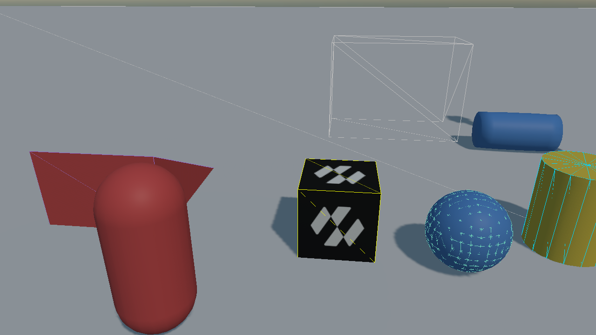
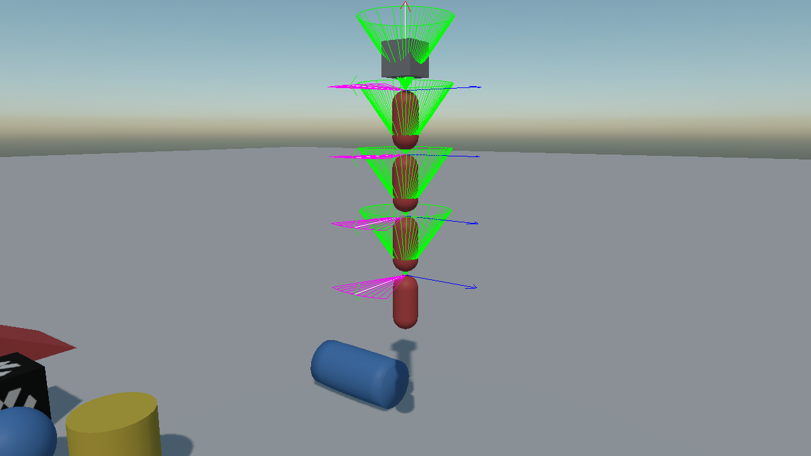
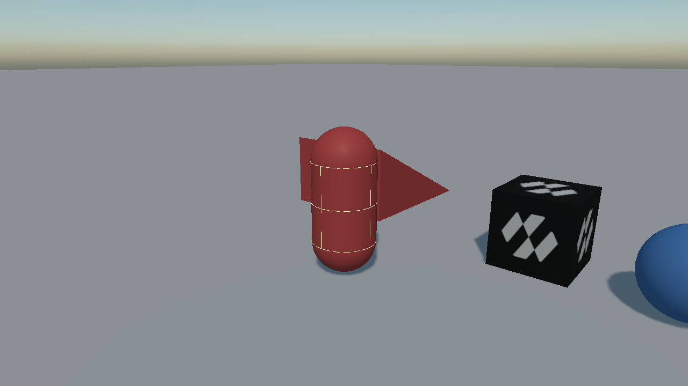
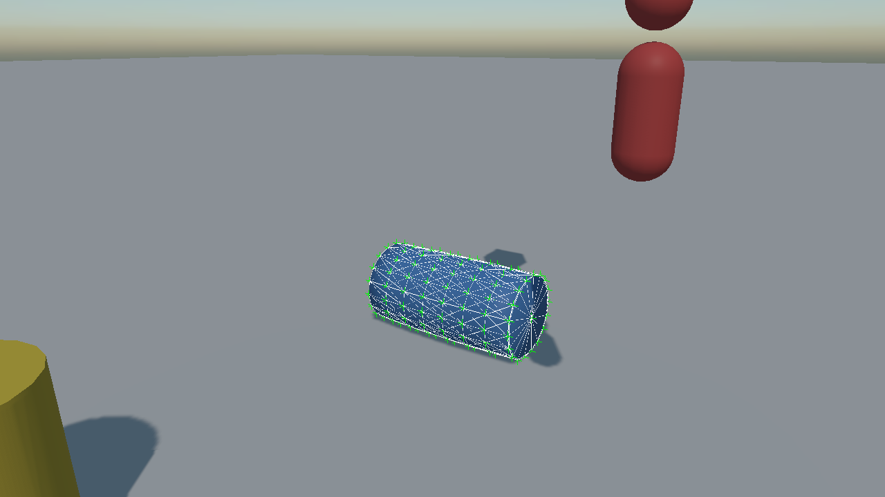
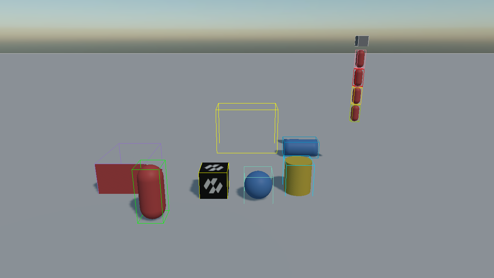
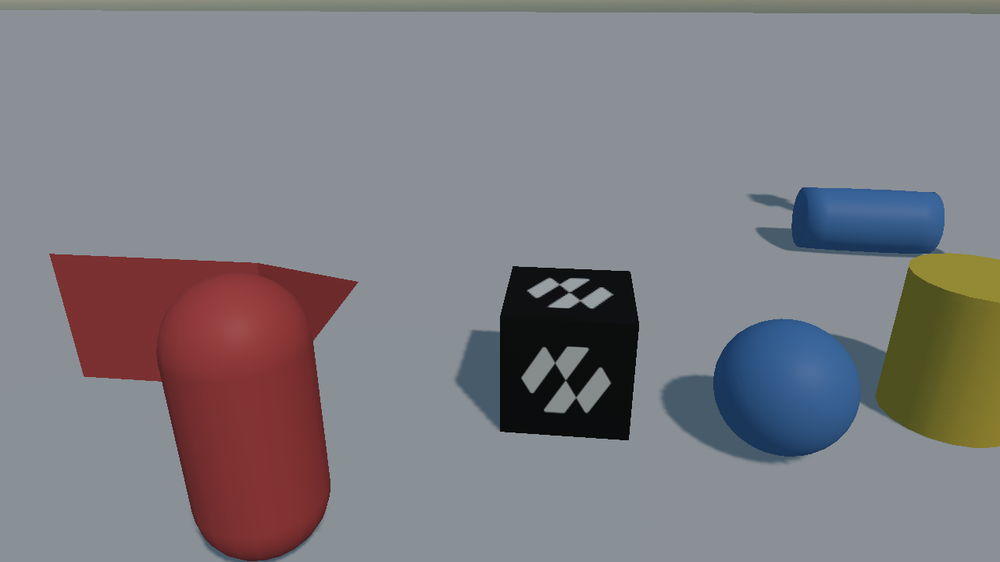
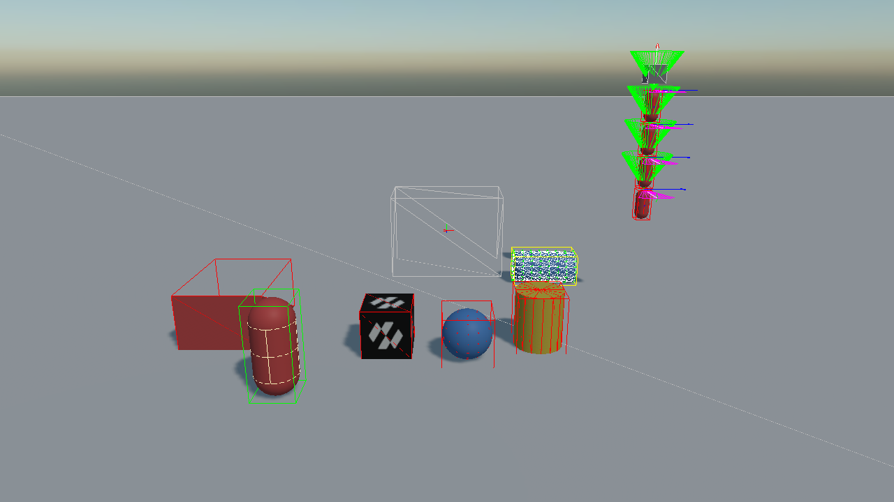

# Debug Rendering

<video autoplay loop muted playsinline width="100%" height="auto">
  <source src="images/debug_rendering.mp4" type="video/mp4">
</video>

When a body behaves oddly, the first question is always whether its shape is what you think it is. Debug rendering answers it: the world draws its own shapes, bounds, contacts and constraints over the scene.

It is one property on the [`PhysicsManager`](physics_manager.md):

```csharp
this.physicsManager.DebugFlags = PhysicsDebugFlags.Colliders | PhysicsDebugFlags.Constraints;
```

## Debug Flags

`PhysicsDebugFlags` is a flags enum, so any combination is allowed.

| Flag | What it draws |
| --- | --- |
| **None** | Nothing. The default. |
| **Colliders** | The outline of every collider, in the interpolated pose it is drawn at. |
| **BoundingBoxes** | Each body's axis-aligned bounding box, which is what the broad phase sees. |
| **CentersOfMass** | A marker at each body's centre of mass. |
| **Velocities** | The linear velocity of every awake body, as a line. |
| **Constraints** | Constraints and the arcs of their limits: hinge ranges, swing cones, twist arcs, slider travel. |
| **Characters** | Each [character controller](character_controller.md)'s capsule and its ground normal. |
| **SleepState** | Colours bodies by state — red asleep, green kinematic, yellow dynamic. |
| **SoftBodyStructure** | The vertices and the edge, volume and LRA constraints of every [soft body](soft_bodies/index.md). |
| **All** | Everything above. |

Five of them are only worth looking at against something they have a reason to draw, so the pictures
below are all taken in one scene that carries a character, a chain of joints, a soft body, a convex
hull over a mesh and a handful of primitives.

| | |
| --- | --- |
|  |  |
| **Colliders** — the flag worth leaving on while building a scene. The hull over the wedge is the case worth seeing: the wireframe and the surface it was generated from are not the same shape. | **Constraints** — each joint's frame drawn in place, with the cone a swing twist allows and the arc a hinge allows. This is how a [ragdoll](ragdolls.md) is tuned. |
|  |  |
| **Characters** — the controller's capsule and the normal of the ground it is standing on, which is what to watch when a character catches on a seam. | **SoftBodyStructure** — the vertices and the edges the solver is working on, which is a different picture from the surface being rendered over them. |
|  |  |
| **BoundingBoxes** — what the broad phase sees, which is always bigger than the shape and, for a rotated body, considerably bigger. | **SleepState** — which bodies have stopped being simulated. A scene that has gone quiet when it should not have is this flag's question. |



*And every flag at once, which is rarely what you want but says what there is.*

## What it is actually showing you

The drawing comes from the **simulation**, not from the renderer. What you see is the shape the solver has, after everything that changed it on the way in:

* the **convex radius** applied, so a box is drawn very slightly smaller and rounder than its mesh;
* a **height field** quantized to the range it was built with;
* a **compound shape** assembled from every collider in the hierarchy;
* the entity's **scale** already applied.

That is what makes it worth trusting: anything that disagrees with the drawn mesh is a real difference, not a drawing artefact. A collider that is visibly the wrong size, in the wrong place, or missing from a compound is the bug you were looking for.

It needs a `RenderManager` in the scene, and it draws on the same line batch everything else does.

## Turning it on from Code

A key that cycles through the useful combinations is worth having in any project that uses physics:

```csharp
public class PhysicsGizmos : Behavior
{
    private static readonly PhysicsDebugFlags[] Steps =
    {
        PhysicsDebugFlags.None,
        PhysicsDebugFlags.Colliders | PhysicsDebugFlags.SleepState,
        PhysicsDebugFlags.Colliders | PhysicsDebugFlags.Constraints | PhysicsDebugFlags.CentersOfMass,
        PhysicsDebugFlags.All,
    };

    [BindSceneManager]
    private PhysicsManager physicsManager = null;

    private int step;
    private bool wasDown;

    protected override void Update(TimeSpan gameTime)
    {
        KeyboardDispatcher keyboard = this.Managers.RenderManager.ActiveCamera3D?.Display?.KeyboardDispatcher;
        bool isDown = keyboard != null && keyboard.IsKeyDown(Keys.G);

        // On the edge, not while held: a key tested every frame would run through all four settings in
        // a twentieth of a second and land back where it started.
        if (isDown && !this.wasDown)
        {
            this.step = (this.step + 1) % Steps.Length;
            this.physicsManager.DebugFlags = Steps[this.step];
        }

        this.wasDown = isDown;
    }
}
```

## What each flag is good for

| Symptom | Flag to turn on |
| --- | --- |
| A body rests too high, or sinks into the floor | **Colliders** — the shape is not the size the mesh is. |
| A compound body behaves as though it were one box | **Colliders** — a child collider is missing from the hierarchy. |
| A body tips over for no reason | **CentersOfMass** — its centre of mass is not where you assumed. |
| A vehicle rolls in every corner | **CentersOfMass** — set `CenterOfMassOffset` lower. |
| A ragdoll explodes on the first frame | **Constraints** — it was built outside its own limits. |
| A hinge opens the wrong way | **Constraints** — the limit arc shows where zero is. |
| A character catches on flat ground | **Characters** — watch the ground normal at the seams. |
| Bodies stop reacting to each other | **SleepState** — they have gone to sleep. |
| Cloth stretches away from its pins | **SoftBodyStructure** — the LRA constraints are missing. |

> [!TIP]
> `Colliders` and `SleepState` together are the pair to keep on while building a scene: the first says whether the shapes are right, and the second says whether anything is still awake that should not be.

> [!NOTE]
> Debug drawing is not free. It walks every body in the world and produces a line for every edge of every shape, so it costs real time in a large scene. It is a tool for development, not something to leave on.
