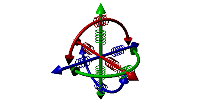
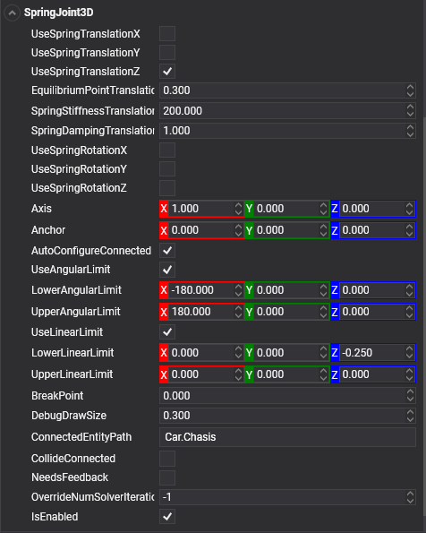

# Spring Joint

The **Spring Joint** is a variant of the previous Six Degrees-of-Freedom joint that includes the addition of springs for each degree of freedom. Springs and motors cannot be combined in this constraint.



## SpringJoint3D

In Evergine, a Spring Joint is implemented using the `Generic6DoFJoint3D` component.



## Properties

### Common Properties

| Property                     | Default       | Description                                                                                                                                              |
|------------------------------|---------------|----------------------------------------------------------------------------------------------------------------------------------------------------------|
| **ConnectedEntityPath**      | null          | The [entity path](../../basics/component_arch/entities/entity_hierarchy.md#entity-paths) of the connected body. Only when the path is valid is a joint established properly. |
| **Anchor**                   | 0, 0, 0       | The point that defines the center of the joint in source entity local space. All physics-based simulations use this point as the center in calculations.               |
| **AutoConfigureConnected**   | true          | Enable this setting to automatically calculate the *ConnectedAnchor* position to match the global position of the anchor property. This is the default setting. Disable it to configure the position of the connected anchor manually. |
| **ConnectedAnchor**          | *auto-calculated* | Manually configure the connected anchor position, in the connected body's local space.                                                                 |
| **BreakPoint**               | 0             | If the value is greater than 0, it indicates the force that needs to be applied for this joint to break.                                                  |
| **CollideConnected**         | false         | Determines whether a collision between the two bodies managed by the joint is enabled.                                                                   |

### Limit Properties

The following properties set the limits of the object's movement.

| Property                         | Default | Description                                                                                  |
|----------------------------------|---------|----------------------------------------------------------------------------------------------|
| **UseLinearLimit**               | false   | If enabled, the position of the connected object will be restricted within the *LowerAngularLimit* & *UpperAngularLimit* values.  |
| **LowerLinearLimit**             | 0       | The lower distance of the limit.                                                             |
| **UpperLinearLimit**             | 0       | The upper distance of the limit.                                                             |
| **UseAngularLimit**              | false   | If enabled, the angular rotations will be restricted within the *LowerAngularLimit* & *UpperAngularLimit* values. |
| **LowerAngularLimit**            | 0       | The lowest angle the rotation can go.                                                        |
| **UpperAngularLimit**            | 0       | The highest angle the rotation can go.                                                       |

## Spring Properties

The following properties set the spring functionality of this joint.

| Property                            | Default | Description                                                                                     |
|-------------------------------------|---------|-------------------------------------------------------------------------------------------------|
| **UseSpringTranslationX, Y, Z**     | false   | If enabled, apply the spring functionality on the X, Y, or Z axis respectively.                 |
| **EquilibriumPointTranslationX, Y, Z** | 0       | Sets the equilibrium point of the spring forces along the X, Y, or Z translation axis.          |
| **SpringStiffnessTranslationX, Y, Z** | 0       | Sets the spring stiffness along the X, Y, or Z translation axis.                                |
| **SpringDampingTranslationX, Y, Z** | 1       | Sets the spring damping along the X, Y, or Z translation axis.                                  |
| **UseSpringRotationX, Y, Z**        | false   | If enabled, apply the spring functionality on the X, Y, or Z axis respectively.                 |
| **EquilibriumPointRotationX, Y, Z** | 0       | Sets the equilibrium point of the spring forces along the X, Y, or Z rotation axis.             |
| **SpringStiffnessRotationX, Y, Z**  | 0       | Sets the spring stiffness along the X, Y, or Z rotation axis.                                   |
| **SpringDampingRotationX, Y, Z**    | 1       | Sets the spring damping along the X, Y, or Z rotation axis.                                     |

## Using Spring Joint

This snippet uses a Spring Joint to add some spring functionality as demonstrated in the [Generic6DoF Joint example](generic_6dof_joint.md#using-generic-6dof-joint).

<video autoplay loop muted width="400px" height="auto">
  <source src="images/SpringJointSample.mp4" type="video/mp4">
</video>

```csharp
protected override void CreateScene()
{
    this.Managers.RenderManager.DebugLines = true;

    // Load your material
    var material = this.Managers.AssetSceneManager.Load<Material>(DefaultResourcesIDs.DefaultMaterialID);
    var cubeMaterial = this.Managers.AssetSceneManager.Load<Material>(EvergineContent.CrateMat);

    float sliderLength = 3;

    // Create the slider holder...
    Entity slider = new Entity()
        .AddComponent(new Transform3D()
        {
            Scale = new Vector3(sliderLength, 0.1f, 0.1f),
            Rotation = new Vector3(0, 0, MathHelper.ToRadians(-45))   // Rotate the slider axis by 45º
        })
        .AddComponent(new MaterialComponent() { Material = material })
        .AddComponent(new CubeMesh())
        .AddComponent(new MeshRenderer())
        .AddComponent(new RigidBody3D()
        {
            PhysicBodyType = RigidBodyType3D.Kinematic
        });

    // Create the sliding object...
    Entity cube = new Entity()
        .AddComponent(new Transform3D())
        .AddComponent(new MaterialComponent() { Material = cubeMaterial })
        .AddComponent(new CubeMesh() { Size = 0.5f })
        .AddComponent(new MeshRenderer())
        .AddComponent(new RigidBody3D()
        {
            PhysicBodyType = RigidBodyType3D.Dynamic,
        });

    // Create the Joint
    slider.AddComponent(new SpringJoint3D()
    {
        ConnectedEntityPath = cube.EntityPath,

        UseLinearLimit = true,                  // Limit the slider
        LowerLinearLimit = new Vector3(0, 0, -sliderLength / 2),
        UpperLinearLimit = new Vector3(0, 0, sliderLength / 2),

        UseSpringTranslationZ = true,            // Add a linear spring on the Z axis
        EquilibriumPointTranslationZ = 0,
        SpringStiffnessTranslationZ = 10,
        SpringDampingTranslationZ = 0.02f,
    });

    this.Managers.EntityManager.Add(slider);
    this.Managers.EntityManager.Add(cube);
}
```