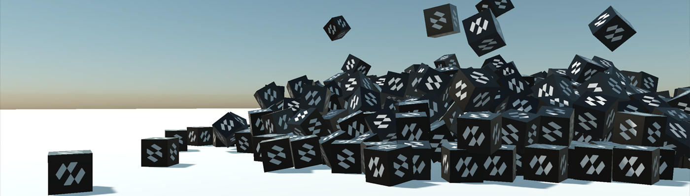

# Migrating from Bullet



Evergine's physics has been rebuilt on **[Jolt Physics](https://github.com/jrouwe/JoltPhysics)**, replacing Bullet. Every component has a new name, several have been merged, and a few concepts work differently.

This page is the map from the old API to the new one. Most of the mechanical part of the work is done by the [migration tool](#migration-tool) at the end of the page; the tables are for reading its report and for the pieces it leaves to you.

## What changed and why

| | Before | Now |
| --- | --- | --- |
| Engine | Bullet, through the `Evergine.Bullet` package | Jolt, built into `Evergine.Framework` |
| Namespace | `Evergine.Framework.Physics3D` | `Evergine.Framework.Physics` |
| Suffix | `RigidBody3D`, `BoxCollider3D`, `HingeJoint3D` | `RigidBody`, `BoxCollider`, `HingeConstraint` |
| Backend | An abstract manager with a Bullet implementation | One concrete `PhysicsManager` |
| Package | `Evergine.Bullet` had to be installed | Nothing to install |

Three things come with the change: the solver is built to use several cores, it can be made deterministic, and it brings [soft bodies](soft_bodies/index.md), [tracked vehicles](vehicles/tracked_vehicles.md), [height fields](colliders/heightfield_collider.md) and [plane colliders](colliders/plane_collider.md), none of which existed before.

## The Manager

```csharp
// Before
this.Managers.AddManager<PhysicManager3D>(new Evergine.Bullet.BulletPhysicManager3D());

// Now
this.Managers.AddManager(new Evergine.Framework.Physics.PhysicsManager());
```

There is no abstract base and no backend to choose. `SceneManagers.PhysicManager3D` is gone too. Bind to the manager instead:

```csharp
[BindSceneManager]
private PhysicsManager physicsManager = null;
```

## Bodies

| Bullet | Jolt | Notes |
| --- | --- | --- |
| `RigidBody3D` | [`RigidBody`](physics_bodies/rigid_body.md) | Dynamic by default; `IsKinematic = true` for a kinematic one. |
| `StaticBody3D` | [`StaticBody`](physics_bodies/static_body.md) | Still a component of its own, and now with no motion properties at all. |
| `BulletGhostBody3D` | `StaticBody` or `RigidBody` | With `IsSensor = true`. Static if it stays put, kinematic if it moves. |
| `PhysicBodyType` (a `RigidBodyType3D`) | *Removed.* | `Kinematic` and `Dynamic` are the two values of `RigidBody.IsKinematic`; static is a choice of component. |
| *None.* | `PhysicsBody` | The new base class of both. Colliders, constraints, queries and collision events hand bodies out as this type. |

> [!NOTE]
> A code-created `StaticBody3D` ghost that followed the cursor, a controller or a hand has to become a **kinematic `RigidBody`**. Bullet paired static ghosts with everything; Jolt never generates a contact between two static bodies. If the sensor must also notice static geometry, set `CollideKinematicVsNonDynamic` on it. See [Sensors](physics_bodies/sensors.md).

| Property | Bullet | Jolt |
| --- | --- | --- |
| Axis locking | `LinearFactor`, `AngularFactor` (0 to 1 per axis) | `AllowedDegreesOfFreedom`, a flags enum that locks an axis **exactly** rather than scaling it. |
| Per-body gravity | `OverrideGravity` + `Gravity` (a vector) | `GravityFactor`, a scalar multiplying the world's gravity. |
| Inertia | `LocalInertia` (a tensor) | `InertiaMultiplier`, a scalar scaling the inertia computed from the shape. |
| Rolling friction | `RollingFriction` | *Removed.* Use `AngularDamping` to stop things rolling for ever. |
| Mass | `Mass`, default 1 | `Mass`, default **0**, which means "work it out from the colliders' `Density`". |
| Friction | default 0.5 | default **0.2**. |
| Damping | default 0 | default **0.05** for both linear and angular. |
| Collision filtering | `CollisionCategory` + `MaskBits` per body | `CollisionCategory` per body, plus one [collision matrix](collision_filtering.md) on the world. There is no per-body mask any more: every old mask rule has to be recreated with `SetCollisionEnabled`, and the migration tool reports each one it removed rather than guessing. |

### Methods

| Bullet | Jolt |
| --- | --- |
| `ApplyForce(force)` | `ApplyForce(force)` |
| `ApplyForceAtPosition(force, position)` | `ApplyForce(force, worldPosition)` |
| `ApplyImpulse(impulse)` | `ApplyImpulse(impulse)` |
| `ApplyImpulseAtPosition(impulse, position)` | `ApplyImpulse(impulse, worldPosition)` |
| `ApplyTorque(torque)` | `ApplyTorque(torque)` |
| `ApplyTorqueImpulse(impulse)` | `ApplyAngularImpulse(impulse)` |
| `ClearForces()` | *Removed.* Forces are cleared at the end of each step. |
| *None.* | `MoveTo`, `Teleport`, `ApplyBuoyancy`, `GetPointVelocity`, `InvalidateShape` |

> [!IMPORTANT]
> Kinematic bodies now have a proper way to be moved: `MoveTo(position, orientation)`. It generates the velocity needed to get there this step, so the body pushes and carries as it should. Writing the `Transform3D` teleports it and drops whatever was standing on it.

## Colliders

| Bullet | Jolt | Notes |
| --- | --- | --- |
| `Collider3D` | `Collider` | |
| `BoxCollider3D` | [`BoxCollider`](colliders/box_collider.md) | |
| `SphereCollider3D` | [`SphereCollider`](colliders/sphere_collider.md) | |
| `CapsuleCollider3D` | [`CapsuleCollider`](colliders/capsule_collider.md) | |
| `CylinderCollider3D` | [`CylinderCollider`](colliders/cylinder_collider.md) | |
| `ConeCollider3D` | [`TaperedCylinderCollider`](colliders/tapered_cylinder_collider.md) | The old radius becomes `BottomRadius` and `TopRadius` stays at 0. A cone is a tapered cylinder. |
| `MeshCollider3D` | [`MeshCollider`](colliders/mesh_collider.md) | `MeshType = TriangleMesh`. |
| `BulletConvexHullCollider3D` | [`MeshCollider`](colliders/mesh_collider.md) | `MeshType = ConvexHull`, which is the default. |
| `BulletCompoundCollider3D` | *Removed.* | A body builds a compound from every collider on its entity and its descendants, automatically. |
| *None.* | [`TaperedCapsuleCollider`](colliders/tapered_capsule_collider.md) | New. |
| *None.* | [`PlaneCollider`](colliders/plane_collider.md) | New. |
| *None.* | [`HeightFieldCollider`](colliders/heightfield_collider.md) | New, and deformable at run time. |

| Property | Bullet | Jolt |
| --- | --- | --- |
| Dimensions | Factors of the model's bounds: a `Size` of 1 fitted the mesh. | Local units by default. [`UseModelBounds`](colliders/index.md#local-units-or-model-bounds) restores the Bullet convention, and the migration tool switches it on for every migrated primitive collider and vehicle wheel. |
| Entity scale | Applied to the model, not always to the collider. | Baked into the native shape: a unit collider on a scaled entity collides at the size it is drawn. |
| Collision margin | `Margin`, 0.04 | `ConvexRadius`, 0.05, on the shapes that have one. |
| Density | *None.* | `Density`, 1000 kg/m³, which is what a body's mass is computed from. |
| Compound | `BulletCompoundCollider3D` | The hierarchy. A child collider moved at run time updates the compound in place. |

## Joints become Constraints

| Bullet | Jolt |
| --- | --- |
| `FixedJoint3D` | [`FixedConstraint`](constraints/fixed_constraint.md) |
| `PointToPointJoint3D` | [`PointConstraint`](constraints/point_constraint.md) |
| `HingeJoint3D` | [`HingeConstraint`](constraints/hinge_constraint.md) |
| `SliderJoint3D` | [`SliderConstraint`](constraints/slider_constraint.md) |
| `ConeTwistJoint3D` | [`SwingTwistConstraint`](constraints/swing_twist_constraint.md) |
| `GearJoint3D` | [`GearConstraint`](constraints/gear_constraint.md) |
| `Generic6DofJoint3D` | [`SixDOFConstraint`](constraints/six_dof_constraint.md) |
| `Generic6DofSpringJoint3D` | [`SixDOFConstraint`](constraints/six_dof_constraint.md) with `LimitsSpring` |
| `SpringJoint3D` | *No direct equivalent.* Springs are a property of a limit: `LimitsSpring` on a hinge, slider or distance constraint, or a six DOF constraint. |
| *None.* | [`DistanceConstraint`](constraints/distance_constraint.md), [`ConeConstraint`](constraints/cone_constraint.md), [`RackAndPinionConstraint`](constraints/rack_and_pinion_constraint.md), [`PulleyConstraint`](constraints/pulley_constraint.md), all new. |

The `IXxxJoint3D` interfaces and the `XxxJointDef3D` structs are gone: a constraint is a component and nothing else.

| Property | Bullet | Jolt |
| --- | --- | --- |
| Breaking | `BreakPoint` | `IsBreakable` + `BreakForce` + `BreakTorque`, plus a `Broken` event. |
| Auto anchor | `AutoConfigureConnected` | `AutoConfigureConnectedAnchor` |
| Motors | `UseMotor`, `MotorTargetVelocity`, `MotorTargetImpulse` | `MotorMode` (`Off`/`Velocity`/`Position`), `TargetAngularVelocity`/`TargetVelocity`, `TargetAngle`/`TargetPosition`, `MaxMotorTorque`/`MaxMotorForce`. |
| Soft limits | `LimitSoftness`, `LimitBiasFactor`, `LimitRelaxationFactor` | `LimitsSpring`, a `SpringParameters` in frequency-and-damping or stiffness-and-damping terms. |

## Character Controller

| Bullet | Jolt |
| --- | --- |
| `CharacterController3D` | [`CharacterController`](character_controller.md) |
| `StepHeight` | `StepHeight` |
| `MaxSlope` (45°) | `MaxSlopeAngle` (π/4, in **radians**) |
| `FallSpeed`, `Gravity` | `ApplyGravity`, plus the world's gravity |
| `JumpSpeed` | An argument to `Jump(speed)` |
| `SetVelocity(v)` | `LinearVelocity` |
| `Teleport(p)` | `Teleport(p)` |

Three real differences:

* It is built on Jolt's `CharacterVirtual` and is **not a rigid body**. Do not add a `RigidBody` or a `Collider` to the same entity.
* The entity's origin is at the character's **feet**, not the middle of its capsule.
* Write only the **horizontal** part of `LinearVelocity`. The component owns the vertical.

## Vehicles

| Bullet | Jolt |
| --- | --- |
| `PhysicVehicle3D` | [`WheeledVehicleController`](vehicles/wheeled_vehicles.md) |
| `PhysicWheel3D` | [`VehicleWheel`](vehicles/vehicle_wheel.md) |
| `ApplyEngineForce`, `SetSteeringValue`, `SetBrake` | One call: `SetDriverInput(forward, right, brake, handBrake)` |
| `SearchVehicle`, `PhysicVehicleEntityPath` | *Removed.* Wheels are child entities and are found by walking the hierarchy. |
| `SuspensionStiffness`, `SuspensionCompression` | `SuspensionSpring`, a `SpringParameters`. |
| `MaxSuspensionTravel`, `SuspensionRestLength` | `SuspensionMinLength`, `SuspensionMaxLength`. |
| `IsSteerableWheel` | `MaxSteerAngle`. Zero means it does not steer. |
| `IsDriveWheel` | `FrontWheelDrive` / `RearWheelDrive` on the controller. |
| `IsBrakableWheel` | `MaxBrakeTorque`. Zero means it does not brake. |
| *None.* | [`TrackedVehicleController`](vehicles/tracked_vehicles.md), new. |

## Queries

| Bullet | Jolt |
| --- | --- |
| `RayCast(ref from, ref to, filterMask)` | `RayCast(origin, direction, maxDistance, in filter, out hit)` |
| `RayCastAll(...)` | `RayCastAll(origin, direction, maxDistance, results, in filter)` |
| `ConvexSweepTest(...)` | `ShapeCast`, `SphereCast`, `BoxCast` |
| `ConvexSweepTestAll(...)` | `ShapeCastAll(...)` |
| `PointTest(...)` | `OverlapPoint`, `OverlapPointAll` |
| `ContactTest(...)` | `OverlapSphere`, `OverlapBox`, `OverlapShape`, `OverlapAABox` |
| `ContactPairTest(...)` | `WereBodiesInContact(first, second)` |
| `HitResult3D` | `RayCastHit`, `ShapeCastHit`, `OverlapHit` |
| A category mask argument | A [`QueryFilter`](queries.md#query-filters) struct: categories, sensors, an ignored body and a predicate. |

Rays are now given an **origin, a direction and a distance** rather than two points, and hits carry both `Distance` and `Fraction`. Every hit's `Body` is a `PhysicsBody`; code that applied an impulse to whatever a ray hit needs `hit.Body as RigidBody` first.

> [!IMPORTANT]
> Bullet's ray casts hit ghost objects. Jolt's skip sensors unless the filter says otherwise, so a migrated ray cast that used to stop at a trigger volume needs a `QueryFilter` with `IncludeSensors = true`. The migration tool writes that filter into the ray casts it converts.

## Collisions

| Bullet | Jolt |
| --- | --- |
| `BeginCollision` | `CollisionStarted` |
| `UpdateCollision` | `CollisionUpdated` |
| `EndCollision` | `CollisionEnded` |
| `CollisionInfo3D` | `CollisionInfo` |
| `ContactPoint3D` | Folded into `CollisionInfo`: `Point`, `Normal`, `PenetrationDepth`, `PointCount`. |

Events are now raised **once per pair of bodies** rather than per pair of sub-shapes, and always on the main thread after the step.

## Manager Settings

| Bullet | Jolt |
| --- | --- |
| `PerformPhysicSteps` | `IsSimulationEnabled` |
| `MaxSubSteps` | `MaxStepsPerFrame` |
| `PhysicWorldResolution` | `CollisionSteps` |
| `FixedTimeStep` | `FixedTimeStep` |
| `ApplySpeculativeContactRestitution` | `SpeculativeContactDistance` |
| `DrawFlags` / `DebugDrawFlags` | [`DebugFlags`](debug_rendering.md), a `PhysicsDebugFlags` |
| `SetDebugDraw()` / `DebugDraw()` | *Removed.* One property does it. |
| `InternalWorld` | `NativePhysicsSystem`, `NativeBodyInterface` |
| `OnPhysicStep` | `PhysicsStepStarting`, `PhysicsStepCompleted`, `SimulationUpdated` |

## Migration Tool

The Evergine repository ships a PowerShell script that does the mechanical part of all of the above, on the C# source, the project files and the `.wescene` and `.weprefab` assets of a project:

```text
src/Tools/Migration/Migrate-BulletToJolt.ps1
```

It takes a project directory, a `.sln`, `.slnx`, `.csproj` or `.weproj`. Handed a solution that also references an Evergine checkout or another repository, it confines itself to the Git repository that owns the solution and reports the projects it left alone. **It is a dry run unless `-Apply` is given**, so the first run costs nothing.

### Recommended process

1. Commit, or otherwise keep, the current state of the project.
2. Run it dry and write the findings to a file:

   ```powershell
   pwsh -File .\src\Tools\Migration\Migrate-BulletToJolt.ps1 `
     -ProjectPath D:\Projects\MyGame\MyGame.Windows.sln `
     -ReportPath D:\Projects\MyGame\bullet-to-jolt-report.json
   ```

3. Read the list of files it would change and every warning in the report.
4. Apply it:

   ```powershell
   pwsh -File .\src\Tools\Migration\Migrate-BulletToJolt.ps1 `
     -ProjectPath D:\Projects\MyGame\MyGame.Windows.sln `
     -Apply
   ```

5. The originals of every changed file, and the report, are kept under `<project>\.bullet-to-jolt-backup\<timestamp>\` unless `-NoBackup` says otherwise.
6. Rebuild the content. Generated assets are deliberately not touched; their source `.wescene` and `.weprefab` files are what was migrated.
7. Build the C# projects and work through what the report flagged.
8. Run the project with [debug rendering](debug_rendering.md) on and check collider placement, sensors, constraints and vehicle wheels.
9. Run the tool dry once more. A fully migrated project reports zero changed files.

| Switch | Purpose |
| --- | --- |
| **-Apply** | Writes the migration. Without it nothing on disk changes. |
| **-AssetsOnly** | Migrates the scene and prefab sources only, leaving the C# alone. |
| **-NoBackup** | Skips the timestamped backup. Only when source control already protects the tree. |
| **-ReportPath &lt;file&gt;** | Writes the full JSON report to a path of your choosing instead of the backup folder. |
| **-PreserveConstraintMasses** | Keeps the original masses in fragile constraint chains instead of applying the stability profile described below. |

### What it does

* Removes the `Evergine.Bullet` and `Evergine.LibBulletc` package and project references.
* Renames the namespace, the manager, and every body, collider, constraint, vehicle and query type, in code and in serialized components.
* Migrates `.wescene` and `.weprefab` component types and the properties that have an equivalent.
* Turns `PhysicBodyType` into `IsKinematic`, in assets and in C# comparisons and assignments, and `StaticBody3D` into `StaticBody`.
* Switches on `UseModelBounds` on every legacy primitive collider and vehicle wheel, including colliders created from C#, so their dimensions keep meaning what they meant.
* Converts collider offsets and orientations, `Margin` to `ConvexRadius` where a convex radius makes sense, CCD to `MotionQuality.LinearCast`, linear and angular factors to `AllowedDegreesOfFreedom`, and inherited negative solver iteration counts to the new zero sentinel.
* Converts the common `RayCast` forms to the `bool`/`out RayCastHit` API, with a filter that still hits sensors.
* Replaces dictionaries keyed by `CollisionInfo.Id` with `(ThisCollider, OtherCollider)` keys where it can prove the pattern, so simultaneous contacts from different sensors stay distinct.
* Folds adjacent `ApplyEngineForce`, `SetSteeringValue` and `SetBrake` calls into one `SetDriverInput`.
* Derives each wheel's radius, position, suspension and grip from the original Bullet asset, lowers the centre of mass, and scales inertia, damping, torque and anti-roll to the chassis, so a migrated car neither wheelies nor sinks its wheels into the ground.
* Stabilizes constraint chains carrying a heavy load, a plank bridge under a vehicle for instance, by adjusting mass ratios and per-constraint solver iterations.
* Sets `CollideKinematicVsNonDynamic` on serialized kinematic sensors.
* Scans every relevant C# file in the repository, not just the startup project, and is idempotent: running it again rewrites nothing.

### What it leaves to you

The report keeps a warning for every conversion where the two engines do not mean the same thing:

* **Every `MaskBits` rule.** Recreate each one in the [collision matrix](collision_filtering.md), and make sure rays and moving sensors exclude their own category where they should. The tool reports the original expression rather than guessing, because a wrong guess lets a cursor ray hit its own sensor.
* **Static sensors that move.** A code-created `StaticBody` ghost that follows a cursor, controller or hand has to become a kinematic `RigidBody`.
* **Vehicles.** Check the wheel order, the steering and drive indices and the visual wheel transforms, then retune torque, brakes, grip and suspension for the handling you want.
* **Constraints** whose Bullet angular limits or motors have no exact equivalent.
* **Custom inertia and per-body gravity** where the report flags them.
* **Custom query code** (`RayCastAll`, sweeps, contact and point tests) that does not match one of the patterns the tool converts safely.
* **Cones.** `ConeCollider3D` becomes a `TaperedCylinderCollider` with the old radius in `BottomRadius` and `TopRadius` at zero; check the result looks right.

## Migration Checklist

For a project migrated by hand, or for checking one the tool has been through:

1. **Remove the `Evergine.Bullet` package reference.** Nothing replaces it; the new physics ships in `Evergine.Framework`.
2. **Change the manager registration** to `new Evergine.Framework.Physics.PhysicsManager()`.
3. **Change the using** from `Evergine.Framework.Physics3D` to `Evergine.Framework.Physics`.
4. **Rename the components** using the tables above, in code and in the `.wescene` and `.weprefab` sources. This is the part the [migration tool](#migration-tool) does for you.
5. **Replace `StaticBody3D`** with `StaticBody`, and `RigidBody3D` with `RigidBody`, setting `IsKinematic` where the body type was `Kinematic`.
6. **Replace `LinearFactor`/`AngularFactor`** with `AllowedDegreesOfFreedom`, and `OverrideGravity` with `GravityFactor`.
7. **Decide on collider units.** Turn on `UseModelBounds` to keep the Bullet sizes, or re-author the colliders in local units.
8. **Move collision filtering** from per-body mask bits to the world's [collision matrix](collision_filtering.md).
9. **Rework the queries**: two points become an origin, a direction and a distance, the mask argument becomes a `QueryFilter`, and a ray that must stop at a trigger volume sets `IncludeSensors`.
10. **Check the defaults.** Friction is 0.2 rather than 0.5, damping is 0.05 rather than 0, and `Mass = 0` now means "compute from density" rather than "static".
11. **Turn on [debug rendering](debug_rendering.md)** (`RenderManager.DebugLines`) and look at the scene. Shapes that were subtly wrong under the old margins and defaults are visible at a glance.
