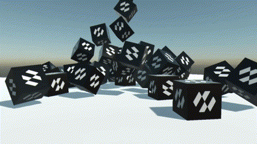
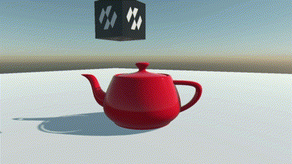
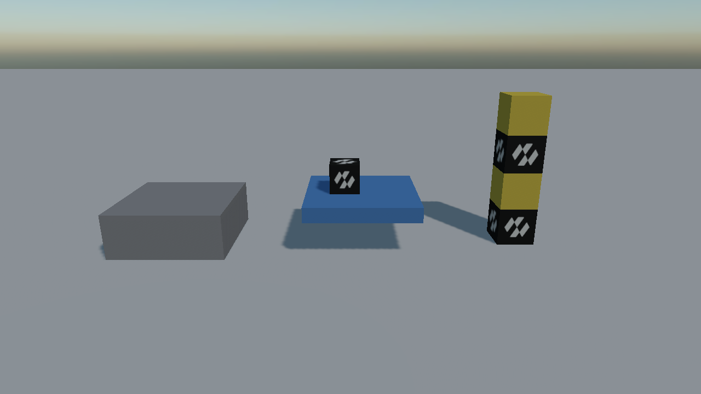

# Physics Bodies
---

A **physics body** is what turns an entity into something the simulation knows about. It gives the entity mass, velocity and a place in the collision world; the [colliders](../colliders/index.md) on it and on its children give it a shape.

In Evergine there is a single component for all of this: `RigidBody`. What kind of body it is comes from one property, `BodyType`.

## Types of Physics Bodies

| | Type | Behaviour |
| --- | --- | --- |
|  | **Static** | Never moves. The floor, the walls, the level. Static bodies never collide with each other, so a level made of a thousand of them costs nothing to simulate. |
|  | **Kinematic** | Moved by you, not by the solver. It pushes dynamic bodies out of the way and carries what stands on it, but nothing can push it back. Lifts, moving platforms, doors. |
|  | **Dynamic** | Moved by the simulation. Gravity pulls it, collisions push it, forces accelerate it. Crates, debris, anything that should fall over. |

*All three in one scene: grey static scenery on the left, a blue kinematic platform carrying a crate in the middle, and a stack of dynamic crates on the right.*

> [!NOTE]
> The previous API had a separate component per kind: `RigidBody3D` for dynamic and kinematic bodies, `StaticBody3D` for static ones. They are now one component and one enum, so changing a crate into scenery is a single property rather than a different component.

## Bodies and Colliders

A body on its own has no shape. When it is created it collects **every collider on its own entity and on its descendants**, and builds one shape out of them. A hierarchy with several colliders in it becomes a compound shape automatically; the walk stops at any descendant that has a `RigidBody` of its own, since that entity is a body in its own right.

See [Colliders](../colliders/index.md) for the shapes available and how a compound one is put together.

## In this section
* [Rigid Body](rigid_body.md)
* [Collisions](collisions.md)
* [Sensors](sensors.md)
* [Using Physics Bodies](using_physics_bodies.md)
