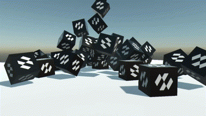
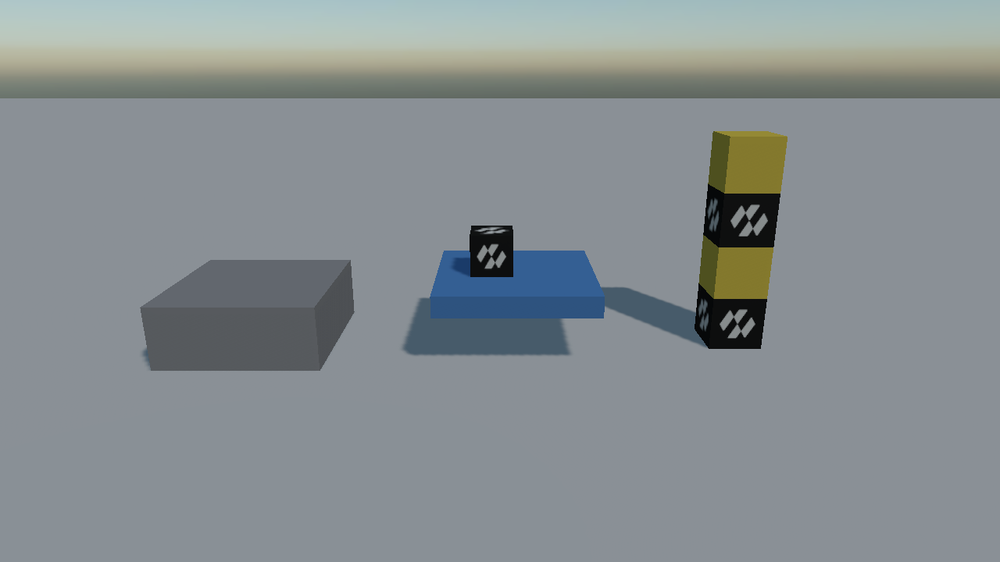

# Physics Bodies
---

A **physics body** is what turns an entity into something the simulation knows about. It gives the entity a place in the collision world, and for the bodies that move, mass and velocity; the [colliders](../colliders/index.md) on it and on its children give it a shape.

There are two body components, and they share a base class:

| Component | What it is for |
| --- | --- |
| [`RigidBody`](rigid_body.md) | A body that moves. Either the solver moves it (**dynamic**, the default) or your code does (**kinematic**, with `IsKinematic` set). |
| [`StaticBody`](static_body.md) | A body that never moves. Level geometry, floors, walls, fixed trigger volumes. |
| `PhysicsBody` | The abstract base of both. Everything a body has whether it moves or not lives here: colliders, collision events, friction and restitution, category and sensor flag. |

## Types of Physics Bodies

| | Type | Behaviour |
| --- | --- | --- |
|  | **Static** (`StaticBody`) | Never moves. The floor, the walls, the level. Static bodies never collide with each other, so a level made of a thousand of them costs nothing to simulate. |
|  | **Kinematic** (`RigidBody` with `IsKinematic`) | Moved by you, not by the solver. It pushes dynamic bodies out of the way and carries what stands on it, but nothing can push it back. Lifts, moving platforms, doors. |
|  | **Dynamic** (`RigidBody`) | Moved by the simulation. Gravity pulls it, collisions push it, forces accelerate it. Crates, debris, anything that should fall over. |

*All three in one scene: grey static scenery on the left, a blue kinematic platform carrying a crate in the middle, and a stack of dynamic crates on the right.*

Kinematic and dynamic are two settings of the same component, because a body switches between them at run time: a ragdoll is kinematic while its animation plays and dynamic when it falls. Static is a component of its own, because a static body has no motion properties at all, and the solver treats it differently from the start. Turning a crate into scenery means swapping `RigidBody` for `StaticBody`.

> [!NOTE]
> The previous API also had two components, `RigidBody3D` and `StaticBody3D`, and a `PhysicBodyType` enum property on the first. The enum is gone: `IsKinematic` is a single flag on `RigidBody`, and there is nothing to set on a `StaticBody`. See [Migrating from Bullet](../migrating_from_bullet.md).

## What Every Body Shares

The members below are defined on `PhysicsBody` and are the same on both components.

| Property | Default | Description |
| --- | --- | --- |
| **Friction** | 0.2 | Surface friction. The value used for a contact is combined from both bodies. |
| **Restitution** | 0 | Bounciness, from 0 (all energy lost on impact) to 1 (none). |
| **CollisionCategory** | `Cat1` | Which of the 32 [categories](../collision_filtering.md) this body belongs to. A body is in exactly one. |
| **IsSensor** | false | Makes the body detect overlaps and report them without any physical response. See [Sensors](sensors.md). |
| **SurfaceVelocity** | 0,0,0 | Tells contacts that the surface is moving even though the body is not. This is how a conveyor belt is built. |
| **EnhancedInternalEdgeRemoval** | false | Stops bodies catching on the seams between the triangles of a mesh collider. |

| Read-only | Description |
| --- | --- |
| **CenterOfMassPosition** | Where its centre of mass is in world space. |
| **WorldBounds** | Its axis-aligned bounding box. |
| **IsInWorld** | Whether the body has actually been created yet. Creation is deferred to a safe point in the step. |
| **Colliders** | The colliders its shape was built from. |

| Method | Description |
| --- | --- |
| **Teleport(position, orientation)** | Puts the body somewhere immediately, discarding its contacts. |
| **InvalidateShape()** | Rebuilds the shape now. Colliders added, removed or edited rebuild it on their own; this is for the cases the body cannot observe. |

| Event | When it fires |
| --- | --- |
| **CollisionStarted** / **CollisionUpdated** / **CollisionEnded** | Two bodies began touching, stayed in contact for another step, or stopped touching. See [Collisions](collisions.md). |

Everything that only makes sense for a body that moves (mass, velocity, damping, forces, `MoveTo`, sleeping) is on [`RigidBody`](rigid_body.md).

> [!TIP]
> Code that does not care whether a body moves should hold a `PhysicsBody`. That is what colliders, constraints, queries and collision events hand out: `Collider.Body`, `RayCastHit.Body` and `CollisionInfo.OtherBody` are all `PhysicsBody`, and `body as RigidBody` is the test for whether it has a velocity to read.

## Bodies and Colliders

A body on its own has no shape. When it is created it collects **every collider on its own entity and on its descendants**, and builds one shape out of them. A hierarchy with several colliders in it becomes a compound shape automatically; the walk stops at any descendant that has a body of its own, since that entity is a body in its own right.

See [Colliders](../colliders/index.md) for the shapes available and how a compound one is put together.

## In this section
* [Rigid Body](rigid_body.md)
* [Static Body](static_body.md)
* [Collisions](collisions.md)
* [Sensors](sensors.md)
* [Using Physics Bodies](using_physics_bodies.md)
