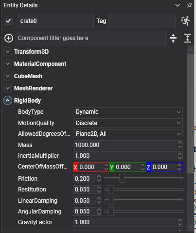
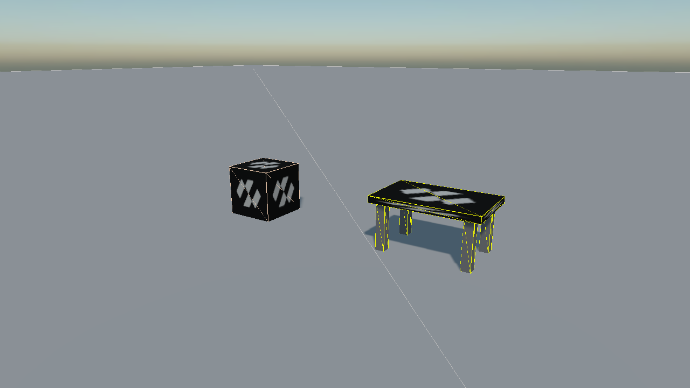

# Rigid Body

<video autoplay loop muted playsinline width="100%" height="auto">
  <source src="images/body_types.mp4" type="video/mp4">
</video>

`RigidBody` is the component that puts an entity into the physics simulation. Everything the solver moves is one: the crates, the floor they land on, and the platform carrying them.

The three kinds of body are the same component with a different `BodyType`, because the difference between them is one of behaviour and not of capability. A crate that becomes scenery, or scenery that starts to move, is a property change rather than a different component.

## RigidBody Component



Add a `RigidBody` to an entity, then add at least one [collider](../colliders/index.md) to give it a shape:

```csharp
Entity crate = new Entity("crate")
    .AddComponent(new Transform3D() { Position = new Vector3(0f, 3f, 0f) })
    .AddComponent(new MaterialComponent() { Material = material })
    .AddComponent(new CubeMesh())
    .AddComponent(new MeshRenderer())
    .AddComponent(new RigidBody())
    .AddComponent(new BoxCollider());

this.Managers.EntityManager.Add(crate);
```

The shape is collected from the colliders on the entity **and on its descendants**, so a compound body is a hierarchy:



*On the left, the ordinary case: `RigidBody` and `BoxCollider` on the same entity. On the right, a table whose `RigidBody` is on the root and whose five `BoxCollider` components are on its children. The children carry no body of their own, and the five shapes are gathered into one compound shape for the body at the top.*

<video autoplay loop muted playsinline width="100%" height="auto">
  <source src="../colliders/images/compound_collider_drop.mp4" type="video/mp4">
</video>

*Which is what "one body" means in practice: shoved over, the table tips as a single object rather than coming apart into a top and four legs.*

### Body Type

| Property | Default | Description |
| --- | --- | --- |
| **BodyType** | `Dynamic` | <ul><li>**Static**: never moves. Two static bodies never collide with each other, whatever the collision matrix says.</li><li>**Kinematic**: moved by your code through `MoveTo`. Pushes dynamic bodies and carries them; nothing pushes it back.</li><li>**Dynamic**: moved by the solver, through gravity, collisions and forces.</li></ul> |

> [!NOTE]
> Switching between static and non-static recreates the body internally. It is not something to do every frame.

### Mass and Surface Properties

| Property | Default | Description |
| --- | --- | --- |
| **Mass** | 0 | Mass in kilograms. **Zero means work it out** from the volume of the colliders and their `Density`, which is usually what you want. Reading the property back returns the mass the solver is actually using. |
| **InertiaMultiplier** | 1 | Scales the inertia computed from the shape. Above 1 the body resists turning; below 1 it spins up easily. This replaces the explicit inertia tensor of the previous API. |
| **CenterOfMassOffset** | 0,0,0 | Moves the centre of mass away from the shape's own. Lowering it is what keeps a vehicle from rolling over. |
| **Friction** | 0.2 | Surface friction. The value used for a contact is combined from both bodies. |
| **Restitution** | 0 | Bounciness, from 0 (all energy lost on impact) to 1 (none). |

<video autoplay loop muted playsinline width="100%" height="auto">
  <source src="images/rigidbody_restitution.mp4" type="video/mp4">
</video>

*Three spheres identical but for `Restitution`: 0, 0.4 and 0.8.*

<video autoplay loop muted playsinline width="100%" height="auto">
  <source src="images/rigidbody_friction.mp4" type="video/mp4">
</video>

*Three boxes given the same push, with `Friction` at 0.02, 0.3 and 0.9.*

> [!NOTE]
> There is no physics material asset. Friction and restitution belong to the **body**, and density belongs to the **collider**.

### Motion Properties

| Property | Default | Description |
| --- | --- | --- |
| **LinearVelocity** | 0,0,0 | Velocity in metres per second. Set before the entity joins the scene, it becomes the body's initial velocity. |
| **AngularVelocity** | 0,0,0 | Angular velocity in radians per second. |
| **LinearDamping** | 0.05 | Slows movement down over time, whatever else is happening. |
| **AngularDamping** | 0.05 | Slows rotation down over time. |
| **GravityFactor** | 1 | Multiplies the world's gravity for this body. `0` makes it weightless; `2` makes it fall twice as hard. |
| **MaxLinearVelocity** | 500 | A speed limit, in metres per second. |
| **MaxAngularVelocity** | 47.12 | A spin limit, in radians per second: 15π, which is seven and a half turns a second. |
| **AllowedDegreesOfFreedom** | `All` | Locks axes outright. `Plane2D` keeps a body in the XY plane turning only about Z, which is how a 2.5D game is built. |
| **MotionQuality** | `Discrete` | `LinearCast` sweeps the body's movement between steps instead of testing only where it lands, which is what stops a fast body passing through a thin wall. |

<video autoplay loop muted playsinline width="100%" height="auto">
  <source src="images/ccd_motion_quality.mp4" type="video/mp4">
</video>

*The same shot at the same speed at two thin walls. The grey one is `Discrete` and goes straight through; the red one is `LinearCast` and stops.*

> [!TIP]
> `AllowedDegreesOfFreedom` locks an axis exactly, rather than scaling it the way the old `LinearFactor` and `AngularFactor` did. A locked axis cannot drift.

### Advanced Properties

| Property | Default | Description |
| --- | --- | --- |
| **CollisionCategory** | `Cat1` | Which of the 32 [categories](../collision_filtering.md) this body belongs to. A body is in exactly one. |
| **IsSensor** | false | Makes the body detect overlaps and report them without any physical response. See [Sensors](sensors.md). |
| **SurfaceVelocity** | 0,0,0 | Tells contacts that the surface is moving even though the body is not. This is how a conveyor belt is built. |
| **AllowSleeping** | true | Lets this body be put to sleep when it stops moving. |
| **EnhancedInternalEdgeRemoval** | false | Stops bodies catching on the seams between the triangles of a mesh collider. |
| **CollideKinematicVsNonDynamic** | false | Needed for a kinematic body to notice static and other kinematic bodies, a kinematic sensor for instance. |
| **ApplyGyroscopicForce** | false | Simulates the gyroscopic effect, which matters for fast-spinning bodies. |
| **SolverVelocityIterationsOverride** | 0 | Per-body override of the world's solver settings. `0` uses the world's. |
| **SolverPositionIterationsOverride** | 0 | The same for position iterations. |

<video autoplay loop muted playsinline width="100%" height="auto">
  <source src="images/conveyor_surface_velocity.mp4" type="video/mp4">
</video>

*`SurfaceVelocity` on a static body. Nothing in the scene turns, and the parcels are carried anyway.*

### Read-only State

| Property | Description |
| --- | --- |
| **IsActive** | Whether the body is awake. |
| **CenterOfMassPosition** | Where its centre of mass is in world space. |
| **WorldBounds** | Its axis-aligned bounding box. |
| **IsInWorld** | Whether the body has actually been created yet. Creation is deferred to a safe point in the step. |
| **Colliders** | The colliders its shape was built from. |

## Methods

| Method | Description |
| --- | --- |
| **ApplyForce(force)** | Applies a force at the centre of mass, in newtons. Meant to be applied every step. |
| **ApplyForce(force, worldPosition)** | Applies it at a point, which also produces torque. |
| **ApplyTorque(torque)** | Applies a turning force. |
| **ApplyImpulse(impulse)** | Applies an instantaneous change of momentum. A one-off kick. |
| **ApplyImpulse(impulse, worldPosition)** | The same, at a point. |
| **ApplyAngularImpulse(impulse)** | An instantaneous change of angular momentum. |
| **ApplyBuoyancy(surfacePosition, surfaceNormal, buoyancy, linearDrag, angularDrag, fluidVelocity, deltaTime)** | Floats the body against a fluid surface. `buoyancy` is the ratio of the fluid's density to the body's, so above 1 it floats. |
| **GetPointVelocity(worldPoint)** | The velocity of one point of the body, rotation included. |
| **MoveTo(position, orientation)** | Moves a **kinematic** body by generating the velocity needed to get there this step, so it pushes and carries properly. |
| **Teleport(position, orientation)** | Puts the body somewhere immediately, discarding its contacts. |
| **WakeUp()** / **Sleep()** | Force the body awake or asleep. |
| **InvalidateShape()** | Rebuilds the shape now, after changing colliders at run time. |

<video autoplay loop muted playsinline width="100%" height="auto">
  <source src="images/kinematic_platforms.mp4" type="video/mp4">
</video>

*Kinematic bodies driven with `MoveTo`: a platform carrying its riders, a turnstile shoving pucks out of the way, and a lift. None of them can be pushed back.*

> [!IMPORTANT]
> To move a kinematic body use `MoveTo`, not the `Transform3D`. Writing the transform teleports the body every step: it arrives at the right place, but with no velocity, so it passes through whatever was in the way and drops whatever was standing on it.

## Events

| Event | When it fires |
| --- | --- |
| **CollisionStarted** | Two bodies began touching. |
| **CollisionUpdated** | Once per step while they stay in contact. |
| **CollisionEnded** | They stopped touching. |
| **Activated** / **Slept** | The body woke up or went to sleep. |

All of them are raised on the main thread after the step, and **once per pair of bodies** rather than per pair of sub-shapes. See [Collisions](collisions.md).

## Using RigidBody from Code

### A bouncing ball

```csharp
Entity ball = new Entity("ball")
    .AddComponent(new Transform3D() { Position = new Vector3(0f, 6f, 0f) })
    .AddComponent(new MaterialComponent() { Material = material })
    .AddComponent(new SphereMesh() { Diameter = 1f })
    .AddComponent(new MeshRenderer())
    .AddComponent(new RigidBody()
    {
        Restitution = 0.8f,     // Keeps most of its energy on impact...
        Friction = 0.2f,
    })
    .AddComponent(new SphereCollider() { Radius = 0.5f });

this.Managers.EntityManager.Add(ball);
```

### Pushing a body

```csharp
public class Launcher : Behavior
{
    [BindComponent]
    private RigidBody body = null;

    public void Launch(Vector3 direction)
    {
        // An impulse rather than a force: this is a single kick, not something applied every step.
        this.body.ApplyImpulse(direction * 12f);
    }
}
```

### A moving platform

```csharp
public class Platform : Behavior
{
    [BindComponent]
    private RigidBody body = null;

    [BindComponent]
    private Transform3D transform = null;

    private Vector3 origin;
    private float elapsed;

    protected override bool OnAttached()
    {
        if (!base.OnAttached())
        {
            return false;
        }

        this.origin = this.transform.Position;
        this.body.BodyType = RigidBodyType.Kinematic;

        return true;
    }

    protected override void Update(TimeSpan gameTime)
    {
        this.elapsed += (float)gameTime.TotalSeconds;

        Vector3 position = this.origin + (Vector3.UnitX * (float)Math.Sin(this.elapsed) * 4f);

        // MoveTo and not transform.Position: this is what gives the platform a velocity, which is
        // what carries anything standing on it and shoves anything in its way.
        this.body.MoveTo(position, this.transform.Orientation);
    }
}
```
