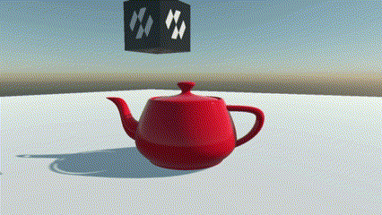
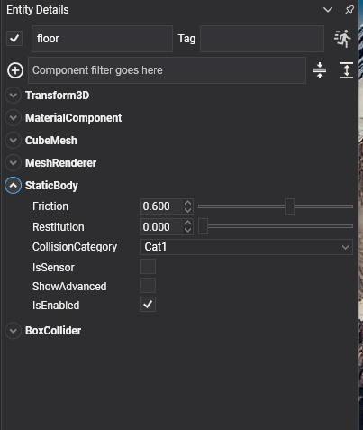

# Static Body



`StaticBody` is the component for everything in a scene that the simulation collides with but never moves: the floor, the walls, the terrain, the level. It is the cheapest kind of body there is. The solver never integrates it, never puts it to sleep or wakes it, and never tests two static bodies against each other, so a level built from a thousand of them costs nothing per step.

## StaticBody Component



Add a `StaticBody` to an entity, then at least one [collider](../colliders/index.md):

```csharp
Entity floor = new Entity("floor")
    .AddComponent(new Transform3D() { Position = new Vector3(0f, -0.2f, 0f), Scale = new Vector3(40f, 0.4f, 40f) })
    .AddComponent(new MaterialComponent() { Material = material })
    .AddComponent(new CubeMesh() { Size = 1f })
    .AddComponent(new MeshRenderer())
    .AddComponent(new StaticBody() { Friction = 0.6f })
    .AddComponent(new BoxCollider());

this.Managers.EntityManager.Add(floor);
```

The component has no properties of its own. Everything it exposes comes from `PhysicsBody` and is listed under [What Every Body Shares](index.md#what-every-body-shares): `Friction`, `Restitution`, `CollisionCategory`, `IsSensor`, `SurfaceVelocity`, `EnhancedInternalEdgeRemoval`, the three collision events, `Teleport` and `InvalidateShape`.

What it does **not** have is anything to do with motion: no mass, no velocity, no damping, no gravity factor, no `MoveTo`. The solver never reads those for a body it never moves, and the previous API accepted them silently on static bodies, which hid a good number of mistakes.

## What a Static Body Is Good For

* **Level geometry.** Floors, walls, props that never move. This is where the triangle-mesh [`MeshCollider`](../colliders/mesh_collider.md), the [`PlaneCollider`](../colliders/plane_collider.md) and the [`HeightFieldCollider`](../colliders/heightfield_collider.md) belong, since none of them can back a dynamic body.
* **Fixed trigger volumes.** A checkpoint or a damage zone is a `StaticBody` with `IsSensor` set. See [Sensors](sensors.md).
* **Conveyors.** `SurfaceVelocity` on a static body carries whatever rests on it without anything in the scene turning.
* **Anchors.** A constraint whose `ConnectedEntityPath` points at a static body is pinned to the level, which is handier than pinning it to the world when the level is built from prefabs.

## Moving a Static Body

Writing to the `Transform3D` of a static body moves it, and the physics world follows. What it does not do is give the body a velocity, so anything resting on it is left behind and anything in its way is passed through rather than pushed. That is fine for placing scenery at load time, and wrong for anything that moves while the game runs.

Something that has to move by code, even occasionally, is a [`RigidBody`](rigid_body.md) with `IsKinematic` set, driven with `MoveTo`. Two cases catch people out:

* **A sensor that follows the cursor, a controller or a hand.** Jolt never generates contact pairs between two static bodies, so a static sensor swept across a static level reports nothing. Make it a kinematic `RigidBody` and, if it must notice static geometry, set `CollideKinematicVsNonDynamic`.
* **Scenery that becomes debris.** A wall that can be knocked down is a dynamic `RigidBody` from the start, perhaps held in place by a breakable [`FixedConstraint`](../constraints/fixed_constraint.md). There is no switching a `StaticBody` into a `RigidBody` at run time: they are different components, and the swap means removing one and adding the other.

> [!NOTE]
> Two static bodies never collide with each other, whatever the [collision matrix](../collision_filtering.md) says. If two pieces of level have to report an overlap, one of them is kinematic.
