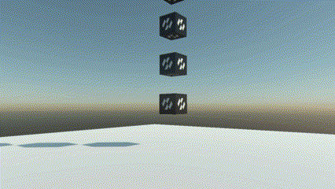

# Using Physics Bodies



A walkthrough that builds a working physics scene from nothing: a floor, a stack of crates to knock over, a platform that carries things, and a way to shoot at all of it. Every step is code you can paste into a `Scene`.

## 1. Register the world

Nothing physical happens without a [`PhysicsManager`](../physics_manager.md). Add one in `RegisterManagers`:

```csharp
public class MyScene : Scene
{
    public override void RegisterManagers()
    {
        base.RegisterManagers();

        this.Managers.AddManager(new Evergine.Framework.Physics.PhysicsManager());
    }
}
```

## 2. Give it a floor

A floor is a **static** body. Static bodies never collide with each other, so a level built from a hundred of them is nearly free.

```csharp
protected override void CreateScene()
{
    Material material = this.Managers.AssetSceneManager.Load<Material>(EvergineContent.Materials.DefaultMaterial);

    Entity floor = new Entity("floor")
        .AddComponent(new Transform3D() { Position = new Vector3(0f, -0.2f, 0f), Scale = new Vector3(40f, 0.4f, 40f) })
        .AddComponent(new MaterialComponent() { Material = material })
        .AddComponent(new CubeMesh() { Size = 1f })
        .AddComponent(new MeshRenderer())
        .AddComponent(new RigidBody()
        {
            BodyType = RigidBodyType.Static,
            Friction = 0.6f,
        })
        .AddComponent(new BoxCollider());

    this.Managers.EntityManager.Add(floor);
}
```

> [!TIP]
> The `BoxCollider` needs no size here. Left at its default it takes the entity's scale, so scaling the entity scales the collider with the mesh.

## 3. Stack some crates

<video autoplay loop muted playsinline width="100%" height="auto">
  <source src="images/body_types.mp4" type="video/mp4">
</video>

```csharp
private void CreateStack(Material material, Vector3 origin, int count)
{
    for (int i = 0; i < count; i++)
    {
        // A hair over one unit apart. Stacked at exactly their own height the boxes start the
        // simulation already touching, and the solver spends its first step pushing them apart.
        Entity crate = new Entity($"crate{i}")
            .AddComponent(new Transform3D() { Position = origin + (Vector3.UnitY * (0.5f + (i * 1.02f))) })
            .AddComponent(new MaterialComponent() { Material = material })
            .AddComponent(new CubeMesh() { Size = 1f })
            .AddComponent(new MeshRenderer())
            .AddComponent(new RigidBody() { Restitution = 0.05f })
            .AddComponent(new BoxCollider());

        this.Managers.EntityManager.Add(crate);
    }
}
```

Dynamic is the default `BodyType`, so nothing has to be said for a crate to fall.

## 4. Add a platform that carries them

A **kinematic** body is driven by your code and pushes everything else out of the way. The one rule is that it has to be moved with `MoveTo`:

```csharp
public class MovingPlatform : Behavior
{
    [BindComponent]
    private RigidBody body = null;

    [BindComponent]
    private Transform3D transform = null;

    private Vector3 origin;
    private float elapsed;

    public Vector3 Travel { get; set; } = new Vector3(4f, 0f, 0f);

    public float Period { get; set; } = 6f;

    protected override bool OnAttached()
    {
        if (!base.OnAttached())
        {
            return false;
        }

        this.origin = this.transform.Position;

        return true;
    }

    protected override void Update(TimeSpan gameTime)
    {
        // Capped, because a hitch must not become a teleport: the first frame of a scene can run to a
        // second while content finishes loading, and advancing the whole of it in one step asks MoveTo
        // for the velocity needed to cross that gap now, which flings anything standing on the platform.
        this.elapsed += Math.Min((float)gameTime.TotalSeconds, 1f / 30f);

        float phase = (float)Math.Sin(this.elapsed * MathHelper.TwoPi / this.Period);

        this.body.MoveTo(this.origin + (this.Travel * phase), this.transform.Orientation);
    }
}
```

Give the platform entity a `RigidBody` with `BodyType = RigidBodyType.Kinematic`, a `BoxCollider`, and this behavior.

> [!IMPORTANT]
> Writing `transform.Position` instead of calling `MoveTo` teleports the body every step. It ends up in the right place, but with no velocity: it passes through whatever was in its way and leaves behind whatever was standing on it.

## 5. Shoot at it

Firing a body into a live world exercises the interesting part of the system — deferred creation, the broad phase taking a new body mid-simulation — and it is the quickest way to see whether the scene behaves.

```csharp
public class BallLauncher : Behavior
{
    private Material material;

    public float Speed { get; set; } = 18f;

    protected override void Update(TimeSpan gameTime)
    {
        MouseDispatcher mouse = this.Managers.RenderManager.ActiveCamera3D?.Display?.MouseDispatcher;

        if (mouse == null || mouse.ReadButtonState(MouseButtons.Left) != ButtonState.Pressing)
        {
            return;
        }

        Camera3D camera = this.Managers.RenderManager.ActiveCamera3D;
        Vector3 direction = Vector3.Normalize(camera.Transform.WorldTransform.Forward);

        this.material ??= this.Managers.AssetSceneManager.Load<Material>(EvergineContent.Materials.DefaultMaterial);

        Entity shot = new Entity("shot")
            .AddComponent(new Transform3D() { Position = camera.Transform.Position + (direction * 1.2f) })
            .AddComponent(new MaterialComponent() { Material = this.material })
            .AddComponent(new SphereMesh() { Diameter = 0.4f })
            .AddComponent(new MeshRenderer())

            // The velocity is set before the entity joins the scene, which is what makes it stick: the
            // manager creates bodies deferred, so a velocity assigned now goes into the body's creation
            // settings instead of having to wait a frame to be applied.
            .AddComponent(new RigidBody()
            {
                Restitution = 0.3f,
                LinearVelocity = direction * this.Speed,
            })
            .AddComponent(new SphereCollider() { Radius = 0.2f });

        this.Managers.EntityManager.Add(shot);
    }
}
```

## 6. React to the impacts

```csharp
this.crateBody.CollisionStarted += (sender, info) =>
{
    // info.OtherEntity is what hit us, info.Point is where, info.Normal is from which side.
    this.PlayThud(info.Point);
};
```

See [Collisions](collisions.md) for the full contact information, and [Sensors](sensors.md) for bodies that report overlaps without stopping anything.

## 7. Check it with debug rendering

When a body behaves oddly the first question is always whether its shape is what you think it is. Turn the wireframe on and look:

```csharp
this.Managers.FindManager<PhysicsManager>().DebugFlags = PhysicsDebugFlags.Colliders;
```

The debug drawing shows the shapes **as the solver has them** — convex radius applied, compound shapes assembled — so anything that disagrees with the mesh is a real difference and not a drawing artefact. See [Debug Rendering](../debug_rendering.md).
