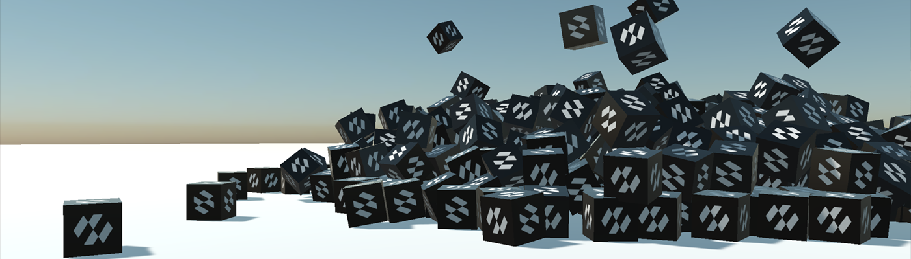

# Physics Manager



The `PhysicsManager` is the physics world. There is **one per scene**, and it owns everything the simulation shares: gravity, the rate the solver runs at, the collision matrix, the debug drawing, and every spatial query.

It is a [scene manager](../basics/scenes/scenemanagers.md), so it is registered once when the scene is built and then reached by binding to it.

## Registering the Physics Manager

Add it in `RegisterManagers`. Nothing physical works without it: bodies, colliders and constraints all look for the manager when they are attached, and do nothing at all if there is none.

```csharp
public class MyScene : Scene
{
    public override void RegisterManagers()
    {
        base.RegisterManagers();

        this.Managers.AddManager(new Evergine.Framework.Physics.PhysicsManager());
    }
}
```

To reach it from a component, bind to it rather than searching for it:

```csharp
public class Explosion : Behavior
{
    [BindSceneManager]
    private PhysicsManager physicsManager = null;
}
```

> [!TIP]
> A scene can also carry its own `PhysicsManager` serialized in the `.wescene` file, which is what makes its settings — the collision matrix above all — editable from the inspector.

## Creation Settings

These size the world when it is created. Changing them afterwards has no effect and traces a warning, so set them before the scene starts.

| Property | Default | Description |
| --- | --- | --- |
| **MaxBodies** | 10240 | The most bodies the world can hold. Reaching it stops bodies being created. |
| **MaxBodyPairs** | 65536 | The most broad phase pairs one step can consider. |
| **MaxContactConstraints** | 10240 | The most contacts the solver can handle in one step. |
| **TempAllocatorSizeMB** | 16 | Scratch memory, in megabytes, for one simulation step. |
| **WorkerThreadCount** | -1 | How many worker threads the solver uses. `-1` means one fewer than the processor count, and `0` — which is what browsers get — runs it all on the calling thread. |

> [!IMPORTANT]
> Running out of any of the three limits above is reported once per world through `Trace.TraceError`, naming the exact property to raise. A world that silently stops creating bodies is nearly impossible to diagnose from the picture alone, so it is worth watching the trace output the first time a scene grows.

## Simulation Settings

These can be changed at any time and take effect on the next step.

| Property | Default | Description |
| --- | --- | --- |
| **Gravity** | 0,-9.81,0 | Acceleration applied to every dynamic body. A single body can opt out with its `GravityFactor`. |
| **FixedTimeStep** | 0.0166 | How much time one physics step advances, in seconds. The simulation always runs at this rate whatever the frame rate is. |
| **MaxStepsPerFrame** | 4 | The most steps one frame may run. It is what stops a long frame — a stall, a breakpoint — being paid back as twenty steps at once. |
| **CollisionSteps** | 1 | Collision sub-steps inside one physics step. Raise it for fast bodies before reaching for `MotionQuality`. |
| **InterpolateTransforms** | true | Blends each body's drawn pose between the last two steps, so motion is smooth even though the solver runs at a fixed rate. |
| **TimeScale** | 1 | Multiplies the time handed to the simulation. `0.25` is slow motion; `0` freezes it while the rest of the scene keeps running. |
| **IsSimulationEnabled** | true | Stops the world stepping at all. Bodies stay where they are and queries still work. |
| **DeterministicSimulation** | false | Makes repeated runs of the same scene produce identical results, at some cost in speed. |
| **AutoOptimizeBroadPhase** | true | Lets the world rebuild its broad phase when enough bodies have been added. |

> [!TIP]
> `FixedTimeStep` and `InterpolateTransforms` work together. The solver wants a constant step to stay stable, and the renderer wants a pose for the exact moment it draws; interpolation is what bridges the two. Turning it off makes bodies visibly step at 60 Hz on a 144 Hz display.

## Solver and Sleeping

| Property | Default | Description |
| --- | --- | --- |
| **SolverVelocityIterations** | 10 | Velocity solver passes per step. More means stiffer stacks and slower steps. |
| **SolverPositionIterations** | 2 | Position solver passes per step, which is what pushes penetrating bodies apart. |
| **SpeculativeContactDistance** | 0.02 | How far ahead of a surface a contact is created, so fast bodies are caught before they overlap. |
| **PenetrationSlop** | 0.02 | How much overlap is tolerated before the solver corrects it. Small values look tighter and jitter more. |
| **AllowSleeping** | true | Lets bodies that have stopped moving be taken out of the simulation until something touches them. |
| **TimeBeforeSleep** | 0.5 | Seconds a body must be still before it sleeps. |
| **PointVelocitySleepThreshold** | 0.03 | How slow "still" is, in metres per second. |

## Read-only State

| Property | Description |
| --- | --- |
| **BodyCount** | Every body in the world. |
| **ActiveBodyCount** | Those awake this step. The gap between the two is what sleeping is buying you. |
| **Bodies** | Every `RigidBody` in the world. |
| **Characters** | Every [`CharacterController`](character_controller.md). |
| **Constraints** | Every [`Constraint`](constraints/index.md). |
| **InterpolationAlpha** | Where the current frame sits between the last two steps, from 0 to 1. |

## Events

| Event | When it fires |
| --- | --- |
| **PhysicsStepStarting** | Before each fixed step, with the step length. The right place to apply forces: a force applied here is applied exactly once per step whatever the frame rate. |
| **PhysicsStepCompleted** | After each fixed step. |
| **SimulationUpdated** | Once per frame while the simulation is enabled, after the poses have been written back to the `Transform3D` components. `StepOnce()` raises it too. |
| **BodyActivated** / **BodySlept** | A body woke up or went to sleep. Both are raised on the main thread. |

```csharp
public class Thruster : Behavior
{
    [BindComponent]
    private RigidBody body = null;

    [BindSceneManager]
    private PhysicsManager physicsManager = null;

    protected override void OnActivated()
    {
        base.OnActivated();

        // Not in Update. Update runs once a frame and a step may run four times in one, or none at
        // all, so a force applied there is a force whose strength depends on the frame rate.
        this.physicsManager.PhysicsStepStarting += this.OnStep;
    }

    protected override void OnDeactivated()
    {
        base.OnDeactivated();

        this.physicsManager.PhysicsStepStarting -= this.OnStep;
    }

    private void OnStep(object sender, float deltaTime)
    {
        this.body.ApplyForce(Vector3.Up * 250f);
    }
}
```

## Advanced Members

| Method | Description |
| --- | --- |
| **FlushPending()** | Applies the bodies, constraints, vehicles and soft bodies that are queued to be added or removed. Structural changes are deferred to a safe point in the step, so a body created this frame is not in the world — and not visible to a query — until the next one. Call this to close that gap. |
| **StepOnce()** | Runs a single step even while `IsSimulationEnabled` is false. Useful for stepping a scene frame by frame while debugging. |
| **OptimizeBroadPhase()** | Rebuilds the broad phase now. Worth doing once after building a large static level. |
| **ContactValidator** | A `Func<RigidBody, RigidBody, bool>` consulted for every pair before a contact is made, for filtering that the [collision matrix](collision_filtering.md) cannot express — one-way platforms, for instance. |

> [!IMPORTANT]
> `ContactValidator` runs on the solver's worker threads. It must be cheap, must not touch the scene, and must not allocate.
