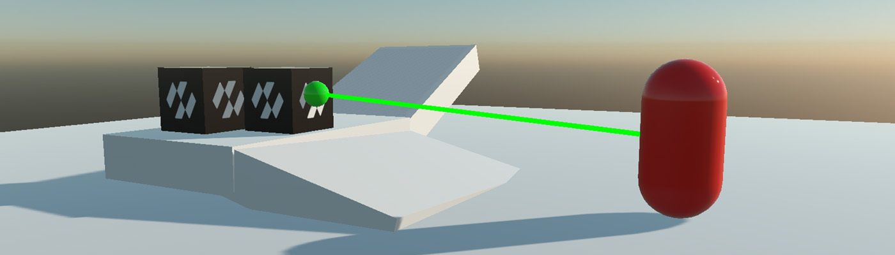
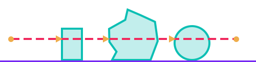

# Queries



A **query** asks the world what is there, without moving anything. Aiming a weapon, checking whether a character can step forward, finding everything caught in a blast: all of it is done with queries rather than by putting bodies into the scene and watching what they hit.

All of them live on the [`PhysicsManager`](physics_manager.md):

| Query | Answers |
| --- | --- |
| **Ray cast** | What does this line hit first? |
| **Shape cast** | If I sweep this shape along this line, where does it first touch something? |
| **Overlap** | What is inside this volume right now? |

> [!IMPORTANT]
> Queries see the world **as the last step left it**. A body created earlier in the same frame is not in it yet, because bodies are added at a safe point in the step. Call `physicsManager.FlushPending()` first if a query has to see something that was only just created.

## Ray Casting

| | |
| --- | --- |
|  | **RayCast** returns the closest hit along the ray, which is what "what am I aiming at" means. |
|  | **RayCastAll** returns every body the ray crosses, in no particular order. |

<video autoplay loop muted playsinline width="100%" height="auto">
  <source src="images/raycast.mp4" type="video/mp4">
</video>

*A ray swept across a scene. The cross is the hit point and the yellow line is the surface normal there.*

| Method | Description |
| --- | --- |
| **RayCast(origin, direction, maxDistance, out hit)** | The closest hit, with the default filter. |
| **RayCast(origin, direction, maxDistance, in filter, out hit)** | The closest hit, filtered. |
| **RayCast(ref ray, maxDistance, in filter, out hit)** | The same, from a `Ray`. |
| **RayCastAll(origin, direction, maxDistance, results, in filter)** | Every hit, appended to `results`. Returns how many there were. |

```csharp
public class Picker : Behavior
{
    [BindSceneManager]
    private PhysicsManager physicsManager = null;

    [BindComponent]
    private Transform3D transform = null;

    public Entity PickAhead()
    {
        Vector3 origin = this.transform.Position;
        Vector3 direction = this.transform.WorldTransform.Forward;

        if (this.physicsManager.RayCast(origin, direction, 100f, out RayCastHit hit))
        {
            return hit.Entity;
        }

        return null;
    }
}
```

### RayCastHit

| Property | Description |
| --- | --- |
| **Body** | The body that was hit. |
| **Entity** | Its entity, which is usually what gameplay code wants. |
| **Collider** | Which collider of a compound shape was hit. |
| **Point** | Where the ray met the surface, in world space. |
| **Normal** | The surface normal there. |
| **Distance** | How far along the ray the hit is, in metres. |
| **Fraction** | The same, as a fraction of `maxDistance`, from 0 to 1. |

## Shape Casting


A shape cast sweeps a whole shape along a line instead of a single ray. It is what answers "can I move there", since a ray through the middle of a character says nothing about its shoulders.

<video autoplay loop muted playsinline width="100%" height="auto">
  <source src="images/shapecast.mp4" type="video/mp4">
</video>

*A sphere swept along the same line as the ray above. The green outline is where it stopped; the cross is where it touched.*

| Method | Description |
| --- | --- |
| **SphereCast(radius, from, direction, maxDistance, in filter, out hit)** | Sweeps a sphere. |
| **BoxCast(halfExtents, from, orientation, direction, maxDistance, in filter, out hit)** | Sweeps a box. |
| **ShapeCast(collider, from, orientation, direction, maxDistance, in filter, out hit)** | Sweeps the shape of an existing collider. |
| **ShapeCastAll(collider, from, orientation, direction, maxDistance, results, in filter)** | Every body the swept shape touches. |

```csharp
// Can this character move a step forward without clipping a wall?
bool blocked = this.physicsManager.SphereCast(
    radius: 0.4f,
    from: this.transform.Position + Vector3.Up,
    direction: this.facing,
    maxDistance: 0.6f,
    filter: QueryFilter.Ignoring(this.body),
    out ShapeCastHit hit);
```

`ShapeCastHit` carries everything `RayCastHit` does, plus **PenetrationDepth**, how deep the shape already overlapped at the start of the sweep.

> [!TIP]
> A shape cast starting inside a body reports a hit at distance zero. Passing the body you are casting from in `QueryFilter.IgnoreBody` is nearly always what you want, and `QueryFilter.Ignoring(body)` is the one-liner for it.

## Overlap Queries

An overlap asks what is inside a volume right now. Nothing is swept and nothing moves.

<video autoplay loop muted playsinline width="100%" height="auto">
  <source src="images/overlap_sphere.mp4" type="video/mp4">
</video>

| Method | Description |
| --- | --- |
| **OverlapPoint(point, in filter, out hit)** | The first body containing a point. |
| **OverlapPointAll(point, results, in filter)** | Every body containing it. |
| **OverlapSphere(centre, radius, results, in filter)** | Every body inside a sphere. |
| **OverlapBox(centre, halfExtents, orientation, results, in filter)** | Every body inside a box. |
| **OverlapShape(collider, position, orientation, results, in filter)** | Every body inside an existing collider's shape. |
| **OverlapAABox(box, results, in filter)** | Every body whose bounds meet an axis-aligned box. **Broad phase only**, so it is approximate and very fast. |

```csharp
public void Explode(Vector3 centre, float radius, float force)
{
    // Reused between calls rather than allocated here: an explosion that runs every frame while a
    // charge burns would otherwise hand the collector a list a frame.
    this.hits.Clear();
    this.physicsManager.OverlapSphere(centre, radius, this.hits, QueryFilter.Default);

    foreach (OverlapHit hit in this.hits)
    {
        Vector3 away = hit.Body.CenterOfMassPosition - centre;
        float distance = away.Length();

        if (distance < 0.001f)
        {
            continue;
        }

        // Falls off with distance, so the edge of the blast nudges and the middle of it throws.
        float falloff = Math.Max(0f, 1f - (distance / radius));

        hit.Body.ApplyImpulse(away / distance * force * falloff);
    }
}
```

`OverlapHit` carries **Body**, **Entity** and **Collider**. There is no point or normal: nothing was cast, so there is no contact to report.

## Query Filters

Every query takes a `QueryFilter`. Its default value hits every solid body and skips sensors, which is what a query usually wants.

| Field | Default | Description |
| --- | --- | --- |
| **CategoryMask** | `None` | The [categories](collision_filtering.md) the query may hit. **Zero means every category**, not none. |
| **IncludeSensors** | false | Whether sensors take part. Off by default: a sensor is a volume to be notified about, not an obstacle. |
| **IgnoreBody** | null | A body the query always skips, normally the one it starts from. |
| **Predicate** | null | An extra test per candidate body. Returning `false` skips it. |

| Factory | Description |
| --- | --- |
| **QueryFilter.Default** | Every solid body, no sensors. |
| **QueryFilter.FromCategories(categories)** | Restricted to a set of categories. |
| **QueryFilter.Ignoring(body)** | Everything except one body. |

```csharp
// Only enemies, never the shooter, and only those still alive.
QueryFilter filter = QueryFilter.FromCategories(CollisionCategory.Cat3);
filter.IgnoreBody = this.body;
filter.Predicate = candidate => candidate.Owner.FindComponent<Health>()?.IsAlive == true;

int found = this.physicsManager.OverlapSphere(this.transform.Position, 8f, this.hits, filter);
```

> [!IMPORTANT]
> `Predicate` is called during the query, on the calling thread. Keep it to a test: do not create or destroy anything from inside one.
