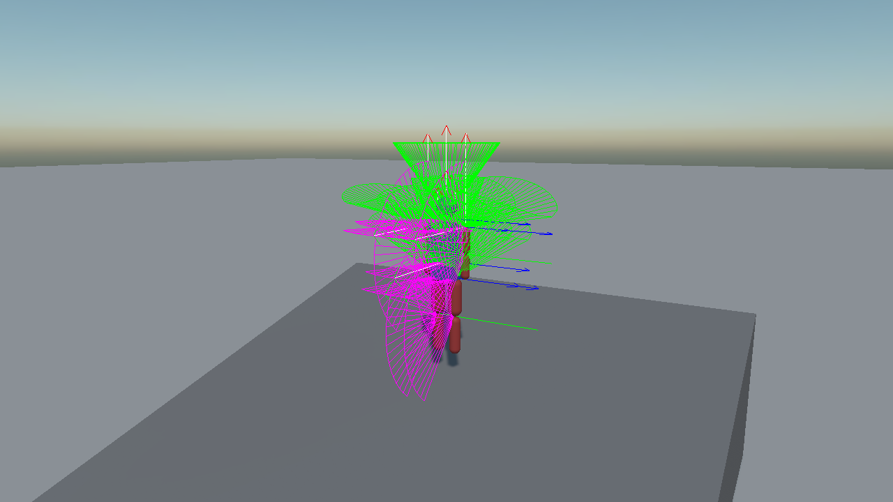
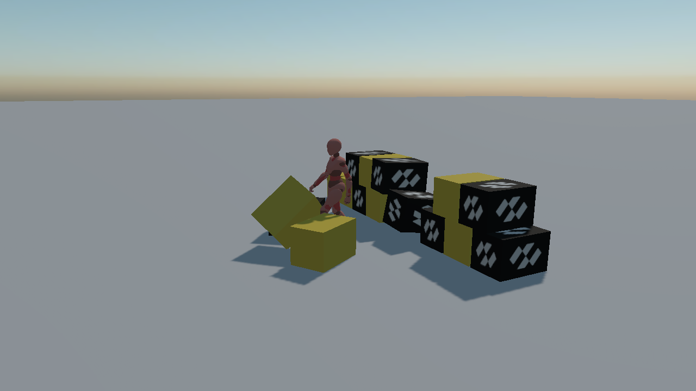

# Ragdolls
---

<video autoplay loop muted playsinline width="100%" height="auto">
  <source src="images/ragdoll_figure.mp4" type="video/mp4">
</video>

A **ragdoll** is a figure the simulation moves instead of an animation: one [rigid body](physics_bodies/rigid_body.md) per bone and one [constraint](constraints/index.md) per joint. There is no ragdoll component — a ragdoll is those two things assembled in a particular way, and this page is about the way.

## The Anatomy

Two kinds of joint cover a whole body:

| Joint | Constraint | Why |
| --- | --- | --- |
| Hips, waist, neck, shoulders | [`SwingTwistConstraint`](constraints/swing_twist_constraint.md) | Cones in two directions plus a twist about the limb's own length, which is what a ball joint does. |
| Elbows, knees | [`HingeConstraint`](constraints/hinge_constraint.md) | One axis, one way, and a stop. A knee that bends both ways is the single most obvious thing wrong with a bad ragdoll. |

The reference figure below is eleven bodies and ten joints, about 1.8 m tall. Every part is built **upright**, so each capsule runs along its own Y axis and no shape needs a rotation of its own; that in turn means every joint anchor is a height that can be read straight off the plan.

| Part | Shape | Mass | Joint to its parent | Limits |
| --- | --- | --- | --- | --- |
| Pelvis | box 0.30 × 0.20 × 0.20 | 12 kg | — (the root) | — |
| Torso | box 0.36 × 0.46 × 0.22 | 22 kg | swing twist to pelvis | 25° / 20° swing, ±25° twist |
| Head | sphere r 0.12 | 5 kg | swing twist to torso | 35° / 35° swing, ±45° twist |
| Upper arm ×2 | capsule r 0.055, h 0.30 | 2.5 kg | swing twist to torso | 80° / 60° swing, ±30° twist |
| Lower arm ×2 | capsule r 0.05, h 0.28 | 2 kg | hinge to upper arm | 0° … 140° |
| Upper leg ×2 | capsule r 0.08, h 0.44 | 7 kg | swing twist to pelvis | 60° / 35° swing, ±20° twist |
| Lower leg ×2 | capsule r 0.065, h 0.44 | 4 kg | hinge to upper leg | 0° … 140° |

```csharp
// A shoulder or a hip. The anchor is in the child's own space: where the two bones meet.
var shoulder = new SwingTwistConstraint()
{
    ConnectedBody = torso.FindComponent<RigidBody>(),
    Anchor = new Vector3(0f, 0.15f, 0f),
    TwistAxis = Vector3.UnitY,
    PlaneAxis = Vector3.UnitX,
    PlaneHalfConeAngle = MathHelper.ToRadians(80f),
    NormalHalfConeAngle = MathHelper.ToRadians(60f),
    TwistMinAngle = MathHelper.ToRadians(-30f),
    TwistMaxAngle = MathHelper.ToRadians(30f),

    // Limbs overlap at the joint on purpose, so they must not push each other apart from inside.
    CollideConnected = false,
};

upperArm.AddComponent(shoulder);
```

```csharp
// An elbow or a knee: one axis, bending one way, with a stop.
var knee = new HingeConstraint()
{
    ConnectedBody = upperLeg.FindComponent<RigidBody>(),
    Anchor = new Vector3(0f, 0.22f, 0f),
    Axis = Vector3.UnitX,
    NormalAxis = Vector3.UnitY,
    MinAngle = 0f,
    MaxAngle = MathHelper.ToRadians(140f),
    CollideConnected = false,
};
```

## Three Rules That Decide Whether It Holds Together

Almost every ragdoll that explodes, jitters or folds through itself breaks one of these.

**`CollideConnected = false` on every joint.** Limbs overlap where they meet — that is what makes a figure look like a figure rather than a chain of sausages. Left connected, the solver spends every step pushing two bodies apart that a constraint is holding together, and the figure blows itself apart on the first frame.

**Build the figure inside its own limits.** A constraint measures its angles from the pose the two bodies were in when it was created. Assemble the figure with an elbow already bent past its stop and the solver's first job is to force it back, which reads as a limb snapping.

**Keep neighbouring masses within about 5:1.** The torso here is 22 kg and the upper arms are 2.5 kg, which is under 9:1 and about as far as it is worth going. A light limb bolted to a very heavy one is a stiff problem: the solver has to move the light body a long way to satisfy a constraint the heavy one barely notices, and it shows up as jitter at the shoulder before it shows up anywhere else.

## Tuning It: Draw the Joints

<video autoplay loop muted playsinline width="100%" height="auto">
  <source src="images/ragdoll_joints.mp4" type="video/mp4">
</video>

`PhysicsDebugFlags.Constraints` draws every joint's frame in place on the figure, with the cone a swing twist allows and the arc a hinge allows. This is how a ragdoll is tuned — a limb that reaches somewhere it should not is a cone drawn too wide, and it is visible before the figure has finished falling.

```csharp
this.Managers.FindManager<PhysicsManager>().DebugFlags = PhysicsDebugFlags.Constraints;
```



## Powered Ragdolls

Every joint can hold a pose instead of hanging limp. Put its motors in `MotorMode.Position` and give it a target, and the constraint drives towards it:

```csharp
foreach (SwingTwistConstraint joint in joints)
{
    // The identity is the pose the joint was built in, since both bodies were given the same axes.
    joint.TargetOrientation = Quaternion.Identity;
    joint.SwingMotorMode = MotorMode.Position;
    joint.TwistMotorMode = MotorMode.Position;
}

foreach (HingeConstraint hinge in hinges)
{
    hinge.TargetAngle = 0f;
    hinge.MotorMode = MotorMode.Position;
}
```

This is what a figure driven by an animation is doing every frame, with the targets read out of the animation instead of fixed.

> [!IMPORTANT]
> Motors make the figure **rigid**, not **upright**. Each target is the rotation of one limb relative to its parent, so a ragdoll lying on its face with its motors on becomes a mannequin lying on its face. Standing it up takes a force on the pelvis, which no joint can supply — a joint only ever holds two bodies to each other. That is a job for a [character controller](character_controller.md), or for an external force on the root body.

## From Animation to Ragdoll

<video autoplay loop muted playsinline width="100%" height="auto">
  <source src="images/ragdoll_from_animation.mp4" type="video/mp4">
</video>

The reason to build a ragdoll over a skeleton rather than as a free-standing figure is the switch: a character walks under its animation, is hit, and falls under the simulation carrying the momentum it had.

Nothing in the framework couples animation to physics, so the coupling is yours to write. It is three ideas.

**One body per bone, in world space.** A bone entity carries the model's own node scale — often a hundredth — so a collider placed directly on one has to be sized and offset in that space. It is far simpler to give each limb an entity of its own and record the fixed offset between it and its bone once, when the ragdoll is built:

```csharp
// Built at the midpoint of the bone, turned so the capsule's own +Y runs down it.
Vector3 along = tip.Position - bone.Position;
Quaternion rotation = RotationFromTo(Vector3.UnitY, Vector3.Normalize(along));
Vector3 centre = bone.Position + (along * 0.5f);

// The offset, in the bone's own space. Read one way it drives the body from the animation.
Quaternion boneInverse = Quaternion.Inverse(bone.Orientation);
Vector3 localPosition = Vector3.Transform(centre - bone.Position, boneInverse);
Quaternion localRotation = boneInverse * rotation;
```

**While animated, the bodies are kinematic and follow.** `MoveTo` rather than a transform write, because that is what gives a kinematic body the velocity the contact solver needs:

```csharp
private void OnPhysicsStepStarting(object sender, float fixedTimeStep)
{
    foreach (Limb limb in this.limbs)
    {
        limb.Body.MoveTo(
            limb.Bone.Position + Vector3.Transform(limb.LocalPosition, limb.Bone.Orientation),
            limb.Bone.Orientation * limb.LocalRotation);
    }
}
```

That single call is what lets a walking figure knock a wall down on its way through. Write the transform instead and it teleports through everything.

**The switch is two lines.**

```csharp
this.animation.IsEnabled = false;

foreach (Limb limb in this.limbs)
{
    limb.Body.BodyType = RigidBodyType.Dynamic;
}
```

> [!TIP]
> Changing `BodyType` from kinematic to dynamic does **not** recreate the body: it keeps its velocity, its constraints and its place in the world. That is what makes this transition look right — every limb inherits the velocity the animation had just given it, so the figure is thrown forward by the stride it was in the middle of instead of dropping straight down like a plank.



> [!NOTE]
> **The skin does not follow the ragdoll, and the reason is narrower than it looks.** Writing the
> simulated poses back onto the bones works — for every bone except one. Written one at a time, or all
> ten at once, with the animation running or switched off, the mesh is fine. Written to the **pelvis**,
> the figure disappears completely; so does moving the entity that carries the model, which moves the
> pelvis with it.
>
> On this rig the pelvis is the skinned mesh's **root joint**: the mesh is drawn at that joint's world
> transform and its bone matrices are unwound again by the same joint's inverse, and the pair does not
> survive that joint being moved by anything other than the animation — not through `Position` and
> `Orientation`, not through `WorldTransform`, not through the local pair the animation itself writes,
> and not by solving for the model root instead. Even writing back the value already there does it.
>
> Until that is fixed inside the renderer, a demonstration has to show the bodies rather than the skin,
> which is what the clip above does: the capsules are drawn from the first frame, sitting inside the
> character as the physics proxy following it, and the moment the skin is hidden they are the ragdoll.

## One more thing the clip needed: root motion

The Mixamo walk is **not an in-place clip**. Its hips channel carries the figure 184.53 node units
forward over its one second and then snaps back to the start when it loops, so a character whose root
is also being moved forward advances about two metres, jumps back one, and does it again, once a
second.

Take that translation out and let the root supply all the travel:

```csharp
// Captured once, when the ragdoll is built.
this.hipsRestZ = hips.LocalPosition.Z;

// And put back every step, before anything reads the pose.
Vector3 local = this.hips.LocalPosition;
this.hips.LocalPosition = new Vector3(local.X, local.Y, this.hipsRestZ);
```

Only the axis along the walk. The other two carry the sway and the bob of a real stride — four and
eight node units of it — and zeroing them gives a figure that glides.

> [!IMPORTANT]
> `AnimationClip.InPlaceMode` looks like the setting for this, and today it is not: the enum and
> `ComputeRootMotion` are both written, but the block in `ModelExporter` that would find the root node
> and call it is commented out, so the value has no effect on an imported clip. Strip the translation at
> run time until that is connected.

Match the root's speed to what the clip animates, or the feet skate. Here the clip's 184.53 node units
a second, at 0.0101 m a unit, come to **1.87 m/s**.

## In this section
* [Constraints](constraints/index.md)
* [Character Controller](character_controller.md)
* [Debug Rendering](debug_rendering.md)
