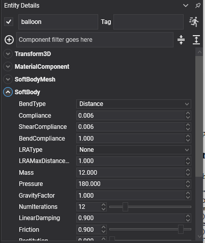
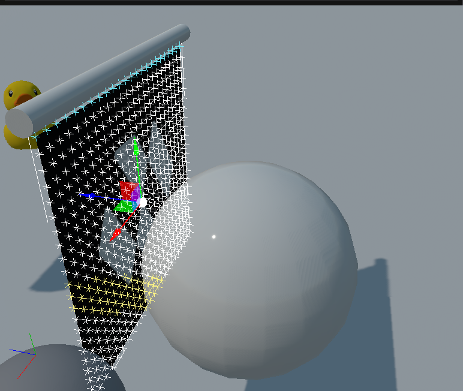
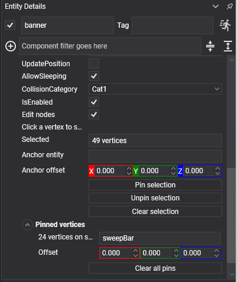
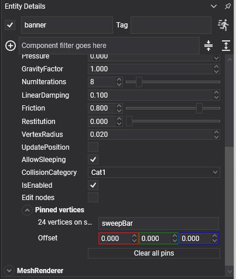

# Soft Bodies
---

<video autoplay loop muted playsinline width="100%" height="auto">
  <source src="images/softbody_overview.mp4" type="video/mp4">
</video>

A **soft body** deforms. Cloth drapes and folds, a balloon squashes when it lands, a jelly wobbles and springs back. Where a [rigid body](../physics_bodies/rigid_body.md) has a pose, a soft body has a surface of vertices held together by constraints, and the solver moves every one of them.

This is entirely new in the Jolt-based physics; the previous API had nothing like it.

A soft body is **two components**, the same split as a mesh and a collider on a rigid body:

| Component | What it is |
| --- | --- |
| [`SoftBodyMesh`](soft_body_meshes.md) | The **shape**: what surface it is and how it is drawn. |
| `SoftBody` | The **behaviour**: how that surface is simulated. |

## Creating a Soft Body

```csharp
Entity flag = new Entity("flag")
    .AddComponent(new Transform3D() { Position = new Vector3(0f, 4f, 0f) })
    .AddComponent(new MaterialComponent() { Material = clothMaterial })
    .AddComponent(new SoftBodyMesh()
    {
        ShapeType = SoftBodyShapeType.Cloth,
        GridColumns = 24,
        GridRows = 22,
        GridSpacing = 0.16f,
        DoubleSided = true,
    })
    .AddComponent(new SoftBody()
    {
        Mass = 2f,
        Compliance = 0f,
        NumIterations = 8,
        Friction = 0.8f,
        VertexRadius = 0.02f,
    })
    .AddComponent(new MeshRenderer());

this.Managers.EntityManager.Add(flag);
```

> [!IMPORTANT]
> Soft bodies do not take part in [collision events](../physics_bodies/collisions.md) or in [queries](../queries.md) in this version. They collide with rigid bodies and with the ground, but a ray cast will not find one, and no `CollisionStarted` is raised for one.

## SoftBody Component



### Structure

| Property | Default | Description |
| --- | --- | --- |
| **Compliance** | 0 | Inverse stiffness of the edges. **Zero holds every edge at exactly its rest length**, which is a rigid shell; a little slack is what lets a body squash and wobble. |
| **ShearCompliance** | 0 | The same for the diagonal edges, which is what resists the surface skewing. |
| **BendCompliance** | 1 | How easily the surface folds. Low makes stiff card; high makes limp fabric. |
| **BendType** | `Distance` | How bending is modelled: `None`, `Distance` or `Dihedral`. |
| **LRAType** | `None` | Long-range attachment constraints, which stop cloth stretching away from its pins. `EuclideanDistance` or `GeodesicDistance`. |
| **LRAMaxDistanceMultiplier** | 1 | How much stretch the LRA constraints allow. |

### Physical

| Property | Default | Description |
| --- | --- | --- |
| **Mass** | 1 | The total mass, spread over the vertices. |
| **Pressure** | 0 | Gas pressure inside a **closed** surface, holding it inflated. |
| **GravityFactor** | 1 | Multiplies the world's gravity for this body. |
| **LinearDamping** | 0.1 | Slows the whole body down. High values stop a wobble feeding itself. |
| **Friction** | 0.2 | Surface friction against other bodies. |
| **Restitution** | 0 | Bounciness. |
| **VertexRadius** | 0 | A skin around every vertex, which stops the surface grinding through thin geometry. |
| **NumIterations** | 5 | Solver passes per step. A heavy or a stiff soft body needs more or its surface jitters. |
| **AllowSleeping** | true | Lets it sleep when it stops moving. |
| **CollisionCategory** | `Cat1` | Which [category](../collision_filtering.md) it belongs to. |
| **UpdatePosition** | true | Whether the entity's transform follows the body. Turn it off for something pinned in place, like a hanging banner. |

### Read-only

| Property | Description |
| --- | --- |
| **VertexCount** | How many vertices the surface has. |
| **Volume** | The volume it currently encloses. Comparing this against the rest volume is how you tell whether a pressurised body is holding its shape. |
| **IsInWorld** | Whether it has been created yet. |
| **GetLocalBounds()** / **GetWorldBounds()** | Its bounds. |
| **CopyVertexPositions(destination)** | Reads the vertices out. |
| **GetFaceIndices()** | The surface's triangles. |
| **VerticesUpdated** | An event raised after each step. |

## Pressure

<video autoplay loop muted playsinline width="100%" height="auto">
  <source src="images/softbody_pressure.mp4" type="video/mp4">
</video>

A surface has no volume term of its own. What holds a hollow shape out is `Pressure`, and it needs **one closed shell** to push against — a mesh with separate pieces, holes or non-manifold edges has nothing to inflate, and lands flat however much pressure it is given.

> [!IMPORTANT]
> `Pressure` is not a pressure. It is the *n* of *n·R·T*, and the force the solver applies is that divided by the enclosed volume. It therefore **cannot be copied between bodies of different sizes**: the value that inflates a small balloon will tear a large tube apart. Scale it with the volume — matching a body of twice the volume means twice the number.

## Pinning Vertices

<video autoplay loop muted playsinline width="100%" height="auto">
  <source src="images/softbody_cloth.mp4" type="video/mp4">
</video>

A **pin group** fixes a set of vertices, optionally to another entity, so the rest of the surface hangs from them. A banner on a moving bar is one pin group naming the bar.

| Property | Description |
| --- | --- |
| **PinGroups** | A list of `SoftBodyPinGroup`. |
| **NotifyPinsChanged()** | Tells the body the pins have been edited. |

Each group holds:

| Field | Description |
| --- | --- |
| **VertexIndices** | Which vertices are pinned. |
| **AnchorEntityPath** | The entity that carries them. Empty pins them in world space. |
| **AnchorOffset** | An offset from that entity. |

```csharp
// A cloth is generated row by row along Z, so index = z * GridColumns + x, and its top edge is
// simply the first row: 0 to GridColumns - 1.
var top = new SoftBodyPinGroup
{
    AnchorEntityPath = "flagpole",
    VertexIndices = Enumerable.Range(0, columns).ToList(),
};

softBody.PinGroups.Add(top);
softBody.NotifyPinsChanged();
```

> [!TIP]
> Pinning to a **kinematic** body moved with `MoveTo` is what makes cloth react properly to being carried: the pins are given a real velocity, so the fabric streams and drapes instead of being teleported along with the anchor.

### Pinning in the Editor

Writing vertex indices out by hand only works while the surface is a grid whose numbering you can
reason about. For anything else — a shape read off a model, a torus, one corner of a cube — the
`SoftBody` inspector has a picking mode.


**Turn on `Edit nodes`.** Everything below it appears with it. The vertices of the body are drawn in
the viewport as points, colour-coded:



*The banner from the sample scene. The row along the top is **cyan** because it is pinned to the bar
that carries it; the band across the middle is **yellow** because it is selected; the rest are grey and
free.*

| Colour | Meaning |
| --- | --- |
| Grey | Free. The solver moves it. |
| Orange | Pinned in world space. |
| Cyan | Pinned to an entity, so it is carried by that entity. |
| Yellow | Currently selected. |

**Select in the viewport.** Clicking a vertex toggles it — within about twelve pixels, so a point
does not have to be hit exactly. Dragging draws a rectangle and takes everything inside it. Holding
**Ctrl** adds to the selection instead of replacing it; **Shift** is not used for this, because the
viewport camera has it.

**Then pin.** With at least one vertex selected the panel shows what to do with it:



| Control | What it does |
| --- | --- |
| **`Selected`** | How many vertices the buttons below will apply to. It follows the rectangle live. |
| **`Anchor entity`** | The dot-separated path of the entity that will carry the group. Left empty, the vertices are held in world space. |
| **`Anchor offset`** | An extra offset from that entity, on top of the spacing the vertices already have. |
| **`Pin selection`** | Makes a new group out of the selection. |
| **`Unpin selection`** | Frees the selected vertices again. |
| **`Clear selection`** | Deselects, without changing anything. |

Every group that exists is listed under **`Pinned vertices`**, one row each, labelled by what it holds
rather than by a number — *"24 vertices on sweepBar"*.



*With `Edit nodes` off, the groups are still listed and still editable: it is only the viewport picking
and the buttons that go away.* Each row's field is that group's anchor path,
so a group can be moved onto a different entity by typing the new path over it.

> [!IMPORTANT]
> **`Clear all pins` is there because changing the shape renumbers the vertices.** A pin group is a
> list of indices into the surface, and changing `ShapeType`, `GridColumns`, `GridRows` or the source
> model regenerates that surface — so the indices survive and now point at completely different
> vertices. Starting the groups over is the way out.

## In this section
* [Soft Body Meshes](soft_body_meshes.md)
