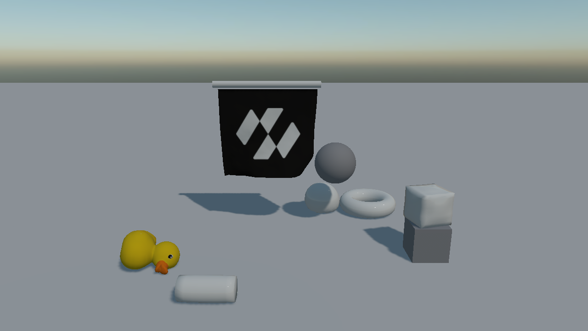
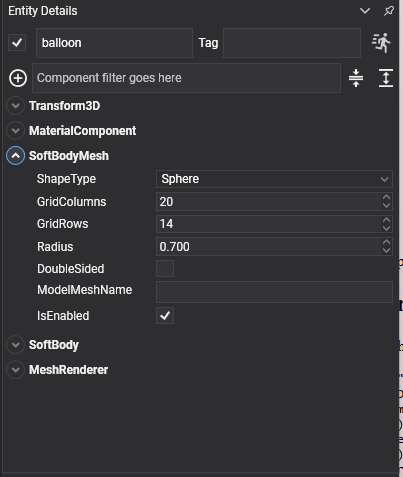

# Soft Body Meshes



`SoftBodyMesh` is the shape half of a [soft body](index.md): it generates the surface, draws it, and hands it to the `SoftBody` beside it. It derives from `MeshComponent`, so the entity is drawn like any other — material, mesh, renderer.

## Built-in Shapes



| `ShapeType` | Surface | Parameters it uses |
| --- | --- | --- |
| **Cloth** | A flat grid. Open, so it cannot hold pressure. | `GridColumns`, `GridRows`, `GridSpacing` |
| **Cube** | A box shell, subdivided per face. Hollow, not a solid block of jelly. | `GridColumns`, `GridSpacing` |
| **Sphere** | A closed sphere. | `Radius`, `GridColumns`, `GridRows` |
| **Cylinder** | A closed cylinder with flat caps. | `Radius`, `Length`, `GridColumns`, `GridRows` |
| **Torus** | A closed ring. | `Radius`, `TubeRadius`, `GridColumns`, `GridRows` |
| **FromModel** | The surface of a model asset. | `SourceModel`, `ModelMeshName`, `ModelScale`, `WeldDistance`, `RecenterModel` |

Each of them landing, one at a time:

| | |
| --- | --- |
| <video autoplay loop muted playsinline width="100%"><source src="images/softbody_cloth.mp4" type="video/mp4"></video> | <video autoplay loop muted playsinline width="100%"><source src="images/softbody_jelly.mp4" type="video/mp4"></video> |
| **Cloth** — pinned along its top row to a moving bar, draping over what it is swept across. | **Cube** — a hollow shell, held out by its pressure and squashing against the block it lands on. |
| <video autoplay loop muted playsinline width="100%"><source src="images/softbody_pressure.mp4" type="video/mp4"></video> | <video autoplay loop muted playsinline width="100%"><source src="images/softbody_bolster.mp4" type="video/mp4"></video> |
| **Sphere** — a water balloon: heavy for its size, slack skin, no bounce. | **Cylinder** — lying on its side, so it squashes along its length instead of standing on one cap. |
| <video autoplay loop muted playsinline width="100%"><source src="images/softbody_torus.mp4" type="video/mp4"></video> | <video autoplay loop muted playsinline width="100%"><source src="images/softbody_model.mp4" type="video/mp4"></video> |
| **Torus** — dropped on edge, which is also what proves the transform's rotation reaches the solver. | **FromModel** — a duck read straight off a model asset, welded and pressurised. |

## Properties

| Property | Default | Description |
| --- | --- | --- |
| **ShapeType** | `Cloth` | Which surface to generate. |
| **GridColumns** | 20 | Resolution across. More vertices means more detail and a slower solve. |
| **GridRows** | 20 | Resolution along. |
| **GridSpacing** | 0.1 | The distance between neighbouring grid points, which is what sets a cloth's size. |
| **Radius** | 0.5 | The radius of a sphere, cylinder or torus. |
| **Length** | 1 | The length of a cylinder. |
| **TubeRadius** | 0.25 | The thickness of a torus's tube. |
| **DoubleSided** | false | Draws both faces. Cloth wants this; a closed shell does not. |
| **SourceModel** | null | The model to read, in `FromModel` mode. |
| **ModelMeshName** | null | Which mesh of the model to use. Empty uses all of them. |
| **ModelScale** | 1 | Scales the model's geometry. |
| **WeldDistance** | 0.001 | How close two vertices must be to be merged into one. |
| **RecenterModel** | true | Moves the geometry so its centre sits on the entity's origin. |

Read-only: **Model**, **RestPositions**, **TriangleIndices**. Method: **SetCustomGeometry(vertices, indices)**. Event: **GeometryChanged**.

## Cloth

A cloth is generated in the local **XZ** plane, row by row along Z. That layout is what makes pinning straightforward: `index = z * GridColumns + x`, and the edge at local −Z is simply `0 … GridColumns - 1`.

```csharp
Entity banner = new Entity("banner")
    .AddComponent(new Transform3D()
    {
        Position = hangFrom,

        // A quarter turn about X stands the cloth up: local +Z maps onto -Y, so the far edge drops
        // and the pinned first row is left at the top.
        LocalOrientation = Quaternion.CreateFromAxisAngle(Vector3.UnitX, MathHelper.PiOver2),
    })
    .AddComponent(new MaterialComponent() { Material = clothMaterial })
    .AddComponent(new SoftBodyMesh()
    {
        ShapeType = SoftBodyShapeType.Cloth,
        GridColumns = 24,
        GridRows = 22,
        GridSpacing = 0.16f,
        DoubleSided = true,
    })
    .AddComponent(new SoftBody()
    {
        Mass = 2f,
        NumIterations = 8,
        Friction = 0.8f,
        VertexRadius = 0.02f,

        // Long-range attachments: without them a hanging cloth stretches away from its pins under its
        // own weight, and the more vertices it has the further it goes.
        LRAType = SoftBodyLRAType.GeodesicDistance,
        LRAMaxDistanceMultiplier = 1.05f,
    })
    .AddComponent(new MeshRenderer());
```

## Closed Shapes

Cube, sphere, cylinder and torus are all **closed shells**, and every one of them needs `Pressure` on its `SoftBody` to hold its shape. A hollow box with no pressure lands and folds flat like a cardboard carton.

```csharp
// A water balloon: heavy for its size, a slack skin, no bounce, and enough damping that its wobble
// dies away instead of turning into a permanent roll.
new SoftBody()
{
    Pressure = 180f,
    Mass = 12f,
    Compliance = 0.006f,
    ShearCompliance = 0.006f,
    Restitution = 0f,
    Friction = 0.9f,
    LinearDamping = 0.9f,
    NumIterations = 12,
    VertexRadius = 0.02f,
}
```

## From a Model

`FromModel` reads a model's surface, welds the seams the exporter split, and hands the result to the solver.

```csharp
new SoftBodyMesh()
{
    ShapeType = SoftBodyShapeType.FromModel,
    SourceModel = this.duckModel,
    ModelScale = 1f,
    WeldDistance = 0.001f,
    RecenterModel = true,
}
```

> [!IMPORTANT]
> A model used with `Pressure` must be **one closed shell**. A model whose eyes, wheels or trim are separate pieces has no single enclosed volume, so the pressure has nothing to act on and the body lands flat whatever value you give it. Check Euler's formula on the welded mesh: `V - E + F` should come to 2 for a single closed surface.

> [!TIP]
> `WeldDistance` is the dial that decides whether a model closes. Too small and the exporter's duplicated seam vertices stay separate, leaving the shell open; too large and real detail is collapsed. The default millimetre is right for most assets — check it against the shortest real edge in the mesh.

## Custom Geometry

For a surface generated at run time:

```csharp
mesh.SetCustomGeometry(vertices, triangleIndices);
```

The same rules apply: a closed shell for pressure, and vertices in the entity's local space.
