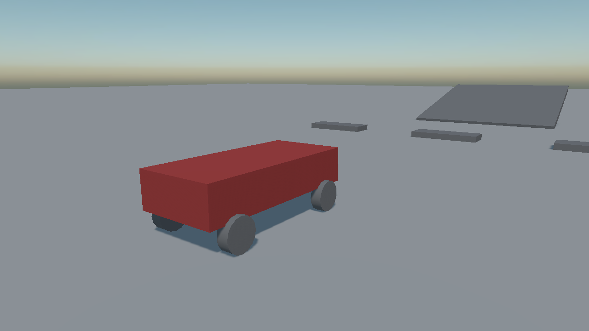

# Vehicles
---

<video autoplay loop muted playsinline width="100%" height="auto">
  <source src="images/vehicle_drive.mp4" type="video/mp4">
</video>

Evergine simulates vehicles as **one rigid body with a constraint on it**, not as a chassis with four bodies bolted to it. The wheels are not bodies and have no colliders: each one is a ray or a shape cast probing downwards for the ground, with a spring between it and the chassis.

That is why a vehicle holds together at speed, does not shake itself apart on a kerb, and costs about as much to simulate as one crate.

## How a vehicle is put together

| Piece | What it is |
| --- | --- |
| **The chassis** | An entity with a **dynamic** [`RigidBody`](../physics_bodies/rigid_body.md) and one or more [colliders](../colliders/index.md). This is the only body in the vehicle. |
| **The controller** | A [`WheeledVehicleController`](wheeled_vehicles.md) or [`TrackedVehicleController`](tracked_vehicles.md) on the same entity. It owns the engine, the gearbox and the driver's input. |
| **The wheels** | A child entity per wheel, each with a [`VehicleWheel`](vehicle_wheel.md). Its **local position is where the wheel is mounted**. |

The controller finds its wheels by walking its descendants, and **the order it finds them in is the wheel index** the controller's properties refer to.



*One chassis body, four wheels that are not bodies at all.*

```csharp
Entity car = new Entity("car")
    .AddComponent(new Transform3D() { Position = new Vector3(0f, 1.2f, 0f) })
    .AddComponent(new RigidBody()
    {
        Mass = 1200f,

        // Low, and it is the single most important number in the whole vehicle: a car whose centre of
        // mass sits at the middle of its box rolls over in the first corner.
        CenterOfMassOffset = new Vector3(0f, -0.4f, 0f),
    })
    .AddComponent(new BoxCollider() { Size = new Vector3(1.8f, 0.8f, 4f) })
    .AddComponent(new WheeledVehicleController()
    {
        FrontWheelLeft = 0,
        FrontWheelRight = 1,
        RearWheelLeft = 2,
        RearWheelRight = 3,
        FrontWheelDrive = false,
        RearWheelDrive = true,
    });

// The four wheels, in the order the indices above refer to.
foreach (var (name, offset, steer) in wheels)
{
    car.AddChild(new Entity(name)
        .AddComponent(new Transform3D() { LocalPosition = offset })
        .AddComponent(new VehicleWheel()
        {
            Radius = 0.35f,
            Width = 0.25f,
            MaxSteerAngle = steer,
        }));
}

this.Managers.EntityManager.Add(car);
```

## Engine

| Property | Default | Description |
| --- | --- | --- |
| **EngineMaxTorque** | 500 | The strongest torque the engine makes, in newton-metres. |
| **EngineMinRPM** | 1000 | Idle speed. |
| **EngineMaxRPM** | 6000 | The red line. |
| **EngineRPM** | *read-only* | What the engine is doing right now — the number a rev counter shows. |

## Transmission

| Property | Default | Description |
| --- | --- | --- |
| **TransmissionMode** | `Auto` | `Auto` changes gear by itself; `Manual` leaves it to you. |
| **GearRatios** | 2.66, 1.78, 1.3, 1.0, 0.74 | The forward gears, from first upwards. |
| **ReverseGearRatios** | -2.9 | The reverse gears. |
| **ShiftUpRPM** | 4000 | The engine speed an automatic gearbox changes up at. |
| **ShiftDownRPM** | 2000 | And down at. |
| **ClutchStrength** | 10 | How firmly the clutch engages. |
| **CurrentGear** | *read-only* | The gear it is in. `0` is neutral, negative is reverse. |

## Chassis and Collision Testing

| Property | Default | Description |
| --- | --- | --- |
| **Up** | 0,1,0 | Which way is up for this vehicle. |
| **Forward** | 0,0,1 | Which way it faces. |
| **MaxPitchRollAngle** | π/3 (60°) | How far it may tip before the wheels stop gripping. It is what stops an upside-down car driving along on its roof. |
| **CollisionTesterType** | `CastSphere` | How each wheel looks for the ground. |

| Tester | Behaviour |
| --- | --- |
| **Ray** | One ray down the suspension. The cheapest, and the one that drops a wheel into every crack in the ground. |
| **CastSphere** | A sphere swept down the suspension. Rides over small obstacles the way a real tyre does. The default, and the right answer nearly always. |
| **CastCylinder** | A cylinder swept down. The most accurate on kerbs and steps, and the most expensive. |

## Events

| Event | When it fires |
| --- | --- |
| **VehicleStepCompleted** | After the vehicle has been stepped, with the step length. |

> [!IMPORTANT]
> `VehicleStepCompleted` fires **inside the native step**. Read telemetry from it if you must, but do not create or destroy anything, and do not touch other bodies from it.

## In this section
* [Wheeled Vehicles](wheeled_vehicles.md)
* [Tracked Vehicles](tracked_vehicles.md)
* [Vehicle Wheel](vehicle_wheel.md)
