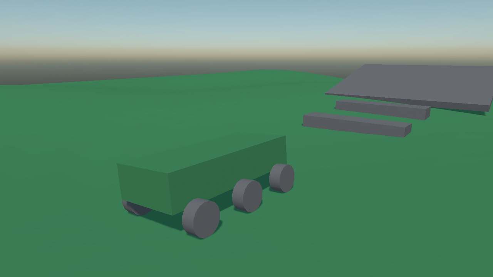
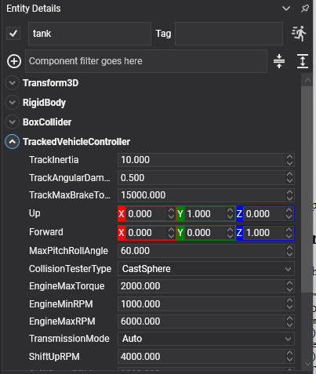

# Tracked Vehicles

<video autoplay loop muted playsinline width="100%" height="auto">
  <source src="images/tracked_drive.mp4" type="video/mp4">
</video>

`TrackedVehicleController` drives anything that steers by running two tracks at different speeds: tanks, excavators, bulldozers, snow groomers.

It is built exactly like a [wheeled vehicle](wheeled_vehicles.md) — one dynamic chassis body, one controller, a child entity per road wheel — and everything in [Vehicles](index.md) about the engine, the gearbox and the collision testers applies unchanged. What differs is how the wheels are driven and how the vehicle turns.



*Six road wheels, none of which steers. What turns it is the two tracks running at different speeds.*

## How a tracked vehicle differs

* **No wheel steers.** Every `MaxSteerAngle` stays at zero. Turning comes from driving one track faster than the other, or from running them in opposite directions to spin on the spot.
* **Each track is one differential.** Every wheel on a side turns together at the speed its track is running, rather than each being driven separately.
* **Two tracks, not four corners.** There are no front-left and rear-right indices — only which wheels belong to the left track and which to the right.

## TrackedVehicleController Component

```csharp
Entity tank = new Entity("tank")
    .AddComponent(new Transform3D() { Position = start })
    .AddComponent(new RigidBody()
    {
        Mass = 4000f,
        CenterOfMassOffset = new Vector3(0f, -0.4f, 0f),
    })
    .AddComponent(new BoxCollider() { Size = new Vector3(2.2f, 0.9f, 4.4f) })
    .AddComponent(new TrackedVehicleController()
    {
        EngineMaxTorque = 2000f,
        GearRatios = new[] { 2.66f, 1.78f, 1.3f, 1.0f },
        ReverseGearRatios = new[] { -2.9f },
    });

// Three road wheels a side. None of them steers.
foreach (var (name, offset) in roadWheels)
{
    tank.AddChild(new Entity(name)
        .AddComponent(new Transform3D() { LocalPosition = offset })
        .AddComponent(new VehicleWheel()
        {
            Radius = 0.4f,
            Width = 0.35f,
            MaxSteerAngle = 0f,
            SuspensionMinLength = 0.1f,
            SuspensionMaxLength = 0.3f,
        }));
}

this.Managers.EntityManager.Add(tank);
```

## Track Properties



| Property | Default | Description |
| --- | --- | --- |
| **LeftTrackWheels** | *empty* | The indices of the wheels the left track drives. Left empty, the wheels are split between the two tracks by where they are mounted. |
| **RightTrackWheels** | *empty* | The same for the right track. |
| **TrackInertia** | 10 | The rotational inertia of each track. A heavy track takes longer to spin up and longer to stop. |
| **TrackAngularDamping** | 0.5 | How quickly a free-running track slows down. |
| **TrackMaxBrakeTorque** | 15000 | The strongest braking torque a track can apply. |

Plus everything in [Vehicles](index.md): the engine, the gearbox, the chassis axes and the collision tester.

## Driving the Vehicle

```csharp
tank.SetDriverInput(forward, leftRatio, rightRatio, brake);
```

| Argument | Range | Meaning |
| --- | --- | --- |
| **forward** | -1 … 1 | Throttle. Negative is reverse. |
| **leftRatio** | -1 … 1 | How much of the throttle the left track gets. |
| **rightRatio** | -1 … 1 | How much the right track gets. |
| **brake** | 0 … 1 | The brake. |

The two ratios are the steering:

| Left | Right | Result |
| --- | --- | --- |
| 1 | 1 | Straight ahead. |
| 1 | 0.5 | A gentle turn to the right. |
| 1 | 0 | A tight turn about the stopped track. |
| 1 | -1 | A neutral turn: spinning on the spot. |

```csharp
public class TankInput : Behavior
{
    [BindComponent]
    private TrackedVehicleController tank = null;

    protected override void Update(TimeSpan gameTime)
    {
        KeyboardDispatcher keyboard = this.Managers.RenderManager.ActiveCamera3D?.Display?.KeyboardDispatcher;

        if (keyboard == null)
        {
            return;
        }

        float forward = (keyboard.IsKeyDown(Keys.W) ? 1f : 0f) - (keyboard.IsKeyDown(Keys.S) ? 1f : 0f);
        float steer = (keyboard.IsKeyDown(Keys.D) ? 1f : 0f) - (keyboard.IsKeyDown(Keys.A) ? 1f : 0f);

        // Steering by taking speed off one track and adding it to the other. Held at full lock with no
        // throttle, the two ratios end up opposite and the vehicle spins on the spot, which is the
        // manoeuvre nothing on wheels can do.
        float left = MathHelper.Clamp(1f + steer, -1f, 1f);
        float right = MathHelper.Clamp(1f - steer, -1f, 1f);

        if (forward == 0f && steer != 0f)
        {
            forward = 1f;
        }

        this.tank.SetDriverInput(forward, left, right, 0f);
    }
}
```

> [!TIP]
> Tracked vehicles are heavy and drive over things rather than around them, so `CastCylinder` is worth the extra cost as a collision tester: it puts the road wheels on top of kerbs and rubble instead of dropping them into every gap.

> [!NOTE]
> A track's grip is not modelled per wheel, so the tyre telemetry on [`VehicleWheel`](vehicle_wheel.md) — the slip and friction values, and `BrakeImpulse` — reads zero on a tracked vehicle. `HasContact`, `SuspensionLength` and `AngularVelocity` all work as usual.
